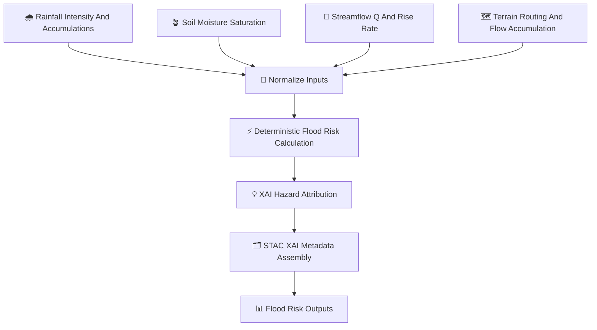

<div align="center">

# 🌊⚠️💧 **Flood Risk Hazard Model — KFM v11.2.2 (MAX MODE)**  
`docs/pipelines/ai/inference/hazards/flood-risk.md`

**Purpose**  
Define the deterministic, FAIR+CARE-enforced, sovereignty-protected **Flood Risk Hazard Model**,  
combining **runoff 🌧️**, **soil saturation 🪴**, **streamflow rise 🌊**, **terrain routing 🗺️**,  
and **rapid water-level change ⚡** to generate watershed-scale flood & flash-flood hazard indices.  
Supports realtime hazard chains, map tiles, and Story Node v3 hydrology + weather narratives.

</div>

---

## 🌊📘⚠️ **Overview — Flood Risk in KFM**

The Flood Risk Model blends:

- 🌧️ **Rainfall intensity & burst index**  
- 💦 **Soil moisture saturation & deficits**  
- 🌊 **Streamflow discharge (Q)** + **ΔQ/Δt rise rate**  
- 🌀 **Runoff surges (RRHI)**  
- 🗺️ **Terrain routing + flow accumulation**  
- 🧭 **Watershed topology & wetness index**  
- 🌡️ **Snowmelt/temperature** (if winter conditions)  
- 🧠 **XAI interpretability** (watershed CAM overlays)  
- 🛡️ **Sovereignty-aware masking** (sensitive watersheds)  

Outputs provide:

- Flash-flood hazard levels  
- Flood Index augmentation  
- Multi-hazard composites (fire/flood, heat/flood, storm/flood)

---

## 🧬🌊⚙️ **Flood Risk Pipeline Architecture (Mermaid-Safe)**



---

## 🌧️🪴🌊 **Inputs Required**

### 1️⃣ 🌧️ Rainfall  
- Downscaled precip  
- Burst index  
- Rolling accumulations (1h/3h/6h)

### 2️⃣ 🪴 Soil Moisture  
- Absolute + anomaly  
- Saturation index  
- Multi-layer depth support  

### 3️⃣ 🌊 Streamflow  
- Discharge (Q)  
- Rise rate (ΔQ/ΔT)  
- Baseflow state  

### 4️⃣ 🗺️ Topography  
- Slope  
- Flow direction  
- Flow accumulation  
- Watershed boundaries  

### 5️⃣ ❄️ Optional Snowmelt  
- Temperature  
- Wet-bulb  
- Melt index  

All MUST include CRS, units, timestamps, and PROV-compatible metadata.

---

## ⚡🧮🌊 **Flood Risk Formula (ASCII-Safe)**

The composite Flood Risk Index (FRI):

```
FRI =
    w1 * runoff_norm
  + w2 * saturation_norm
  + w3 * rise_rate_norm
  + w4 * flow_accum_norm
  + w5 * precip_burst_norm
```

Where:

- All weights (`w1..w5`) MUST be deterministic  
- Norm values are **watershed-normalized**  
- ΔQ/Δt MUST be seed-locked and reproducible

---

## 📦🌊📊 **Outputs**

The model MUST produce:

- `flood_risk_grid.tif`  
- `flood_risk_metadata.json`  
- `flood_risk_summary.json`  
- Optional hazard-CAM overlays  
- STAC-XAI compliant Item  
- Deterministic seed metadata  
- Complete PROV-O lineage  
- CARE metadata block  

---

## 💡🧠🌊 **XAI Integration**

Hazards XAI MUST output:

- Feature importance for runoff, saturation, rise rate, flow accum, burst index  
- CAM overlays for watershed-level flood signals  
- Seed metadata  
- STAC-XAI attribution assets  
- CARE + sovereignty filters applied to XAI masks  

Example XAI importance block:

```json
{
  "xai": {
    "importance": {
      "runoff": 0.41,
      "saturation": 0.27,
      "rise_rate": 0.18,
      "accumulation": 0.09,
      "precip_burst": 0.05
    },
    "seed": 42
  }
}
```

---

## 🛡️⚖️🌊 **CARE + Sovereignty Enforcement**

Flood risk maps MUST NOT expose hyperlocal vulnerability inside sovereignty-protected,  
culturally sensitive, or endangered ecological watersheds.

Therefore apply:

- **H3 watershed generalization**  
- Downsampling of FI maxima  
- Removal of ΔQ/Δt spikes in sensitive zones  
- Attachable CARE block:

```json
{
  "care": {
    "masking": "h3-watershed-generalized",
    "scope": "public-generalized",
    "notes": ["Flood risk hotspots generalized in sovereignty-protected basins"]
  }
}
```

---

## 🔒⚙️🧪 **Determinism Requirements**

- No stochastic routing  
- Rise-rate computed with stable ordering  
- CN/runoff dependence deterministic  
- Slope/flow accumulation deterministic  
- Seed-lock ensures stable XAI attribution  

---

## 🧪📏🔬 **CI Validation Requirements**

CI MUST confirm:

- Deterministic FRI output  
- CRS + units present  
- XAI metadata complete  
- STAC-XAI validity  
- PROV completeness  
- CARE block enforced  
- Hydrology/hazard coupling correct  
- Telemetry integrations (OTel, energy, carbon)

Failures → ❌ CI BLOCKED.

---

## 🕰️📜 **Version History**

| Version  | Date       | Notes                                          |
|----------|------------|------------------------------------------------|
| v11.2.2  | 2025-11-28 | Initial Flood Risk Hazard Model (MAX MODE)     |

---

<div align="center">

### 🔗 Footer  
[🌪️ Back to Hazards Pipeline](./README.md) ·  
[🌊 Hydrology Models](../hydrology/README.md) ·  
[🏛 Governance](../../../../standards/governance/ROOT-GOVERNANCE.md)

</div>

