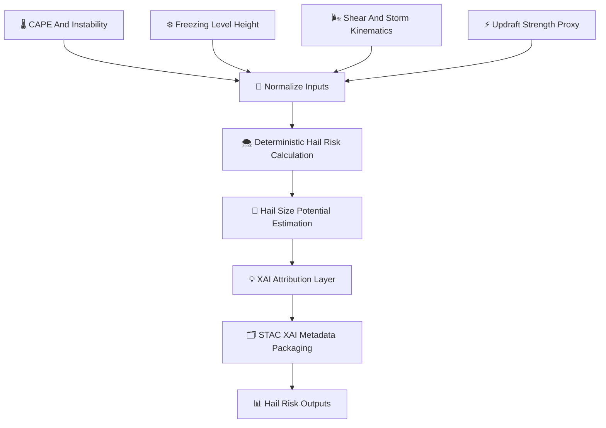

<div align="center">

# 🌨️🧊⚡ **Hail Risk Hazard Model — KFM v11.2.2**  
`docs/pipelines/ai/inference/hazards/hail-risk.md`

**Purpose**  
Define the deterministic, sovereignty-protected, FAIR+CARE–aligned **Hail Risk Model**, integrating  
**updraft strength ⚡**, **freezing-level height ❄️**, **CAPE-driven lift 🌡️**, **shear profile 🌬️**,  
and **storm-top thermodynamics 🧊** to estimate hail probability and hail size potential.  
Outputs are XAI-ready, seed-locked, STAC-XAI compliant, and feed the **Severe Storms**,  
**Tornado**, and **Multi-Hazard** pipelines.

</div>

---

## 🌨️📘⚡ **Overview — Hail Hazard Science in KFM**

The hail model blends:

- 🌡️ **CAPE & mid-level instability**  
- ❄️ **Freezing-level height and thickness**  
- 🌬️ **Vertical wind shear**  
- ⚡ **Updraft proxy (vertical velocity predictor)**  
- 🧊 **Thermal profile for melting potential**  
- 🌀 **Storm-top divergence signals (optional)**  
- 🛡️ **FAIR+CARE masking** in sovereignty-sensitive regions  
- 🧠 **XAI explainability** (CAM grids, feature weights)  
- 🗂️ **STAC-XAI hazard catalog**  
- 📜 **PROV-O lineage**

---

## 🧬🌨️⚙️ **Hail Risk Pipeline Architecture (Mermaid-Safe)**



---

## 🌡️❄️🌬️ **Inputs Required**

### 1️⃣ 🌡️ CAPE & Instability  
- CAPE  
- Mid-level lapse rates  
- Elevated mixed-layer stability metrics  

### 2️⃣ ❄️ Freezing Level  
- 0°C height  
- Melting-layer thickness  
- Wet-bulb zero height  

### 3️⃣ 🌬️ Shear & Kinematics  
- Bulk shear (0–6 km)  
- Deep-layer shear  
- Storm-relative winds  
- Divergence/convergence fields  

### 4️⃣ ⚡ Updraft Proxy  
- Derived from instability + shear environment  
- Deterministic model, seed-locked  

### 5️⃣ 🧊 Thermal Profile  
- Melting potential  
- Layer temperatures  
- Hailstone survival potential  

All MUST include CRS, units, ISO timestamps, and STAC-derived metadata.

---

## ⚡🧮🌨️ **Hail Risk Formulas (ASCII-Safe)**

### **1. Hail Risk Index (HRI)**  
```
HRI =
    w1 * cape_norm
  + w2 * shear_norm
  + w3 * updraft_norm
  + w4 * freezing_level_norm
  + w5 * lapse_rate_norm
```

### **2. Hail Size Potential (HSP)**  
```
HSP = HRI * (1 - melting_factor)
```

Where melting_factor is a deterministic function of the thermal column.

---

## 📦🌨️📊 **Outputs**

The model MUST produce:

- `hail_risk_grid.tif`  
- `hail_size_potential_grid.tif`  
- `hail_risk_metadata.json`  
- `hail_risk_summary.json`  
- CAM/XAI maps (optional)  
- STAC-XAI Item  
- Deterministic seed  
- PROV-O lineage  
- CARE metadata  

---

## 💡🧠🌨️ **XAI Integration**

XAI MUST reveal:

- Contribution of CAPE  
- Freezing-level role  
- Shear contribution  
- Updraft strength sensitivity  
- Lapse rate influence  
- Seed-lock information  
- Watershed/storm-environment hotspots  
- STAC-XAI attribution assets  

Example:

```json
{
  "xai": {
    "importance": {
      "cape": 0.40,
      "shear": 0.25,
      "updraft": 0.20,
      "freezing_level": 0.10,
      "lapse_rates": 0.05
    },
    "seed": 42
  }
}
```

---

## 🛡️⚖️🌪️ **CARE + Sovereignty Enforcement**

Hail hazard maps MUST:

- Apply **H3 hazard generalization** in sovereignty-protected regions  
- Downsample small-scale hail hotspots  
- Remove hyperlocal hail-size potential near protected communities  
- Provide CARE metadata:

```json
{
  "care": {
    "masking": "h3-hazard-generalized",
    "scope": "public-generalized",
    "notes": ["Hail risk generalized in sovereignty-protected regions"]
  }
}
```

---

## 🔒⚙️🧪 **Determinism Requirements**

- Updraft predictor = deterministic  
- No random ensemble forecasts  
- Fixed order of shear/lapse rate calculations  
- Thermal column deterministic  
- Reproducible under CI  

---

## 🧪📏🔬 **CI Validation Requirements**

CI MUST ensure:

- Deterministic hazard fields  
- CRS + units present  
- XAI metadata complete  
- STAC-XAI validation  
- PROV lineage complete  
- CARE enforcement active  
- Telemetry logs attached  
- No missing driver dependencies  

Fail → ❌ merge blocked.

---

## 🕰️📜 **Version History**

| Version  | Date       | Notes                                       |
|----------|------------|----------------------------------------------|
| v11.2.2  | 2025-11-28 | Initial Hail Risk Hazard Model (MAX MODE)    |

---

<div align="center">

### 🔗 Footer  
[⚡ Back to Hazards Pipeline](./README.md) ·  
[🌨️ Severe Storms](./severe-storms.md) ·  
[🏛 Governance](../../../../standards/governance/ROOT-GOVERNANCE.md)

</div>

