<div align="center">

# 🌀⚡🌪️🔥🌊 **Multi-Hazard Composite Model — KFM v11.2.2**  
`docs/pipelines/ai/inference/hazards/hazard-composite.md`

**Purpose**  
Define the sovereignty-safe, deterministic, FAIR+CARE-enforced **Multi-Hazard Composite Model**,  
which combines **severe storms 🌪️**, **hail 🌨️**, **tornado potential 🧲**, **flood risk 🌊**,  
**fire weather 🔥**, **heat 🌡️**, and **winter hazards ❄️** into a unified, scale-aware,  
XAI-explainable composite hazard index for statewide risk intelligence, Story Node v3 generation,  
and Focus Mode v3 hazard overlays.

</div>

---

## 🌪️🔥🌊 **Overview — Why a Composite Hazard?**

Single hazards show only one dimension of risk.  
Communities, however, face **compound and sequential hazards**, such as:

- Heat → drought → fire weather → smoke  
- Severe storms → hail → flash flooding  
- Winter storms → freezing rain → power loss  
- Dryline storms → tornado → heavy rain → flooding  

The Multi-Hazard Composite:

- Stacks hazards together deterministically  
- Normalizes each hazard domain  
- Assigns domain weights (version-pinned)  
- Produces a unified, sovereignty-safe hazard signal  
- Includes provenance, telemetry, and CARE markings  
- Offers XAI justification for emergency management

---

## 🧬🌀⚙️ **Composite Model Pipeline (Mermaid-Safe)**

```mermaid
flowchart TD
    A[🌪️ Severe Storms Index] --> D[📏 Normalize Hazard Inputs]
    B[🌨️ Hail Risk] --> D
    C[🧲 Tornado Potential] --> D
    E[🌊 Flood Risk] --> D
    F[🔥 Fire Weather Risk] --> D
    G[🌡️ Heat Stress] --> D
    H[❄️ Winter Hazard Index] --> D
    D --> I[🌀 Deterministic Weighted Composite]
    I --> J[💡 XAI Composite Attribution]
    J --> K[🗂️ STAC XAI Metadata Packaging]
    K --> L[📊 Multi-Hazard Composite Output]
```



---

## ⚡🌪️🔥🌊 **Inputs Required**

The composite uses **version-pinned hazard drivers**:

### 🌪️ Severe Storms  
- CAPE, CIN, shear, LLJ, lapse rates, storm-environment indices

### 🌨️ Hail  
- Freezing level, lapse rates, updraft proxy, CAPE

### 🧲 Tornado  
- SRH, shear, CAPE/CIN balance, storm motion

### 🌊 Flood  
- Runoff, RRHI, soil moisture, streamflow rise, flow accumulation

### 🔥 Fire Weather  
- VPD, RH, wind, fuel dryness, slope

### 🌡️ Heat  
- Heat Index, WBGT, humidity stress

### ❄️ Winter  
- Freezing rain potential, snowfall rate, wind chill, wet-bulb

All inputs must:

- Include CRS, units, timestamps  
- Pass deterministic validation  
- Include PROV lineage linking back to climate/hydrology AI  
- Include any applicable CARE masking

---

## 🧮🌀📈 **Composite Formula (ASCII-Safe)**

All hazard components are normalized to consistent ranges, then blended:

```
CompositeHazard =
    w1 * severe_storms_norm
  + w2 * hail_norm
  + w3 * tornado_norm
  + w4 * flood_norm
  + w5 * fire_weather_norm
  + w6 * heat_norm
  + w7 * winter_norm
```

### Deterministic Requirements  
- Weights `w1..w7` MUST be version-pinned.  
- Normalization MUST be watershed/region-aware.  
- Composite MUST be identical on repeated runs (seed-locked).  

---

## 📦🌀📊 **Outputs**

The composite model MUST produce:

- `hazard_composite_grid.tif`  
- `hazard_composite_metadata.json`  
- `hazard_composite_summary.json`  
- Optional CAM overlays (XAI)  
- STAC-XAI Item containing all hazard components  
- Deterministic seed metadata  
- PROV lineage  
- CARE metadata block

---

## 💡🧠🌀 **XAI Integration**

XAI MUST include:

- Contribution of each hazard driver  
- CAM overlays for composite hotspots  
- Hazard-stack sensitivity analysis  
- Watershed/storm-scale attribution maps  
- STAC-XAI linkage  
- Deterministic seed tracking  

Example:

```json
{
  "xai": {
    "importance": {
      "severe_storms": 0.32,
      "hail": 0.18,
      "tornado": 0.15,
      "flood": 0.14,
      "fire_weather": 0.11,
      "heat": 0.06,
      "winter": 0.04
    },
    "seed": 42
  }
}
```

---

## 🛡️⚖️🧭 **CARE + Sovereignty Enforcement**

Composite hazard grids MUST NOT reveal hyperlocal vulnerabilities in:

- Tribal communities  
- Ecologically sensitive basins  
- Protected lands  
- Cultural heritage areas  

Apply:

- **H3 hazard generalization**  
- Downsample narrow hotspots  
- Blur storm-track signatures in restricted areas  

CARE block:

```json
{
  "care": {
    "masking": "h3-hazard-generalized",
    "scope": "public-generalized",
    "notes": ["Composite hazard values generalized in sovereignty-protected regions"]
  }
}
```

---

## 🔒⚙️🧪 **Determinism Requirements**

- No random weighting  
- No probabilistic hazard sampling  
- Seed-locked composite  
- Strict floating-point order  
- Reproducible on CI replay  

---

## 🧪📏🔬 **CI Validation Requirements**

CI MUST verify:

- STAC-XAI validity  
- PROV lineage completeness  
- Deterministic composite re-runs  
- CRS + units present  
- CARE blocks included  
- All hazard drivers available and version-pinned  
- Telemetry (OTel, energy, carbon) attached  

CI failure → ❌ merge blocked.

---

## 🕰️📜 **Version History**

| Version  | Date       | Notes                                           |
|----------|------------|-------------------------------------------------|
| v11.2.2  | 2025-11-28 | Initial Multi-Hazard Composite Model (MAX MODE) |

---

<div align="center">

### 🔗 Footer  
[⚡ Back to Hazards Pipeline](./README.md) ·  
[🌀 Hazard Models](./) ·  
[🏛 Governance](../../../../standards/governance/ROOT-GOVERNANCE.md)

</div>

