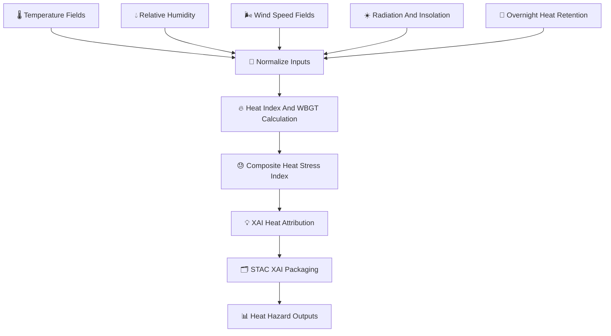

<div align="center">

# 🌡️🔥😓 **Heat Risk Hazard Model — KFM v11.2.2 (MAX MODE)**  
`docs/pipelines/ai/inference/hazards/heat-risk.md`

**Purpose**  
Define the deterministic, FAIR+CARE-governed, sovereignty-safe **Heat Risk Hazard Model**,  
which blends **Heat Index 🌡️**, **Humidity Stress 💧**, **Wet Bulb Globe Temperature 🥵**,  
**Overnight Heat Retention 🌙**, **Surface Radiative Load 🔥**, and **Wind Effects 🌬️** into a unified  
**heat hazard index** for public health, agricultural impact, and Story Node v3 narrative overlays.

</div>

---

## 🌡️📘🔥 **Overview — Heat Hazards in KFM**

The Heat Risk model captures:

- 🌡️ **Air Temperature** (downscaled)  
- 💧 **Relative Humidity** (for HI/WBGT)  
- 🌬️ **Wind Speed** (heat dissipation modifier)  
- 🌫️ **Overnight Low Temperature Heat Retention**  
- ☀️ **Solar Radiation / Net Radiation Load**  
- 🧠 **Humidity Stress Index**  
- 🔥 **Wet Bulb Temperature / Wet Bulb Globe Temperature (WBGT)**  
- 🌎 **Urban Heat Island (if available)**  
- 🛡️ **CARE + Sovereignty-safe output generalization**  
- 🗂️ **STAC-XAI hazard metadata**  
- 📜 **PROV lineage for health-risk traceability**

Heat risk is one of the **most sensitive hazard domains** due to health implications → additional CARE protections.

---

## 🧬🌡️⚙️ **Heat Risk Pipeline Architecture (Mermaid-Safe)**



---

## 🌡️💧🌬️ **Inputs Required**

### 1️⃣ 🌡️ Temperature  
- Downscaled T2M  
- Optional: 850/700 mb temps for vertical stability  
- Must include units, CRS, timestamps  

### 2️⃣ 💧 Relative Humidity  
- Downscaled or reconstructed from dewpoint  
- Required for Heat Index and WBGT  

### 3️⃣ 🌬️ Wind Speed  
- 10 m wind  
- Can reduce heat stress  

### 4️⃣ ☀️ Radiation Load  
- Shortwave/longwave or bulk net radiative heating  

### 5️⃣ 🌙 Overnight Heat Retention  
- Previous-day minimum temperature  
- Heatwave persistence factor  

All MUST satisfy STAC, PROV, FAIR+CARE, and sovereignty metadata rules.

---

## 🔥🧮🌡️ **Heat Hazard Formulas (ASCII-Safe)**

### **Heat Index (HI)**  
(Deterministic version of NOAA HI)

```
HI = c1 + c2*T + c3*RH + c4*T*RH + c5*T^2 + c6*RH^2 + ...
```

### **Wet Bulb Temperature (Approx.)**
```
Tw = f(T, RH)     # deterministic psychrometric function
```

### **Wet Bulb Globe Temperature (WBGT)**  
(det. formula)

```
WBGT = 0.7*Tw + 0.2*Tg + 0.1*Ta
```

### **Heat Stress Composite (HSC)**  
```
HSC =
    w1 * HI_norm
  + w2 * WBGT_norm
  + w3 * humidity_stress_norm
  + w4 * overnight_heat_norm
  + w5 * radiation_norm
```

All weights MUST be version-pinned + seed-locked.

---

## 📦🌡️📊 **Outputs**

The model MUST generate:

- `heat_risk_grid.tif`  
- `heat_index_grid.tif`  
- `wbgt_grid.tif`  
- `heat_risk_metadata.json`  
- `heat_risk_summary.json`  
- Optional XAI CAM / gradient overlays  
- STAC-XAI Item with full hazard metadata  
- PROV-O lineage  
- CARE metadata block  
- Deterministic seeds  

---

## 💡🧠🔥 **XAI Integration**

Heat XAI MUST include:

- Contributions: T, RH, WBGT, radiation, wind  
- Sensitivity to humidity  
- CAM overlays for heat hotspots  
- Deterministic importance vectors  
- STAC-XAI attribution assets  
- PROV lineage + seed tracking  

Example:

```json
{
  "xai": {
    "importance": {
      "temp": 0.47,
      "humidity": 0.29,
      "radiation": 0.14,
      "overnight_heat": 0.06,
      "wind": 0.04
    },
    "seed": 42
  }
}
```

---

## 🛡️⚖️🌎 **CARE + Sovereignty Enforcement**

Heat risk MUST:

- H3-generalize sensitive communities  
- Remove hyperlocal urban heat signatures in tribal areas  
- Block ultra-granular WBGT outputs near sovereignty-protected regions  
- Include:

```json
{
  "care": {
    "masking": "h3-hazard-generalized",
    "scope": "public-generalized",
    "notes": ["Heat hazard generalized in sovereignty-protected areas"]
  }
}
```

---

## 🔒⚙️🧪 **Determinism Requirements**

- No random sampling  
- Deterministic psychrometric functions  
- Fixed evaluation order  
- Seed-lock enforced  
- Reproducible in CI  

---

## 🧪📏🔬 **CI Validation Requirements**

CI MUST verify:

- CRS + units  
- Deterministic output stability  
- Correct XAI metadata  
- STAC-XAI compliance  
- PROV lineage completeness  
- CARE block present  
- Telemetry bundle generation  
- No missing hazard dependencies  

Failure → ❌ merge blocked.

---

## 🕰️📜 **Version History**

| Version  | Date       | Notes                                    |
|----------|------------|-------------------------------------------|
| v11.2.2  | 2025-11-28 | Initial Heat Risk Hazard Model (MAX MODE) |

---

<div align="center">

### 🔗 Footer  
[🌪️ Back to Hazards Pipeline](./README.md) ·  
[🌡️ Heat & Meteorology Models](./) ·  
[🏛 Governance](../../../../standards/governance/ROOT-GOVERNANCE.md)

</div>

