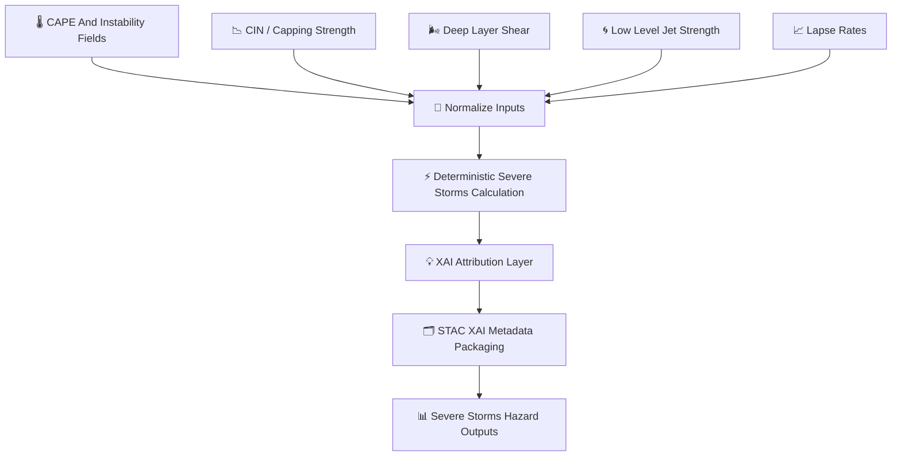

<div align="center">

# ⛈️🌪️⚡ **Severe Storms Hazard Model — KFM v11.2.2 (MAX MODE)**  
`docs/pipelines/ai/inference/hazards/severe-storms.md`

**Purpose**  
Define the deterministic, XAI-ready, FAIR+CARE-governed **Severe Storms Hazard Model**,  
combining **CAPE 🌡️**, **CIN 📉**, **deep-layer shear 🌬️**, **low-level jet 🌀**,  
**lapse rates 📈**, and **dryline dynamics 🌵🌀**, to produce statewide severe-thunderstorm  
hazard fields used in realtime maps, hazard pipelines, and Story Node v3 narrative overlays.

</div>

---

## ⚡⛈️🌪️ **Overview — Severe Thunderstorm Hazard Science**

The Severe Storms Hazard Model blends:

- 🌡️ **Instability:** CAPE, lifted indices, theta-e  
- 📉 **CIN:** capping strength & storm initiation inhibition  
- 🌬️ **Shear:** 0–1km, 0–3km, 0–6km bulk shear  
- 🌀 **LLJ:** overnight inflow strength  
- 📈 **Lapse Rates:** mid-level / low-level lapse rate steepness  
- 🌵 **Dryline Index:** convergence & moisture gradient  
- 🧠 **XAI Explainability:** attribution maps, importance vectors  
- 🛡️ **FAIR+CARE Filtering:** sovereignty-aware hazard boundaries  
- 🗂️ **STAC-XAI Hazard Metadata**  
- 📜 **PROV-O Lineage**

This model underpins **hail**, **tornado**, and **supercell composite** hazards.

---

## 🌪️⚙️⛈️ **Severe Storms Pipeline Architecture (Mermaid-Safe)**



---

## 🌡️📉🌬️ **Inputs Required**

### 1️⃣ 🌡️ Instability  
- CAPE (surface/elevated)  
- LFC/EL levels  
- Theta-e ridge index  

### 2️⃣ 📉 CIN / Cap Strength  
- Forecast initiation windows  
- Dryline suppression fields  

### 3️⃣ 🌬️ Shear  
- Bulk shear  
- Deep-layer shear  
- Storm-relative winds  

### 4️⃣ 🌀 LLJ  
- 850mb / 925mb wind maxima  
- Nocturnal inflow  

### 5️⃣ 📈 Lapse Rates  
- 700–500mb lapse  
- 0–3 km lapse  
- Used for hail/tornado cross-compatibility  

### 6️⃣ 🌵 Dryline Parameters  
- Dewpoint gradient  
- Surface convergence  
- Moisture discontinuity  

---

## ⚡🧮⛈️ **Hazard Formula (ASCII-Safe)**

```
SevereStormsIndex =
    w1 * cape_norm
  + w2 * shear_norm
  + w3 * llj_norm
  + w4 * lapse_norm
  + w5 * (1 - cin_norm)
  + w6 * dryline_norm
```

All weights MUST be deterministic, version-pinned, and reproducible.

---

## 📦⚡📊 **Outputs**

Model MUST generate:

- `severe_storms_grid.tif`  
- `severe_storms_metadata.json`  
- `severe_storms_summary.json`  
- Optional CAM overlays (XAI)  
- STAC-XAI Item  
- Deterministic seed metadata  
- Full PROV lineage  
- CARE metadata block  

---

## 💡🧠⛈️ **XAI Integration**

XAI MUST provide:

- CAPE contribution  
- CIN inhibition role  
- Shear influence  
- LLJ enhancement effect  
- Lapse rate impact  
- Dryline convergence signal  
- Watershed/storm-environment CAM layers  
- Deterministic seed + STAC-XAI asset links  

Example:

```json
{
  "xai": {
    "importance": {
      "cape": 0.31,
      "shear": 0.27,
      "llj": 0.18,
      "lapse_rates": 0.13,
      "cin": 0.08,
      "dryline": 0.03
    },
    "seed": 42
  }
}
```

---

## 🛡️⚖️🌪️ **CARE + Sovereignty Enforcement**

Severe Storms hazard MUST:

- Mask hyperlocal storm-initiation hotspots  
- Generalize supercell tracks near sovereignty-protected lands  
- Remove high-risk indices from culturally sensitive regions  

CARE block example:

```json
{
  "care": {
    "masking": "h3-hazard-generalized",
    "scope": "public-generalized",
    "notes": ["Severe storm hotspots generalized within sovereignty-protected regions"]
  }
}
```

---

## 🔒⚙️🧪 **Determinism Requirements**

- No stochastic convective triggering  
- No random updraft predictors  
- Seed-lock for all calculations  
- Stable floating-point order  
- Deterministic shear/lapse/CAPE processing  

---

## 🧪📏🔬 **CI Validation Requirements**

CI MUST confirm:

- CRS + units present  
- Deterministic hazard fields  
- Correct XAI metadata  
- STAC-XAI compliance  
- PROV lineage complete  
- CARE block present  
- Telemetry data linked  
- No missing drivers  

Failure → ❌ merge blocked.

---

## 🕰️📜 **Version History**

| Version  | Date       | Notes                                           |
|----------|------------|-------------------------------------------------|
| v11.2.2  | 2025-11-28 | Initial Severe Storms Model (MAX MODE)          |

---

<div align="center">

### 🔗 Footer  
[🌪️ Back to Hazards Pipeline](./README.md) ·  
[⚡ Hazard Models](./) ·  
[🏛 Governance](../../../../standards/governance/ROOT-GOVERNANCE.md)

</div>

