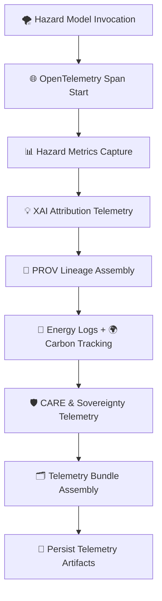

<div align="center">

# 📡🌪️⚡🔥🌊 **Hazards Telemetry & Observability**  
`docs/pipelines/ai/inference/hazards/telemetry/README.md`

**Purpose**  
Provide the full **hazards telemetry specification** for KFM v11.2.2, including:  
🌐 **OpenTelemetry spans**,  
📊 **hazard metrics**,  
📜 **PROV-O lineage**,  
💡 **XAI attribution telemetry**,  
🔋 **energy usage**,  
🌍 **carbon emissions**,  
🛡️ **FAIR+CARE + sovereignty governance**,  
🌀 **seed-locked determinism auditing**,  
for **ALL hazard classes**: severe storms, tornado, hail, flood, fire weather, heat, and winter storms.

</div>

---

## 🗂️📁⚡ **Directory Layout (Hazards Telemetry)**

```
docs/pipelines/ai/inference/hazards/telemetry/
    📄 README.md                   # ← This file
    📄 example-span.json           # OTel span example
    📄 example-provenance.json     # PROV-O lineage example
    📄 example-xai.json            # Hazard XAI telemetry
    📄 example-energy.json         # Energy usage (Wh)
    📄 example-carbon.json         # Carbon footprint (gCO2e)
```

---

## 🌩️⚡📡 **Hazards Telemetry Architecture**



---

## 🌪️📡📊 **Telemetry Categories (All Hazards)**

### 1️⃣ 🌐 OpenTelemetry Spans  
Capture:  
- Model ID + version  
- Hazard type (tornado, hail, flood, fire, heat, winter)  
- Latency per hazard component  
- Deterministic seed value  
- STAC Item lineage references  
- Input variable lists  

### 2️⃣ 📊 Hazard Metrics  
Metrics for each domain:

- **Severe Storms 🌪️**: CAPE, CIN, shear, LLJ, lapse rates, updraft proxies  
- **Tornado 🧲**: STP variants, SRH layers  
- **Hail 🌨️**: updraft strength proxies, freezing level, CAPE-heights  
- **Flood 🌊**: FI, RRHI, rise rate, soil saturation  
- **Fire Weather 🔥**: VPD, RH, wind, ERC-like dryness  
- **Heat 🌡️**: HI, WBGT, humidity stress index  
- **Winter ❄️**: wet bulb, freezing rain probability, snowfall rate, wind chill  

### 3️⃣ 💡 XAI Telemetry  
Each hazard model MUST record:

- Feature contributions  
- CAM overlays indexes  
- Spatial attribution masks  
- Variable importance tables  
- Seed-lock metadata  
- STAC-XAI asset references  

### 4️⃣ 📜 PROV-O Lineage  
Includes:

```json
{
  "prov": {
    "wasGeneratedBy": "urn:kfm:activity:hazard:abcd1234",
    "used": ["urn:kfm:data:stac:item-001", "urn:kfm:data:stac:item-002"],
    "agent": "urn:kfm:service:hazard-ai-engine"
  }
}
```

### 5️⃣ 🔋🌍 Energy + Carbon Telemetry  
Record:  
- FLOPs  
- GPU/CPU time  
- Energy consumption (Wh)  
- Carbon footprint (gCO₂e)  

### 6️⃣ 🛡️ Sovereignty + CARE Telemetry  
- Masking decisions  
- Hazard downsampling in protected regions  
- Aggregation for sensitive communities  
- CARE-scope labels  
- Sovereignty justification snippets  

---

## 🧠🌩️💡 **Hazards XAI Telemetry** (per hazard domain)

- **Storms 🌪️**  
  - Shear contributions  
  - CAPE/CIN balance attribution  
  - Dryline positioning sensitivity  

- **Tornado 🧲**  
  - SRH layer contributions  
  - Storm motion roles  

- **Hail 🌨️**  
  - Updraft attribution  
  - Thermal profile contributions  

- **Flood 🌊**  
  - Runoff/soil moisture/streamflow attribution breakdown  
  - Slope impact on FI  

- **Fire Weather 🔥**  
  - VPD & RH roles  
  - Fuel dryness mapping  

- **Heat 🌡️**  
  - Wet-bulb dominance  
  - Radiative vs humidity stress  

- **Winter ❄️**  
  - Freezing level roles  
  - Wind-chill + snowfall attribution  

---

## 🛡️⚖️🧭 **FAIR+CARE & Sovereignty Enforcement Telemetry**

Hazards telemetry MUST include:

```json
{
  "care": {
    "masking": "h3-hazard-generalized",
    "scope": "public-generalized",
    "notes": ["Hazard hotspots generalized in sovereignty-protected regions"]
  }
}
```

Monitors:

- Hazard suppression in tribal regions  
- Flooding anonymization downstream of protected sites  
- Fire-weather smoothing in ecological preserves  
- Tornado/hail hotspot mitigation for culturally sensitive areas  

---

## 🧪📏🔬 **CI Validation Requirements**

CI MUST verify:

- Hazard telemetry JSON schema validity  
- All hazard models emit telemetry  
- Seeds included in all spans  
- STAC-XAI metadata present  
- PROV fields complete  
- CARE block always included  
- Deterministic replay: telemetry === telemetry after rerun  
- Energy + carbon metrics present  
- No leakage of sensitive hazard maps  

CI failure → ❌ merge blocked.

---

## 🕰️📜 **Version History**

| Version  | Date       | Notes                                                  |
|----------|------------|--------------------------------------------------------|
| v11.2.2  | 2025-11-28 | Initial Hazards Telemetry README (MAX MODE)           |

---

<div align="center">

### 🔗 Footer  
[🌪️ Back to Hazards Pipeline](../README.md) ·  
[📁 Telemetry Examples](./examples/) ·  
[🏛 Governance](../../../../standards/governance/ROOT-GOVERNANCE.md)

</div>

