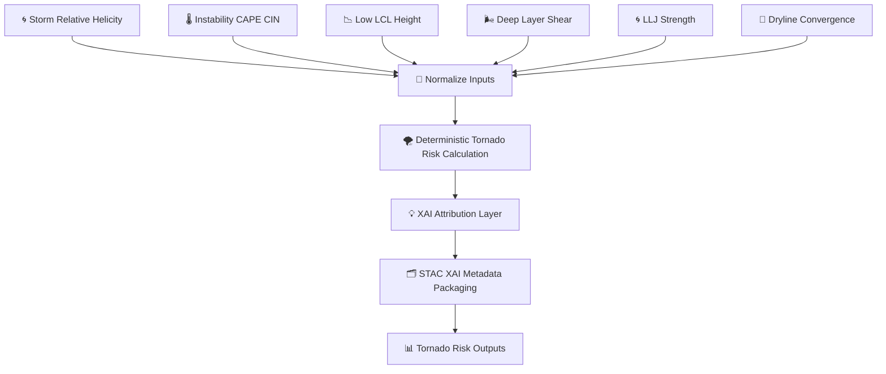

<div align="center">

# 🌪️🧲⚡ **Tornado Risk Hazard Model — KFM v11.2.2 (MAX MODE)**  
`docs/pipelines/ai/inference/hazards/tornado-risk.md`

**Purpose**  
Define the deterministic, XAI-enhanced, sovereignty-protected **Tornado Risk Model** for KFM.  
Integrates **SRH 🌀**, **CAPE 🌡️**, **LCL height 📉**, **deep-layer shear 🌬️**, **LLJ strength 🌀**,  
**dryline forcing 🌵**, and **storm-relative winds 🔄** into a unified tornado potential index  
for realtime mapping, hazard chains, and Story Node v3 meteorological narratives.

</div>

---

## 🌪️📘⚡ **Overview — Tornado Potential in KFM**

The Tornado Risk Model incorporates:

- 🌀 **Storm-Relative Helicity (SRH)** — 0–1 km / 0–3 km  
- 🌡️ **Instability (CAPE / CIN)**  
- 📉 **Low-Level LCL height** (lower = higher tornado probability)  
- 🌬️ **Deep-Layer Shear** (supercell organization)  
- 🌀 **LLJ strength** (inflow + helicity enhancement)  
- 🌵 **Dryline forcing** & moisture gradient  
- 🔄 **Storm motion vectors**  
- 🧠 **Tornado XAI** (CAM overlays + feature weights)  
- 🛡️ **FAIR+CARE masking**  
- 📜 **PROV-O lineage**  
- 🗂️ **STAC-XAI hazard catalog entry**

This model is a **deterministic analogue** of STP-like tornado parameters.

---

## 🧬🌪️⚙️ **Tornado Risk Pipeline (Mermaid-Safe)**



---

## 🌀🌡️🌬️ **Inputs Required**

### 1️⃣ 🌀 Storm Relative Helicity (SRH)  
- 0–1 km, 0–3 km  
- Derived storm motion  

### 2️⃣ 🌡️ Instability  
- CAPE (surface / mixed-layer / effective)  
- CIN to assess inhibition  

### 3️⃣ 📉 LCL Height  
- Lower LCL → larger tornado potential  
- Derived from temp/dewpoint  

### 4️⃣ 🌬️ Shear  
- Deep-layer shear (0–6 km)  
- Shear vectors for storm mode  

### 5️⃣ 🌀 LLJ  
- 850/925 mb wind maxima  
- Nocturnal inflow  

### 6️⃣ 🌵 Dryline Parameters  
- Moisture gradient  
- Surface convergence  

### Metadata  
All MUST include: CRS, units, timestamp, STAC references.

---

## ⚡🧮🌪️ **Tornado Risk Formula (ASCII-Safe)**

```
TornadoRisk =
    w1 * srh_norm
  + w2 * cape_norm
  + w3 * shear_norm
  + w4 * llj_norm
  + w5 * (1 - lcl_norm)
  + w6 * dryline_norm
```

### Deterministic Requirements  
- No probabilistic components  
- Seed-locked  
- Version-pinned weights  
- Stable floating-point order  

---

## 📦🌪️📊 **Outputs**

- `tornado_risk_grid.tif`  
- `tornado_risk_metadata.json`  
- `tornado_risk_summary.json`  
- Optional CAM layers  
- STAC-XAI Item  
- Deterministic seeds  
- Full PROV lineage  
- CARE metadata block  

---

## 💡🧠🌪️ **XAI Integration**

XAI MUST reveal:

- SRH contribution  
- CAPE impact  
- LCL sensitivity  
- Shear & LLJ effects  
- Dryline gradient influence  
- CAM overlays of tornado-favorable regions  
- Variable importance vectors  
- Seed-lock metadata  
- STAC-XAI linkage  

Example:

```json
{
  "xai": {
    "importance": {
      "srh": 0.38,
      "cape": 0.24,
      "shear": 0.18,
      "llj": 0.12,
      "lcl": 0.05,
      "dryline": 0.03
    },
    "seed": 42
  }
}
```

---

## 🛡️⚖️🌪️ **CARE + Sovereignty Enforcement**

Tornado risk fields MUST:

- Avoid revealing hyperlocal tornado-initiation zones in tribal areas  
- Generalize narrow corridors of high STP-like fields  
- Remove sensitive hotspots near protected lands  
- Include:

```json
{
  "care": {
    "masking": "h3-hazard-generalized",
    "scope": "public-generalized",
    "notes": ["Tornado risk generalized in sovereignty-protected regions"]
  }
}
```

---

## 🔒⚙️🧪 **Determinism Requirements**

- No stochastic updraft predictors  
- No random sampling of storm environments  
- Deterministic SRH computations  
- Fixed shear/lapse/CAPE evaluation order  
- CI-reproducible risk maps  

---

## 🧪📏🔬 **CI Validation Requirements**

CI MUST verify:

- CRS/units  
- Deterministic tornado risk output  
- Complete XAI metadata  
- STAC-XAI conformity  
- Full PROV-O lineage  
- CARE enforcement  
- Telemetry generation  
- All parent hazard drivers present  

Failure → ❌ CI BLOCKED.

---

## 🕰️📜 **Version History**

| Version  | Date       | Notes                                           |
|----------|------------|-------------------------------------------------|
| v11.2.2  | 2025-11-28 | Initial Tornado Risk Hazard Model (MAX MODE)    |

---

<div align="center">

### 🔗 Footer  
[🌪️ Back to Hazards Pipeline](./README.md) ·  
[⚡ Severe Storms](./severe-storms.md) ·  
[🏛 Governance](../../../../standards/governance/ROOT-GOVERNANCE.md)

</div>

