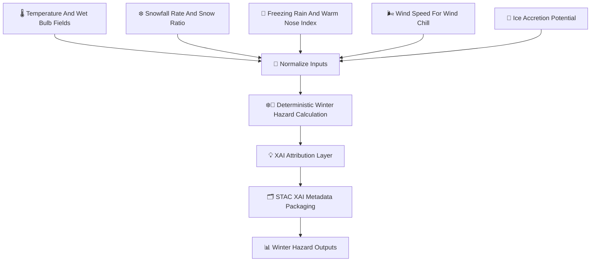

<div align="center">

# ❄️🌬️🧊 **Winter Weather Hazard Model — KFM v11.2.2 (MAX MODE)**  
`docs/pipelines/ai/inference/hazards/winter-weather.md`

**Purpose**  
Define the deterministic, FAIR+CARE–aligned, sovereignty-protected **Winter Weather Hazard Model**,  
integrating **snowfall 🌨️**, **freezing rain 🧊**, **sleet ❄️**, **ice accretion 🌬️🧊**,  
**wet-bulb & freezing-level thermodynamics ❄️🌡️**, and **wind chill 🥶** into a unified hazard index.  
Supports realtime hazard mapping, emergency response, and Story Node v3 meteorological narratives.

</div>

---

## ❄️📘🌬️ **Overview — Winter Weather in KFM**

Winter hazards require blended thermal + hydrologic + dynamic interpretation:

- 🌡️ **Wet-bulb temperature** (freezing diagnostics)  
- ❄️ **Snowfall rate** (liquid-equivalent + snow ratio)  
- 🧊 **Freezing rain potential** (warm-nose detection)  
- 🌬️ **Wind chill** (combined wind & thermal stress)  
- 🌧️ **QPF phases** (rain/snow/sleet partitioning)  
- 📉 **Ice accretion models**  
- ❄️🌬️ **Blizzard risk** (wind + visibility + snowfall synergy)  
- 🧠 **Winter XAI** for attribution + transparency  
- 🛡️ **CARE masking** for sensitive communities  
- 🗂️ **STAC-XAI** hazard representations  
- 📜 **PROV-O lineage** for full traceability  

This is one of the **most complex hazard domains** due to overlapping physics.

---

## 🧬❄️⚙️ **Winter Weather Pipeline Architecture (Mermaid-Safe)**



---

## 🌡️❄️🧊 **Inputs Required**

### 1️⃣ 🌡️ Temperature & Wet-Bulb  
- Surface & vertical temperatures  
- Wet-bulb (psychrometric)  
- Freezing-level detection  

### 2️⃣ ❄️ Snowfall  
- Snowfall rate  
- Liquid-equivalent  
- Snow ratio (deterministic)  

### 3️⃣ 🧊 Freezing Rain  
- Warm-nose depth  
- Subfreezing surface layer  
- Precip type classification  

### 4️⃣ 🌬️ Wind Chill  
- 10 m wind  
- Surface temp  

### 5️⃣ 🧊 Ice Accretion  
- Accretion efficiency  
- Rainfall rate  
- Surface thermodynamics  

All MUST include CRS, units, timestamp, STAC references, and PROV metadata.

---

## ⚡🧮❄️ **Winter Hazard Formula (ASCII-Safe)**

```
WinterHazardIndex =
    w1 * snowfall_norm
  + w2 * freezing_rain_norm
  + w3 * ice_accretion_norm
  + w4 * wind_chill_norm
  + w5 * wetbulb_norm
```

Weights MUST be version-pinned & deterministic.

---

## 📦❄️📊 **Outputs**

Outputs MUST include:

- `winter_hazard_grid.tif`  
- `winter_freezing_rain_grid.tif`  
- `winter_snowfall_grid.tif`  
- `winter_windchill_grid.tif`  
- `winter_hazard_metadata.json`  
- `winter_hazard_summary.json`  
- Optional CAM maps  
- STAC-XAI Item  
- Deterministic seed metadata  
- Full PROV lineage  
- CARE block  

---

## 💡🧠❄️ **XAI Integration**

XAI MUST expose:

- Snowfall vs freezing rain contributions  
- Wet-bulb vs warm-nose analysis  
- Wind chill importance  
- Ice accretion sensitivity  
- CAM overlays for winter hazards  
- STAC-XAI linkage  
- Seed metadata  

Example:

```json
{
  "xai": {
    "importance": {
      "snowfall": 0.28,
      "freezing_rain": 0.33,
      "ice_accretion": 0.19,
      "wind_chill": 0.12,
      "wetbulb": 0.08
    },
    "seed": 42
  }
}
```

---

## 🛡️⚖️❄️ **CARE + Sovereignty Enforcement**

Winter hazards MUST:

- Generalize high-risk ice-accretion hotspots in sovereignty-protected regions  
- Remove hyperlocal freezing-rain vulnerability signals  
- Apply H3-based hazard smoothing  
- Include:

```json
{
  "care": {
    "masking": "h3-hazard-generalized",
    "scope": "public-generalized",
    "notes": ["Winter hazard values generalized in sovereignty-protected areas"]
  }
}
```

---

## 🔒⚙️🧪 **Determinism Requirements**

- Deterministic snow ratio  
- Deterministic warm-nose detection  
- Fixed psychrometric evaluation order  
- No stochastic precipitation-type algorithms  
- Seed-lock for system reproducibility  

---

## 🧪📏🔬 **CI Validation Requirements**

CI MUST ensure:

- CRS/units  
- Deterministic outputs  
- Accurate STAC-XAI annotation  
- Full PROV lineage  
- CARE enforcement  
- XAI metadata completeness  
- Telemetry presence  
- All hazard drivers linked correctly  

CI failure → ❌ BLOCK.

---

## 🕰️📜 **Version History**

| Version  | Date       | Notes                                             |
|----------|------------|---------------------------------------------------|
| v11.2.2  | 2025-11-28 | Initial Winter Weather Hazard Model (MAX MODE)    |

---

<div align="center">

### 🔗 Footer  
[🌪️ Back to Hazards Pipeline](./README.md) ·  
[❄️ Winter Weather Models](./) ·  
[🏛 Governance](../../../../standards/governance/ROOT-GOVERNANCE.md)

</div>

