<div align="center">

# 💡🌪️🔥🌊🌡️❄️ **Hazards XAI Subsystem — KFM v11.2.2 (MAX MODE)**  
`docs/pipelines/ai/inference/hazards/xai-hazards.md`

**Purpose**  
Define the **explainability subsystem** for all **KFM hazard models**, providing  
deterministic, sovereignty-safe, FAIR+CARE–governed **XAI** for:

🌪️ Tornado Risk  
⛈️ Severe Storms  
🌨️ Hail  
🌊 Flood & Flash-Flood  
🔥 Fire Weather  
🌡️ Heat Risk  
❄️ Winter Weather  
🌀 Multi-Hazard Composite

This file establishes **CAM overlays**, **feature importance**, **seed-locked attribution**,  
**STAC-XAI metadata**, and **PROV-O lineage** for all hazard inference.

</div>

---

## 🔥🌪️💡 **Overview — Why Hazards XAI?**

Hazard outputs influence:

- Emergency management  
- Tribal & community risk planning  
- Public health  
- Infrastructure protection  
- Disaster preparedness  
- Agricultural impact analysis  

Therefore hazard AI must be:

- **Deterministic** (no randomness)  
- **Transparent** (XAI + narrative drivers)  
- **FAIR+CARE compliant**  
- **Sovereignty-Respectful**  
- **Scientifically grounded**  
- **Explainable in watershed & storm-space**

Hazards XAI enables:

- 🌩️ Storm-level driver attribution  
- 🌪️ Tornado environment decomposition  
- 🌨️ Hail updraft + freezing-layer contributions  
- 🌊 Flood hydrology attribution  
- 🔥 Fire dryness + wind contribution scoring  
- 🌡️ Heat index dominance patterns  
- ❄️ Winter hazard thermodynamic reasoning  
- 🌀 Multi-hazard stacking transparency  

---

## 🧬💡⚙️ **Hazards XAI Architecture (Mermaid-Safe)**

```mermaid
flowchart TD
    A[⚡ Hazard Model Output] --> B[📦 Collect Inputs And Metadata]
    B --> C[🎛️ Select XAI Method]
    C --> D[💡 Compute Attributions]
    D --> E[🗺️ Generate CAM Layers]
    E --> F[📊 Feature Importance Tables]
    F --> G[🧾 Assemble STAC XAI Assets]
    G --> H[📜 Attach PROV And CARE Metadata]
    H --> I[💽 Emit XAI Results]
```



---

## 🌪️⛈️🌨️ **Hazard-Specific XAI Logic**

### 1️⃣ ⛈️ Severe Storms XAI  
Explains the roles of:

- CAPE  
- CIN  
- Shear  
- LLJ  
- Lapse rates  
- Dryline forcing  

### 2️⃣ 🌪️ Tornado XAI  
Explains:

- SRH  
- CAPE/CIN balance  
- Shear & LLJ  
- LCL height  
- Dryline convergence  

### 3️⃣ 🌨️ Hail XAI  
Explains:

- CAPE + lapse rates  
- Updraft proxy  
- Freezing-level height  
- Storm-top thermodynamics  

### 4️⃣ 🌊 Flood XAI  
Explains:

- Runoff  
- Soil saturation  
- Streamflow rise  
- Accumulation paths  
- Precip burst  

### 5️⃣ 🔥 Fire Weather XAI  
Explains:

- VPD  
- RH  
- Wind  
- Fuel dryness  
- Radiation loading  

### 6️⃣ 🌡️ Heat XAI  
Explains:

- Temperature  
- Humidity stress  
- WBGT  
- Overnight heat  
- Radiation  

### 7️⃣ ❄️ Winter XAI  
Explains:

- Snowfall rate  
- Freezing rain potential  
- Wind chill  
- Ice accretion  
- Wet-bulb fields  

### 8️⃣ 🌀 Composite Hazard XAI  
Explains weighted stack contributions across all hazard domains.

---

## 🗺️🌀💡 **CAM Overlays (Hazard-Wide)**

CAM (Class Activation Map) overlays MUST be:

- Watershed-safe  
- Sovereignty-safe (H3 generalized)  
- Deterministic  
- STAC-XAI linked  

Example STAC asset block:

```json
{
  "assets": {
    "xai_cam_hail": {
      "href": "s3://kfm/hazards/xai/hail_cam_2025-06-03.tif",
      "roles": ["xai", "explanation"],
      "type": "image/tiff"
    }
  }
}
```

---

## 📊📈💡 **Feature Importance (Hazard-Wide)**

Every hazard MUST include a deterministic **importance vector**:

```json
{
  "xai": {
    "importance": {
      "cape": 0.28,
      "shear": 0.19,
      "llj": 0.13,
      "soil_moisture": 0.17,
      "vpd": 0.10,
      "snowfall": 0.06,
      "heat_index": 0.07
    }
  }
}
```

Importance MUST map exactly to the variables used in the hazard-driver model.

---

## 🛡️⚖️🌎 **FAIR+CARE & Sovereignty Enforcement for XAI**

Hazards XAI MUST:

- Mask or generalize sensitive hazard signatures inside tribal boundaries  
- Smooth or downsample CAM overlays in sovereignty zones  
- Redact hyperlocal risk-driving features  
- Include sovereignty decision metadata:

```json
{
  "care": {
    "masking": "h3-hazard-generalized",
    "scope": "public-generalized",
    "notes": ["Hazard XAI generalized to protect sovereignty-sensitive communities"]
  }
}
```

---

## 📜🧾🌪️ **PROV-O Integration**

All hazards XAI MUST embed complete provenance:

```json
{
  "prov": {
    "wasGeneratedBy": "urn:kfm:activity:xai:hazard:abcd",
    "used": [
      "urn:kfm:data:stac:hail_item",
      "urn:kfm:data:stac:storm_item"
    ],
    "agent": "urn:kfm:service:hazard-xai-engine"
  }
}
```

This ensures explainability → lineage → governance traceability.

---

## 🔒⚙️🧪 **Determinism Requirements**

Hazards XAI MUST be:

- Seed-locked  
- Reproducible across hardware  
- Free of stochastic sampling  
- Stable in floating-point evaluation  
- CI-repeatable  

---

## 🧪📏🔬 **CI Validation Requirements**

CI MUST:

- Validate XAI JSON against hazard schemas  
- Validate CARE block presence  
- Validate STAC-XAI linkage  
- Validate PROV-O completeness  
- Validate determinism across runs  
- Validate XAI variable names match hazard-driver metadata  
- Validate no sovereignty leakage through XAI maps  

Failure → ❌ CI BLOCK.

---

## 🕰️📜 **Version History**

| Version  | Date       | Notes                                           |
|----------|------------|-------------------------------------------------|
| v11.2.2  | 2025-11-28 | Initial Hazards XAI Subsystem (MAX MODE)        |

---

<div align="center">

### 🔗 Footer  
[⚡ Back to Hazards Pipeline](./README.md) ·  
[🌀 Hazard Models](./) ·  
[🏛 Governance](../../../../standards/governance/ROOT-GOVERNANCE.md)

</div>

