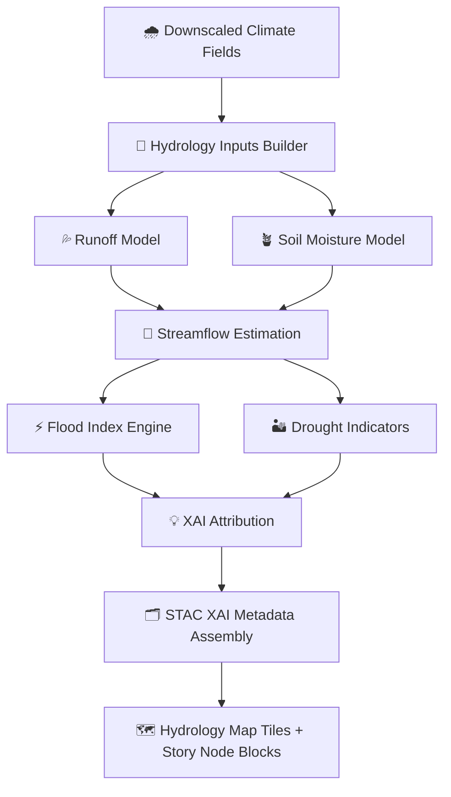

<div align="center">

# 💧🌊📈⚡ **Hydrology AI Inference — KFM v11.2.2**  
`docs/pipelines/ai/inference/hydrology/README.md`

**Purpose**  
Provide a **FAIR+CARE-governed**, **deterministic**, **XAI-ready**, and **sovereignty-aware** AI hydrology pipeline.  
Supports realtime + batch inference across **runoff 🌧️**, **flooding 🌊**, **soil moisture 🪴**,  
**streamflow 📈**, **drought 🏜️**, **watershed hazards 🌀**, and **environmental narratives 🧠**.

Outputs power:  
- Hazard chains (flash flood → rapid runoff → streamflow surge)  
- Agricultural water insights  
- Watershed-scale decision support  
- Story Node v3 hydrology context  
- Focus Mode v3 AI narrative overlays  

</div>

---

## 💧📘🌎 **Overview — Hydrology AI System (MAX MODE)**

The KFM Hydrology Inference System blends:

- 🌧️ **Precipitation** (downscaled + bias-corrected)  
- 🪴 **Soil moisture** (absolute + anomaly)  
- 🌡️ **Evapotranspiration** (ET)  
- 🗺️ **Terrain derivatives** (slope, aspect, flow direction, contributing area)  
- 🧭 **Watershed topology** (NHD streams + DEM routing)  
- ⚡ **Runoff + rapid runoff indices**  
- 🌊 **Streamflow magnitude + rise rate**  
- 🌀 **Flood index (FPI/FFI)**  
- 🏜️ **Drought indicators (SPI, SPEI, SSI)**  
- 🧠 **Hydrology XAI** (CAM-like watershed overlays)  
- 🛡️ **CARE + Sovereignty masking** (protected watersheds auto-generalized)

All models run **deterministically** under strict seed-lock rules.

---

## 📂🗂️💧 **Directory Layout (v11.2.2 MAX MODE)**

```
docs/pipelines/ai/inference/hydrology/
    📄 README.md                        # This file (MAX MODE)
    📄 runoff-driver.md                 # 🌧️ Runoff & rapid-runoff models
    📄 soil-moisture-driver.md          # 🪴 Soil moisture + anomaly modeling
    📄 streamflow-driver.md             # 🌊 Streamflow magnitudes & routing
    📄 flood-index.md                   # ⚠️ Flood probability / flash-flood indices
    📄 drought-index.md                 # 🏜️ SPI/SPEI/SSI drought analytics
    📄 xai-hydrology.md                 # 💡 XAI interpretability for hydrology drivers
    📁 telemetry/                       # 📊 OTel + PROV-O + energy/carbon examples
        📄 README.md
```

---

## 🌀🧬💦 **Hydrology Pipeline Architecture**



---

## 🌧️⚙️🔧 **Hydrology Driver Models**

### 1️⃣ 🌧️ **Runoff Driver (CN/ML Hybrid)**
- Precip-intensity–soil-interaction model  
- DEM-informed topographic wetness  
- Rapid Runoff Hazard Index (RRHI)  

### 2️⃣ 🪴 **Soil Moisture Driver**
- Water balance + ET model  
- Multi-layer soil moisture (surface/deep)  
- Deterministic anomaly engine  

### 3️⃣ 🌊 **Streamflow Driver**
- Deterministic routing model (DEM-based)  
- ML-assisted magnitude estimation (optional)  
- Flood-wave timing + rise-rate indicators  

### 4️⃣ ⚠️ **Flood Index**
- FPI / FFI composites  
- Runoff × soil moisture × slope × streamflow × rainfall burst  

### 5️⃣ 🏜️ **Drought Indicators**
- SPI / SPEI / SSI deterministic windows  
- Seasonal + multi-year drought cycles  
- CARE-governed smoothing in sensitive ecological zones  

---

## 🛡️🌱⚖️ **FAIR+CARE + Sovereignty Enforcement**

Hydrology outputs MUST:

- 🟦 Apply **H3 watershed masking** in tribal or protected regions  
- 🌱 Avoid disclosing sensitive ecological hydrology states  
- ⚖️ Include CARE metadata (`masking`, `scope`, `notes`)  
- 🧭 Respect water-resource sovereignty boundaries  
- 🧾 Embed PROV-O lineage for all transformations  

Example block:

```json
{
  "care": {
    "masking": "h3-watershed-generalized",
    "scope": "public-generalized",
    "notes": ["Hydrology fields generalized in sovereignty-protected basins"]
  }
}
```

---

## 💡🌊📊 **XAI for Hydrology (Watershed-Aware)**

Hydrology XAI MUST include:

- Feature contributions:  
  - precip intensity 🌧️  
  - soil moisture 🪴  
  - ET 🌡️  
  - slope/flow direction 🗺️  
  - streamflow history 🌊  
- Spatial watershed CAM overlays  
- Deterministic seed-lock  
- STAC-XAI asset references  
- PROV-O lineage for transparency  

---

## 📦🗂️🌧️ **Outputs**

The pipeline produces:

- Hydrology map tiles (raster)  
- Runoff / soil-moisture / streamflow COGs  
- Flood index rasters (hazard-level)  
- Drought index timeseries (SPI/SPEI/SSI)  
- STAC Items for each hydrology domain product  
- Telemetry bundles (energy, carbon, trace spans, XAI runtimes)  
- Story Node v3 hydrology context blocks  

---

## 🧪🛠️📏 **CI Validation Requirements**

CI MUST enforce:

- Deterministic outputs  
- CRS + vertical axis consistency  
- STAC-XAI conformance  
- Provenance completeness  
- CARE + sovereignty constraints  
- Telemetry validation  
- No missing hydrology-driver metadata  
- Seed-lock behavior across all inference steps  

Failure → ❌ merge blocked.

---

## 🕰️📜 **Version History**

| Version  | Date       | Notes                                      |
|----------|------------|---------------------------------------------|
| v11.2.2  | 2025-11-28 | Initial MAX-EMOJI hydrology pipeline README |

---

<div align="center">

### 🔗 Footer  
[💧 Back to Hydrology Models](./) ·  
[🌡️ Climate Inference Root](../README.md) ·  
[🏛 Governance](../../../standards/governance/ROOT-GOVERNANCE.md)

</div>

