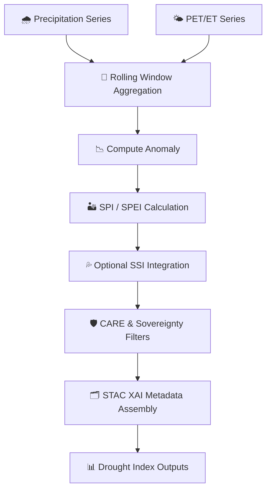

<div align="center">

# 🏜️📉💧 **Drought Index Model (SPI · SPEI · SSI)**  
`docs/pipelines/ai/inference/hydrology/drought-index.md`

**Purpose**  
Define the deterministic **drought index modeling** subsystem for KFM hydrology inference, including  
**SPI (Standardized Precipitation Index)**, **SPEI (Standardized Precipitation–Evapotranspiration Index)**,  
and **SSI (Soil Moisture Index)**.  
Outputs support drought monitoring, agricultural intelligence, hazard-chain context, and  
Story Node v3 environmental narratives — all under FAIR+CARE + sovereignty governance.

</div>

---

## 💧📘🏜️ **Overview — Drought Modeling in KFM**

The Drought Index System integrates climate + hydrology fields:

- 🌧️ Precipitation (downscaled, bias-corrected)  
- 🌤️ Evapotranspiration (PET/ET)  
- 💦 Soil moisture (absolute + anomaly)  
- 🌡️ Temperature (for SPEI energy balance)  
- 🗺️ Watershed-level flow + soil type properties  
- 🧭 Multi-timescale rolling windows (1/3/6/12/24 months)  
- 🧠 AI-enhanced drought tendency indicators  
- 🛡️ CARE + sovereignty-safe drought dissemination  

Outputs are deterministic, seed-locked, and aligned to STAC-XAI + PROV-O.

---

## 🗂️📁🏜️ **Drought Index Directory Layout (v11.2.2)**

```
docs/pipelines/ai/inference/hydrology/
    📄 drought-index.md           # ← This file (MAX EMOJI MODE)
    📄 runoff-driver.md
    📄 soil-moisture-driver.md
    📄 streamflow-driver.md
    📄 flood-index.md
    📄 xai-hydrology.md
    📁 telemetry/
```

---

## 🧬📈🌧️ **Drought Index Pipeline**



---

## 🌡️📉📊 **Model Types & Formulas**

### 1️⃣ **SPI — Standardized Precipitation Index**
Based on **precip-only** deficits:

```
SPI = (P - mean_P) / std_P
```

### 2️⃣ **SPEI — Standardized Precipitation–Evapotranspiration Index**
Water-balance driven:

```
D = P - PET
SPEI = (D - mean_D) / std_D
```

### 3️⃣ **SSI — Soil Moisture Index**
Hydrologically grounded:

```
SSI = (SM - mean_SM) / std_SM
```

Where:  
- `P` = precipitation  
- `PET` = potential evapotranspiration  
- `SM` = soil moisture  

All windows MUST be seed-locked + reproducible.

---

## 🧱🔧💧 **Input Requirements**

### 🌧️ Precipitation  
- Downscaled, bias-corrected  
- Daily/monthly granularity  

### 🌤️ ET/PET  
- Derived from temperature, humidity, solar radiation  

### 💦 Soil Moisture  
- Absolute + anomaly fields  
- Watershed-scale smoothing  

### 🗺️ Metadata  
- CRS (`EPSG:4326`)  
- Units (`mm`, `mm/day`, `mm/month`, etc.)  
- Temporal precision  

---

## 📦🗂️📉 **Outputs**

- `drought_spi_grid.tif`  
- `drought_spei_grid.tif`  
- `drought_ssi_grid.tif`  
- `drought_index_metadata.json`  
- `drought_index_summary.json`  
- STAC Items (SPI/SPEI/SSI)  
- Deterministic seeds  
- PROV-O lineage  
- CARE metadata block  

---

## 💡🧠🌍 **XAI for Drought Index**

XAI MUST include:

- Variable contributions (P, ET, SM, PET deficits)  
- Sensitivity to rolling-window width  
- CAM overlays for watershed dryness patterns  
- Deterministic attribution grids  
- Full XAI metadata in STAC Items  

---

## 🛡️⚖️🧭 **CARE + Sovereignty Enforcement**

Drought indices MUST:

- Smooth sensitive watershed regions  
- Avoid disclosing hyperlocal dryness anomalies  
- Apply H3 watershed masking  
- Include sovereignty-safe metadata:

```json
{
  "care": {
    "masking": "h3-watershed-generalized",
    "scope": "public-generalized",
    "notes": ["Drought metrics generalized in sovereignty-protected basins"]
  }
}
```

---

## 🧪🔬📏 **CI Validation Requirements**

CI MUST validate:

- Deterministic rolling-window computation  
- CRS + units correctness  
- PROV-O completeness  
- STAC-XAI metadata correctness  
- CARE block always present  
- No missing drought index variables  
- Energy + carbon telemetry included  
- Metadata schemas pass validation  

Failure → ❌ merge blocked.

---

## 🕰️📜 **Version History**

| Version  | Date       | Notes                                       |
|----------|------------|----------------------------------------------|
| v11.2.2  | 2025-11-28 | Initial drought-model documentation (MAX MODE) |

---

<div align="center">

### 🔗 Footer  
[💧 Back to Hydrology Pipeline](./README.md) ·  
[🌊 Hydrology Drivers](./) ·  
[🏛 Governance](../../../../standards/governance/ROOT-GOVERNANCE.md)

</div>

