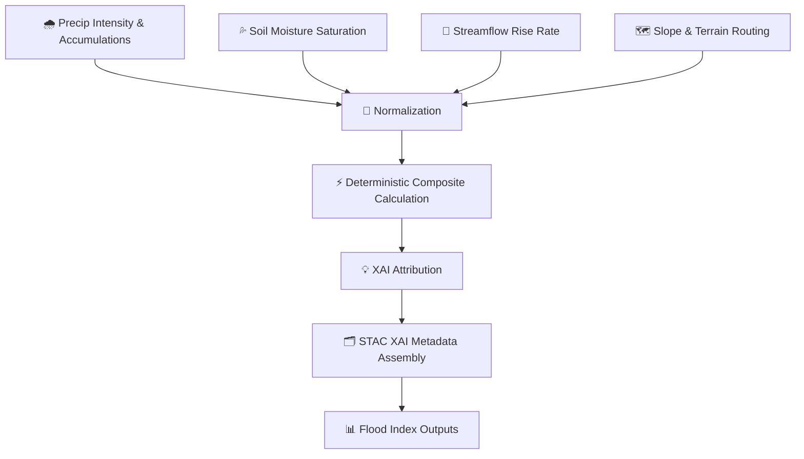

<div align="center">

# 🌊⚠️📈💧 **Flood Index Model (FFI/FPI) — Hydrology AI**  
`docs/pipelines/ai/inference/hydrology/flood-index.md`

**Purpose**  
Define the deterministic, XAI-ready, sovereignty-aware **Flood Index model** for the KFM Hydrology  
Inference System.  
Integrates **runoff surges**, **soil moisture saturation**, **streamflow rise rates**, **terrain slope**,  
and **precipitation bursts**, producing watershed-scale flood hazard indicators for:  
- Realtime hazard monitoring ⚠️  
- Flash-flood risk analytics 🌊  
- Story Node v3 hydrology narratives 📖  
- Focus Mode v3 watershed overlays 🧠  

All outputs MUST follow **FAIR+CARE**, **PROV-O**, **STAC-XAI**, and **KFM-PDC v11** requirements.

</div>

---

## 🌧️🌊📈 **Overview — The Flood Index Concept**

Flood Index (FI) provides a composite hazard score by blending:

- 🌧️ **Rainfall intensity** (rate, duration, burstiness)  
- 💦 **Soil moisture saturation** (absolute + anomaly)  
- 🌊 **Streamflow magnitude & rise rate**  
- 🗺️ **DEM terrain slope & flow direction**  
- 🌪️ **Runoff surges** (RRHI)  
- 🌫️ **Antecedent wetness** (short/long window)  

The result: a deterministic, interpretable, multi-factor watershed hazard indicator.

---

## 🗂️📁🌧️ **File Placement (Hydrology Model Layout)**

```
docs/pipelines/ai/inference/hydrology/
    📄 flood-index.md               # ← This file
    📄 runoff-driver.md
    📄 soil-moisture-driver.md
    📄 streamflow-driver.md
    📄 drought-index.md
    📄 xai-hydrology.md
    📁 telemetry/
```

---

## 🧬🌧️🌀 **Flood Index Pipeline Architecture**



---

## 🌡️📊⚙️ **Model Inputs**

### 1️⃣ 🌧️ **Precipitation Inputs**
- Intensity (mm/hr)  
- Burst index  
- Rolling-window accumulations  

### 2️⃣ 💦 **Soil Moisture Inputs**
- Multi-layer soil moisture  
- Anomaly from climatology  
- Saturation index  

### 3️⃣ 🌊 **Streamflow Inputs**
- Discharge magnitude  
- Rise rate (ΔQ/Δt)  
- Routing metadata  

### 4️⃣ 🗺️ **Terrain Inputs**
- Slope  
- Flow direction  
- TWI (topographic wetness index)  

Each MUST include:  
- CRS (`EPSG:4326`)  
- Units  
- Temporal metadata (ISO 8601)  

---

## ⚡🧮📉 **Flood Index Formula (ASCII-Safe)**

Composite hazard calculation:

```
FI =
    w1 * runoff_norm
  + w2 * soil_sat_norm
  + w3 * streamflow_rise_norm
  + w4 * slope_norm
  + w5 * precip_burst_norm
```

Where:

- `w1…w5` are deterministic weights (seed-locked)  
- All `_norm` values are standardized per watershed  

Runoff normalization:

```
runoff_norm = (runoff - mean_runoff) / std_runoff
```

Streamflow rise rate:

```
rise_norm = (ΔQ/Δt) / rise_scale
```

---

## 📦🗂️🌊 **Outputs**

Flood Index model MUST produce:

- `flood_index_grid.tif` (COG)  
- `flood_index_metadata.json`  
- `flood_index_summary.json`  
- STAC Item with FI metadata  
- Deterministic seeds  
- PROV-O lineage  
- CARE metadata  

---

## 💡🧠📈 **XAI Integration for Flood Index**

XAI MUST reveal:

- Contribution of precip intensity  
- Slope influence on hazard distribution  
- Soil moisture impact weight  
- Runoff/streamflow interplay  
- Deterministic attribution maps  
- Feature importance tables  
- STAC-XAI linking  

XAI artifacts include:

- CAM overlays  
- Hydrology variable contribution bars  
- Watershed hotspot maps  

---

## 🛡️⚖️🧭 **CARE + Sovereignty Enforcement**

Flood Index MUST NOT reveal hyperlocal hazards inside protected tribal or ecological basins.

Thus:

- Apply **H3 watershed generalization**  
- Reduce spatial precision of FI maxima  
- Attach sovereignty-safe metadata:

```json
{
  "care": {
    "masking": "h3-watershed-generalized",
    "scope": "public-generalized",
    "notes": ["Flood Index generalized within sovereignty-protected watersheds"]
  }
}
```

---

## 🔒⚙️🧪 **Determinism Requirements**

Flood Index MUST follow:

- Fixed seed operations  
- Deterministic normalization  
- No random ensemble simulations  
- Reproducible floating-point operations  
- Deterministic watershed boundaries  

---

## 🧪📏🔬 **CI Validation Requirements**

CI MUST validate:

- CRS + units  
- Deterministic FI output  
- XAI metadata  
- STAC-XAI compliance  
- PROV lineage completeness  
- CARE block present  
- No missing drivers  
- All watershed boundaries respected  
- Energy + carbon telemetry present  

Failure → ❌ merge blocked.

---

## 🕰️📜 **Version History**

| Version  | Date       | Notes                                           |
|----------|------------|-------------------------------------------------|
| v11.2.2  | 2025-11-28 | Initial Flood Index documentation (MAX MODE)    |

---

<div align="center">

### 🔗 Footer  
[💧 Back to Hydrology Pipeline](./README.md) ·  
[🌊 Hydrology Models](./) ·  
[🏛 Governance](../../../../standards/governance/ROOT-GOVERNANCE.md)

</div>

