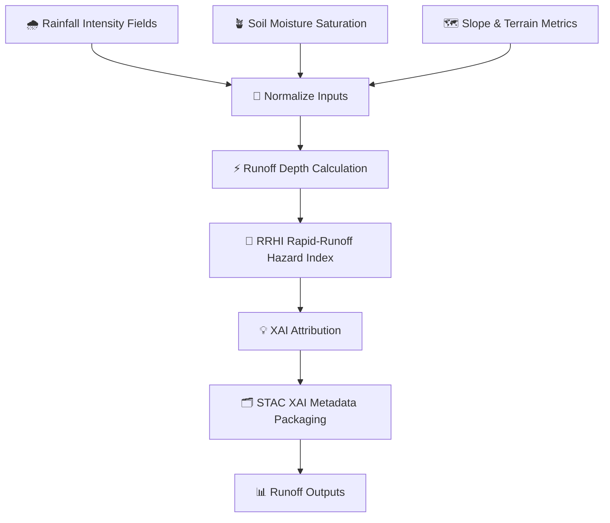

<div align="center">

# 🌧️⚡💧 **Runoff Driver Model**  
`docs/pipelines/ai/inference/hydrology/runoff-driver.md`

**Purpose**  
Define the deterministic, FAIR+CARE-compliant, watershed-aware **Runoff Driver** used to convert  
rainfall intensity into **runoff depth**, **runoff anomaly**, and the **Rapid-Runoff Hazard Index (RRHI)**.  
Feeds the **Flood Index**, **Streamflow Driver**, and Story Node v3 hydrology narratives.

</div>

---

## 🌧️📘💧 **Overview — Rainfall → Runoff Conversion**

The Runoff Driver integrates:

- 🌧️ **Rainfall intensity & accumulations** (downscaled, bias-corrected)  
- 🪴 **Soil moisture saturation** (absolute + anomaly)  
- 🗺️ **Terrain slope, TWI, flow direction**  
- 🧭 **Watershed routing**  
- 🌡️ **ET & infiltration potential**  
- 🧩 **Curve Number (CN) hydrology modeling**  
- 🧠 **AI-enhanced runoff prediction** (optional, deterministic)

Outputs must be **seed-locked**, **XAI-ready**, and **SAFE under sovereignty & ecological protections**.

---

## 🗂️📁💧 **Directory Placement**

```
docs/pipelines/ai/inference/hydrology/
    📄 runoff-driver.md          # ← This file
    📄 soil-moisture-driver.md
    📄 streamflow-driver.md
    📄 flood-index.md
    📄 drought-index.md
    📄 xai-hydrology.md
    📁 telemetry/
```

---

## 🧬🌧️💦 **Runoff Driver Pipeline Architecture**



---

## 🧱🔧🌧️ **Input Requirements**

### 1️⃣ 🌧️ Precipitation  
- Downscaled & bias-corrected  
- Intensity + accumulations  
- Temporal granularity: hourly / sub-hourly (if available)

### 2️⃣ 🪴 Soil Moisture  
- Layered (surface/deep)  
- Saturation index  
- Watershed-mean smoothing  

### 3️⃣ 🗺️ Terrain & Routing  
- DEM slope  
- TWI (topographic wetness index)  
- Flow direction grid  
- Watershed boundaries  

### 4️⃣ 🌡️ ET & Infiltration  
- PET / ET estimates  
- Optional infiltration modeling for drought vs wet regimes  

All inputs MUST include:  
- CRS (`EPSG:4326`)  
- Units  
- ISO-8601 timestamps  

---

## ⚡📈💧 **Runoff Depth Formula (ASCII-Safe)**

Deterministic CN-based method:

```
S = (25400 / CN) - 254
Ia = 0.2 * S
runoff = ((P - Ia)^2) / (P + 0.8*S)
```

Where:  
- `P` = rainfall depth  
- `CN` = Curve Number (soil/land-cover dependent)  
- Slope/soil corrections applied deterministically  

For ML-enhanced mode:

```
runoff = f(P, SM, slope, ET, landcover)    # deterministic seed-locked model
```

---

## 🚨⚡📊 **RRHI — Rapid-Runoff Hazard Index**

```
RRHI = runoff_norm * soil_sat_norm * precip_burst_norm * slope_norm
```

- Highlights fast hydrologic response regions  
- Feeds Flood Index → hazard chains  
- Sovereignty-governed masking applied  

---

## 📦🗂️🌧️ **Outputs**

The driver MUST produce:

- `runoff_grid.tif`  
- `runoff_metadata.json`  
- `runoff_summary.json`  
- `rrhi_grid.tif`  
- STAC Item with hydrology metadata  
- Deterministic seed metadata  
- PROV-O lineage  
- CARE compliance fields  

---

## 💡🧠📈 **XAI Integration**

Hydrology XAI MUST include:

- Attribution for:  
  - Precip intensity  
  - Soil moisture saturation  
  - ET  
  - Slope/TWI  
  - Watershed routing  
- Spatial CAM overlays  
- Deterministic seed metadata  
- STAC-XAI asset links  
- PROV lineage  

---

## 🛡️⚖️🧭 **CARE + Sovereignty Enforcement**

Runoff outputs MUST:

- Apply H3 watershed-generalization inside protected basins  
- Downsample hyperlocal slopes if revealing sensitive terrain  
- Mask RRHI hotspots in sovereignty regions  
- Include CARE metadata:

```json
{
  "care": {
    "masking": "h3-watershed-generalized",
    "scope": "public-generalized",
    "notes": ["Runoff and RRHI generalized in sovereignty-protected basins"]
  }
}
```

---

## 🔒⚙️🧪 **Determinism Requirements**

- No stochastic sampling  
- CN parameters fixed  
- DEM derivatives deterministic  
- Seed-locked ML mode  
- Floating-point summation order fixed  

---

## 🧪📏🔬 **CI Validation Requirements**

CI MUST validate:

- CRS + units correct  
- Deterministic outputs stable  
- Runoff + RRHI present  
- XAI metadata complete  
- STAC-XAI compliant  
- PROV lineage present  
- CARE block applied  
- Telemetry references correct  

Failure → ❌ merge blocked.

---

## 🕰️📜 **Version History**

| Version  | Date       | Notes                                   |
|----------|------------|-----------------------------------------|
| v11.2.2  | 2025-11-28 | Initial Runoff Driver (MAX EMOJI MODE) |

---

<div align="center">

### 🔗 Footer  
[💧 Back to Hydrology Pipeline](./README.md) ·  
[🌊 Hydrology Models](./) ·  
[🏛 Governance](../../../../standards/governance/ROOT-GOVERNANCE.md)

</div>

