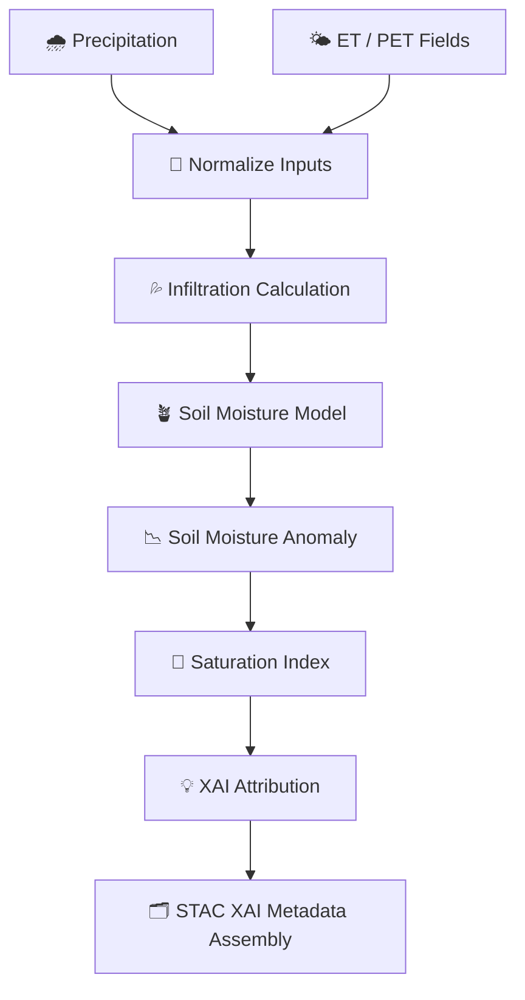

<div align="center">

# 🪴💧📉 **Soil Moisture Driver Model**  
`docs/pipelines/ai/inference/hydrology/soil-moisture-driver.md`

**Purpose**  
Define the watershed-scale, deterministic, FAIR+CARE-governed **Soil Moisture Driver**, including:  
- **Absolute soil moisture** (surface & root-zone)  
- **Saturation index**  
- **Soil moisture anomaly**  
- **Water balance model integration**  
- **Hydrology XAI attribution maps**  
- **Sovereignty-safe watershed reporting**

Outputs feed the **Runoff Driver**, **Flood Index**, **Streamflow Driver**, and **Drought Index (SSI)**.

</div>

---

## 🪴📘💧 **Overview — Soil Moisture in Hydrology AI**

The Soil Moisture Driver uses:

- 🌧️ Precip intensity & accumulation  
- 🌤️ ET (evapotranspiration) & PET  
- 💦 Infiltration capacity  
- 🪨 Soil type & hydraulic conductivity  
- 🗺️ DEM terrain (slope, TWI)  
- 🌀 Runoff inputs (feedback)  
- 🌡️ Temperature + radiation forcing  
- 🧠 AI enhancements (deterministic) for infiltration & recharge  

It produces:

- Surface soil moisture  
- Root-zone soil moisture  
- Moisture anomaly  
- Saturation index  
- Slope-weighted wetness  

All outputs MUST be deterministic and seed-locked.

---

## 🗂️📁🪴 **Directory Placement (v11.2.2)**

```
docs/pipelines/ai/inference/hydrology/
    📄 soil-moisture-driver.md     # ← This file
    📄 runoff-driver.md
    📄 streamflow-driver.md
    📄 flood-index.md
    📄 drought-index.md
    📄 xai-hydrology.md
    📁 telemetry/
```

---

## 🧬💦⚙️ **Soil Moisture Pipeline Architecture**



---

## 🌡️🌧️💦 **Input Requirements**

### 1️⃣ 🌧️ Precipitation (P)
- Downscaled & bias-corrected  
- Hourly/daily cumulative precipitation  
- Intensities for infiltration vs runoff partitioning  

### 2️⃣ 🌤️ ET & PET
- Derived from climate fields  
- Required for water balance closure  

### 3️⃣ 🪴 Soil Type & Properties
- Hydraulic conductivity  
- Porosity  
- Field capacity & wilting point  

### 4️⃣ 🗺️ Terrain
- Slope  
- Flow direction  
- TWI  

### 5️⃣ 💧 Water-Balance Components
- Infiltration  
- Recharge  
- Baseflow coupling (optional)

All MUST include CRS, units, and temporal metadata.

---

## 🧮📉🪴 **Core Formulas (ASCII-Safe)**

### **Water Balance**
```
SM_t = SM_(t-1) + P - ET - runoff - drainage
```

### **Saturation Index**
```
Sat = SM / field_capacity
```

### **Soil Moisture Anomaly**
```
SM_anom = SM - climatology_SM
```

---

## 📦🗂️💧 **Outputs**

- `soil_moisture_grid.tif`  
- `soil_moisture_anomaly_grid.tif`  
- `saturation_index_grid.tif`  
- `soil_moisture_metadata.json`  
- `soil_moisture_summary.json`  
- STAC Item metadata (SM, anomaly, saturation)  
- PROV-O lineage  
- Deterministic seed metadata  
- CARE block  

---

## 💡🧠🪴 **XAI Integration**

Hydrology XAI MUST expose:

- Contributions: P, ET, PET, slope, soil type, infiltration  
- CAM overlays (watershed moisture sensitivity)  
- Feature-importance curves  
- Deterministic seed  
- XAI metadata embedded in STAC Items  

---

## 🛡️⚖️🧭 **CARE + Sovereignty Enforcement**

Soil moisture MUST:

- Apply watershed-scale H3 masking  
- Downsample sensitive ecological basins  
- Mask hyperlocal anomalies  
- Include sovereignty metadata:

```json
{
  "care": {
    "masking": "h3-watershed-generalized",
    "scope": "public-generalized",
    "notes": ["Soil moisture generalized in sovereignty-protected watersheds"]
  }
}
```

---

## 🔒⚙️🧪 **Determinism Rules**

- No stochastic infiltration  
- No random soil parameter perturbations  
- Seed-locked inference  
- Deterministic DEM derivatives  
- Fixed floating-point evaluation order  

---

## 🧪📏🔬 **CI Validation Requirements**

CI MUST validate:

- CRS + units present  
- Deterministic water-balance calculations  
- XAI metadata complete  
- STAC-XAI validity  
- PROV lineage correct  
- CARE + sovereignty blocks included  
- Telemetry logs exist  
- Soil-property metadata included  

Failure → ❌ merge blocked.

---

## 🕰️📜 **Version History**

| Version  | Date       | Notes                                           |
|----------|------------|-------------------------------------------------|
| v11.2.2  | 2025-11-28 | Initial Soil Moisture Driver (MAX MODE)        |

---

<div align="center">

### 🔗 Footer  
[💧 Back to Hydrology Pipeline](./README.md) ·  
[🌊 Hydrology Models](./) ·  
[🏛 Governance](../../../../standards/governance/ROOT-GOVERNANCE.md)

</div>

