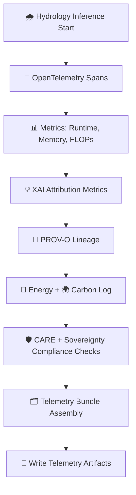

<div align="center">

# 💧📊⚡ **Hydrology Telemetry & Monitoring (OTel · PROV-O · FAIR+CARE)**  
`docs/pipelines/ai/inference/hydrology/telemetry/README.md`

**Purpose**  
Provide canonical **hydrology telemetry standards** for KFM v11.2.2, including:  
🌐 **OpenTelemetry spans**,  
📊 **metrics**,  
📜 **PROV-O lineage**,  
💡 **XAI attribution metrics**,  
🔋 **energy usage**,  
🌍 **carbon footprint**,  
🌀 **deterministic inference auditing**,  
🛡️ **FAIR+CARE + sovereignty governance monitoring**.

Hydrology pipelines generate telemetry for:  
- 🌧️ Runoff modeling  
- 🪴 Soil moisture balance  
- 🌊 Streamflow routing  
- ⚠️ Flood index generation  
- 🏜️ Drought indicator analysis  
- 💡 Hydrology XAI overlays  
- 🗂️ STAC-XAI metadata construction  
- 🛡️ CARE compliance evaluation  

</div>

---

## 🗂️📁💧 **Directory Layout (MAX MODE)**

```
docs/pipelines/ai/inference/hydrology/telemetry/
    📄 README.md                      # This file
    📄 example-span.json              # 🌐 OTel span for hydrology inference
    📄 example-provenance.json        # 📜 PROV-O lineage example
    📄 example-xai.json               # 💡 Hydrology XAI telemetry
    📄 example-energy.json            # 🔋 Energy usage bundle
    📄 example-carbon.json            # 🌍 Carbon footprint
```

---

## 💧🌐📡 **Hydrology Telemetry Architecture**



---

## 🌧️📡📊 **Telemetry Categories**

### 1️⃣ 🌐 **OTel Spans**
Tracks:
- Hydrology model invoked (runoff, streamflow, etc.)  
- Input assets + STAC references  
- Deterministic seed  
- Latency per stage  
- Backpressure state in streaming mode  

### 2️⃣ 📊 **Metrics**
Includes:
- FLOPs  
- Memory usage  
- Soil moisture integration steps  
- Runoff CN computations  
- Streamflow routing segments  
- Flood index composite computation load  

### 3️⃣ 💡 **XAI Hydrology Telemetry**
Captures:
- CAM overlays on watersheds  
- Feature importance (precip, slope, soil moisture, ET, streamflow history)  
- Attribution heatmaps summary metrics  
- Deterministic seed for reproducibility  

### 4️⃣ 📜 **PROV-O Lineage**
Records:
- STAC Items used  
- Hydrology model versions  
- Downscaling parent fields  
- CARE and sovereignty influences  

### 5️⃣ 🔋🌍 **Energy + Carbon**
- Energy (Wh) per hydrology model  
- Carbon footprint (gCO₂e)  
- Composite pipeline totals  

---

## 🛡️🧭⚖️ **FAIR+CARE + Sovereignty Telemetry**

Telemetry MUST include:

- CARE masking decisions (`h3-watershed-generalized`)  
- Sovereignty intersections detected  
- “deny” or “degrade” logic triggered  
- Justification metadata  
- Hydrological sensitivity markers  

Example:

```json
{
  "care": {
    "masking": "h3-watershed-generalized",
    "scope": "public-generalized",
    "notes": ["Telemetry indicates protected basin generalization"]
  }
}
```

---

## 🧪🧩📡 **CI Validation Requirements**

CI MUST confirm:

- All telemetry JSON conforms to hydrology telemetry schema  
- Determinism across inference runs  
- Energy + carbon logs exist for every hydrology inference  
- PROV-O lineage complete  
- CARE block always included  
- No missing STAC references  
- All example telemetry under `examples/` validates  

Failures → ❌ CI BLOCKED.

---

## 🕰️📜 **Version History**

| Version  | Date       | Notes                                          |
|----------|------------|------------------------------------------------|
| v11.2.2  | 2025-11-28 | Initial MAX-EMOJI hydrology telemetry README   |

---

<div align="center">

### 🔗 Footer  
[💧 Back to Hydrology Pipeline](../README.md) ·  
[📊 Telemetry Examples](./examples/) ·  
[🏛 Governance](../../../../standards/governance/ROOT-GOVERNANCE.md)

</div>

