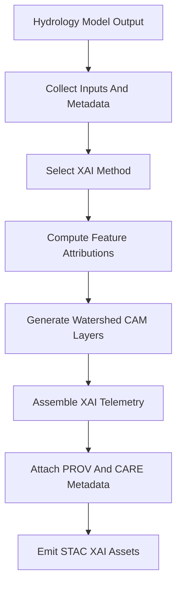

<div align="center">

# 💧💡🧠 **Hydrology XAI Subsystem**  
`docs/pipelines/ai/inference/hydrology/xai-hydrology.md`

**Purpose**  
Define the explainability subsystem for **hydrology AI models** — making **runoff 🌧️**, **soil moisture 🪴**,  
**streamflow 🌊**, **flood index ⚠️**, and **drought indices 🏜️** **auditable, interpretable, and FAIR+CARE-governed**.  
This includes **attribution methods**, **CAM-like watershed overlays**, **feature importance metrics**,  
**STAC-XAI metadata**, and **PROV-O lineage** for all hydrology drivers.

</div>

---

## 💧📘💡 **Overview — Why Hydrology XAI?**

Hydrology XAI answers:

- *Why* did a pixel or watershed show **high runoff** or **flash-flood risk**?  
- *Which factors* drove a **soil moisture anomaly**?  
- *Where* is **streamflow rise** most sensitive to upstream changes?  
- *How* do **drought indices** react to precipitation vs PET vs soil moisture?

Hydrology XAI provides:

- 🌊 Watershed-level CAM overlays  
- 🧩 Feature contribution vectors (P, ET, SM, slope, land cover, routing)  
- 🧠 Model-type–aware attribution (physical formulas vs ML approximators)  
- 🧾 PROV-O + STAC-XAI integration  
- 🛡️ CARE-friendly, sovereignty-safe explainability  

---

## 🗂️📁💧 **File Placement**

```
docs/pipelines/ai/inference/hydrology/
    📄 runoff-driver.md
    📄 soil-moisture-driver.md
    📄 streamflow-driver.md
    📄 flood-index.md
    📄 drought-index.md
    📄 xai-hydrology.md           # ← This file
    📁 telemetry/
```

---

## 🧬🧠🌊 **Hydrology XAI Architecture**



---

## 💡📐📊 **Supported XAI Methods**

Hydrology XAI supports:

- **Gradient-based methods**  
  - Integrated Gradients  
  - Gradient times Input  

- **CAM-like methods**  
  - Spatial CAM for watershed tiles  
  - Saliency for runoff / flood / drought signals  

- **Global importance**  
  - Permutation feature importance  
  - SHAP-style aggregated importance (if ML components used)  

Each method MUST:

- Be **deterministic** under seed-lock  
- Respect **hydrology units and constraints**  
- Produce **machine- and human-readable summaries**

---

## 🌧️🪴🌊 **XAI by Model Type**

### 1️⃣ 🌧️ Runoff Driver XAI

Explain contributions from:

- Precip intensity and burst  
- Soil moisture saturation  
- Slope / TWI  
- Curve Number / land cover  
- Infiltration vs runoff partitioning  

### 2️⃣ 🪴 Soil Moisture Driver XAI

Explain:

- Water balance terms (P, ET, runoff, drainage)  
- Soil properties  
- Terrain effects on storage  
- Seasonal and anomaly components  

### 3️⃣ 🌊 Streamflow Driver XAI

Explain:

- Contribution of upstream runoff  
- Watershed routing structure  
- Slope and channel geometry proxies  
- Sensitivity in rise rate (ΔQ over Δt)  

### 4️⃣ ⚠️ Flood Index XAI

Explain:

- Weight of runoff vs soil saturation  
- Role of slope vs flow accumulation  
- Precip burst contribution  
- Where FI is most sensitive to small changes  

### 5️⃣ 🏜️ Drought Index XAI

Explain:

- Precip deficits vs ET/PET  
- Soil moisture memory  
- Window length sensitivity (1/3/6/12 months)  

---

## 🗺️🌀💧 **Watershed CAM Overlays**

XAI generates **spatial overlays** in watershed space:

- Highlight sub-basins with highest **attribution** to hazard or drought  
- Provide **map layers** usable by the map front-end (MapLibre)  
- Output STAC-XAI assets like:

```json
{
  "assets": {
    "xai_cam_runoff": {
      "href": "s3://kfm/hydro/xai/cam_runoff_2025-06-03.tif",
      "type": "image/tiff",
      "roles": ["xai", "explanation"]
    }
  }
}
```

---

## 📦🗂️💡 **XAI Output Schema (High-Level)**

Every hydrology XAI output MUST include:

```json
{
  "xai": {
    "model": "runoff-driver-v11.2.2",
    "variables": ["precip_intensity", "soil_moisture", "slope", "twi"],
    "importance": {
      "precip_intensity": 0.45,
      "soil_moisture": 0.30,
      "slope": 0.15,
      "twi": 0.10
    },
    "cam_assets": ["xai_cam_runoff"],
    "seed": 42
  }
}
```

Plus:

- `prov` with activity, used inputs, agent  
- `care` with masking and scope  

---

## 🛡️⚖️🧭 **CARE + Sovereignty for Hydrology XAI**

Hydrology XAI MUST:

- Avoid highlighting **hyperlocal vulnerabilities** inside sovereignty-protected basins  
- Use **H3 watershed generalization** for sensitive overlays  
- Remove or aggregate XAI maps where they expose culturally sensitive hydrological patterns  
- Include a CARE block:

```json
{
  "care": {
    "masking": "h3-watershed-generalized",
    "scope": "public-generalized",
    "notes": ["Hydrology XAI generalized inside sovereignty-protected watersheds"]
  }
}
```

---

## 📜🧾🧠 **PROV-O & STAC-XAI Integration**

All hydrology XAI outputs MUST embed:

- PROV-O fields:

```json
{
  "prov": {
    "wasGeneratedBy": "urn:kfm:activity:xai:hydro:abcd1234",
    "used": [
      "urn:kfm:data:stac:runoff_item",
      "urn:kfm:data:stac:soilm_item"
    ],
    "agent": "urn:kfm:service:hydrology-xai-engine"
  }
}
```

- STAC-XAI assets linking back to hydrology grids  
- Model IDs, seeds, run timestamps  

---

## 🔒⚙️🧪 **Determinism Requirements**

Hydrology XAI MUST be:

- Seed-locked (no random perturbations)  
- Reproducible with same inputs + model version  
- Stable under CI replay tests  
- Independent of non-deterministic hardware effects (as far as feasible)  

---

## 🧪📏🔬 **CI Validation Requirements**

CI MUST ensure:

- XAI JSON matches hydrology XAI schemas  
- Care + sovereignty blocks are present when required  
- STAC-XAI references resolve  
- PROV-O fields complete  
- Determinism across repeated runs  
- No leaking of high-resolution CAM inside protected basins  
- Telemetry (latency, energy, carbon) attached for XAI routines  

Failures → ❌ merge blocked.

---

## 🕰️📜 **Version History**

| Version  | Date       | Notes                                      |
|----------|------------|--------------------------------------------|
| v11.2.2  | 2025-11-28 | Initial Hydrology XAI subsystem (MAX MODE) |

---

<div align="center">

### 🔗 Footer  
[💧 Back to Hydrology Pipeline](./README.md) ·  
[🌊 Hydrology Models](./) ·  
[🏛 Governance](../../../../standards/governance/ROOT-GOVERNANCE.md)

</div>

