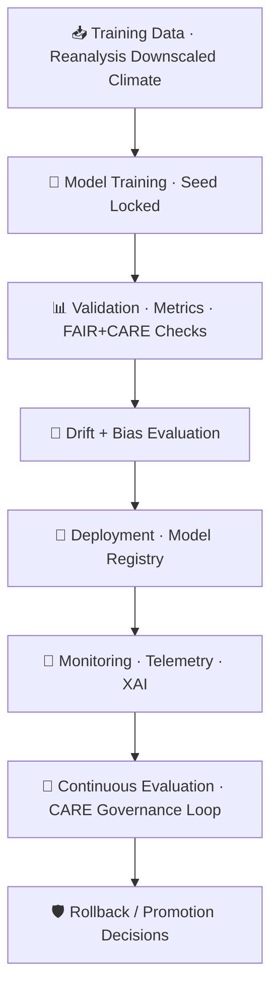

<div align="center">

# 🌡️🤖🚀 **Climate AI MLOps Pipeline — KFM v11.2.2 (MAX MODE)**  
`docs/pipelines/ai/models/climate/mlops/README.md`

**Purpose**  
Define the **end-to-end Climate AI MLOps system** that powers KFM's downscaling, anomaly detection,  
drivers, hazard-related climate factors, and Focus Mode environmental intelligence.  
This pipeline covers:

🧠 **Model training**  
📊 **Validation + verification**  
🚀 **Deployment & promotion**  
🌀 **Drift & bias detection**  
🔍 **Monitoring & telemetry**  
💡 **XAI model-card generation**  
🛡️ **FAIR+CARE + Sovereignty governance**  
📜 **STAC + PROV lineage**  

All operations MUST be deterministic, reproducible, and sovereignty-safe.

</div>

---

## 🧬🤖📘 **Overview — Climate AI MLOps in KFM**

The Climate MLOps pipeline integrates:

- Reanalysis input datasets (ERA5, NARR, etc.)  
- Downscaling architectures (U-Net, Transformer, hybrid models)  
- Climate driver models (CAPE, CIN, shear, LLJ)  
- Bias-correction models  
- Anomaly models  
- Sustainability telemetry (energy, carbon)  
- FAIR+CARE risk screening  
- Deterministic CI enforcement  
- STAC-model-card metadata  

This MLOps system ensures climate models are **validated, explainable, traceable**, and **safe for public release**.

---

## 🗂️📁🌡️ **Directory Layout (MAX MODE)**

```
docs/pipelines/ai/models/climate/mlops/
    📄 README.md                       # ← This file
    📄 model-training.md               # Training process & configs
    📄 validation.md                   # Metrics, tests, governance gates
    📄 deployment.md                   # Versioning, promotion, registry
    📄 monitoring.md                   # Telemetry + model observability
    📄 drift-detection.md              # Drift, bias, stability signals
    📄 rollbacks.md                    # Safe rollback procedures
    📁 telemetry/                      # Energy, carbon, OTel, PROV
        📄 README.md
    📁 xai/                            # Model-card explainability artifacts
        📄 README.md
```

---

## 🧠⚙️🚀 **Climate MLOps Architecture (Mermaid-Safe)**



---

## 🧠💽📥 **1. Climate Model Training**

Training MUST be:

- Deterministic (seed-locked)  
- Using documented data lineage  
- Sustainable (energy/carbon measured)  
- FAIR+CARE screened  
- Version-pinned  

Training metadata MUST include:

- Loss curves  
- Hyperparameters  
- Training domain  
- STAC references  
- PROV lineage  
- Energy/Carbon logs  
- Governance signoffs  

Outputs:

- `<model>.pt`  
- `<model>_metadata.json`  
- `<model>_summary.json`

---

## 📊🧪📈 **2. Validation & Governance Gates**

Validation MUST confirm:

- RMSE/MAE/bias/stability metrics  
- XAI readiness  
- Sovereignty-safe climate signal distribution  
- No harmful or misleading environmental patterns  
- Temporal consistency  
- Spatial sampling correctness  
- FAIR+CARE contextual safety  

All tests logged to telemetry.

---

## 🌀📉🔍 **3. Drift + Bias Detection**

Climate model drift examples:

- Systematic bias drift (warming/cooling anomalies)  
- Vertical gradient distortion  
- CAPE/CIN shape drift  
- Shear/LLJ pattern drift  
- Hydrology-coupled drift (soil moisture imbalances)  

Drift detection uses:

- Sequential validation  
- Embedding drift (climate embeddings)  
- Regime clustering  
- Probabilistic early warnings (deterministic thresholds)  

Outputs:

- `drift_report.json`  
- `bias_audit.json`

---

## 🚀📦🔐 **4. Deployment & Promotion**

Deployment requires:

- Model-card v11  
- STAC model item  
- Signed integrity hash  
- CI promotion tests  
- FAIR+CARE review  
- Sovereignty approval  
- Registry entry with immutability flag  

Deployment artifacts:

- `model.pt`  
- `model.stac.json`  
- `xai/`  
- `provenance/`  
- `telemetry/`  

---

## 📡📊🧠 **5. Monitoring & Telemetry**

Telemetry MUST include:

- OTel spans  
- XAI metrics  
- Drift/bias signals  
- Energy + carbon metrics  
- Runtime performance  
- Input distribution changes  

Example:

```json
{
  "telemetry": {
    "runtime_ms": 128,
    "energy_wh": 0.42,
    "carbon_gCO2e": 0.03
  }
}
```

---

## 🛡️⚖️📜 **6. FAIR+CARE + Sovereignty Governance Loop**

Every climate model must pass:

- Tribal sovereignty impact screening  
- Geospatial generalization for sensitive regions  
- Cultural environmental context masking  
- Model-card FAIR+CARE certification  

Example CARE block:

```json
{
  "care": {
    "masking": "h3-climate-generalized",
    "scope": "public-generalized",
    "notes": ["Climate model outputs generalized in sovereignty-protected regions"]
  }
}
```

---

## 🔄🛡️🚨 **7. Rollbacks & Safety Controls**

Rollback triggers:

- Drift threshold exceeded  
- Bias violation  
- Sovereignty conflict  
- Telemetry anomaly  
- Performance regression  
- Governance disapproval  

Rollback artifacts MUST include:

- `rollback_report.json`  
- Lineage references  
- Telemetry summaries  

---

## 🧪📏🔬 **CI Validation Requirements**

CI MUST validate:

- Deterministic training reproducibility  
- Validation metrics thresholds  
- XAI metadata presence  
- Telemetry correctness  
- FAIR+CARE compliance  
- PROV lineage integrity  
- Sovereignty filtering logic correctly applied  
- Stable hash across reruns  

Failure → ❌ CI BLOCK.

---

## 🕰️📜 **Version History**

| Version  | Date       | Notes                                             |
|----------|------------|---------------------------------------------------|
| v11.2.2  | 2025-11-28 | Initial Climate MLOps Pipeline Documentation      |

---

<div align="center">

### 🔗 Footer  
[🌡️ Back to Climate AI Models](../README.md) ·  
[🧠 Model Training](./model-training.md) ·  
[🏛 Governance](../../../../standards/governance/ROOT-GOVERNANCE.md)

</div>

