<div align="center">

# 🚀🌡️🤖 **Climate AI Model Deployment — KFM v11.2.2 (MAX MODE)**  
`docs/pipelines/ai/models/climate/mlops/deployment.md`

**Purpose**  
Define the **deployment, promotion, and registry governance** for Climate AI models used across  
downscaling, drivers, anomaly detection, hydrology coupling, hazard generation, and Focus Mode.  

This subsystem governs:

🚀 **Model deployment → registry**  
🔐 **Model signing + immutability**  
📦 **Model artifact packaging (XAI + PROV + Telemetry)**  
📊 **Promotion gates (metrics + governance)**  
🛡️ **FAIR+CARE + sovereignty compliance**  
📜 **STAC-model item construction**  
🌀 **Rollback safety**  

Deployments MUST be deterministic, version-pinned, and safe.

</div>

---

## 🚀📘🌡️ **Overview — Why Deployment Governance?**

Climate models influence downstream systems:

🌪️ Hazard scoring  
💧 Hydrology inference  
🌡️ Climate analog search  
📖 Story Node v3 narratives  
🎯 Focus Mode reasoning  

Deployment governance ensures:

- Deterministic inference  
- Provenance chain integrity  
- Policy-compliant geospatial outputs  
- Reversible deployments  
- CI-safe model promotion  

---

## 🧬🚀⚙️ **Deployment Architecture (Mermaid-Safe)**

```mermaid
flowchart TD
    A[📦 Candidate Model Artifacts] --> B[📊 Validate Metrics + Governance Gates]
    B --> C[🔐 Sign Model + Generate Integrity Hash]
    C --> D[🗂️ Build STAC Model Item + PROV Lineage]
    D --> E[🛡️ FAIR + CARE + Sovereignty Screening]
    E --> F[🚀 Push To Model Registry]
    F --> G[📡 Monitoring + Telemetry Activation]
    G --> H[🌀 Promotion / Rollback Control]
```



---

## 📦🔐🌡️ **1. Model Artifact Preparation**

Every model MUST include:

- `<model>.pt` or ONNX artifact  
- `model_metadata.json`  
- `model_summary.json`  
- `xai/` directory  
- `provenance/` chain  
- `telemetry/` bundle  
- `stac/model-item.json`  
- Multihash integrity checksum  

Artifacts MUST be reproducible, seed-locked, and stable.

---

## 📊🧪📈 **2. Validation + Promotion Gates**

Before deployment, the following MUST pass:

- RMSE/MAE/bias thresholds  
- Spatial pattern consistency  
- Extreme-value safety tests  
- Hydrology + hazard impact screens  
- Drift tests  
- FAIR+CARE cultural safety tests  
- Sovereignty constraint screening  
- XAI interpretability  
- Energy + carbon telemetry completeness  

Promotion is **blocked** unless all pass.

---

## 🔐📝🧾 **3. Model Signing + Integrity Hashing**

Deployment requires:

- SHA-256 model hash  
- Signed metadata block  
- Immutability flag for model registry  
- Optional Sigstore endorsement  

Stored as:

```
{
  "integrity": {
    "hash": "<sha256>",
    "signature": "<sigstore-signed-block>",
    "immutable": true
  }
}
```

---

## 🗂️🌡️📜 **4. STAC Model Item Assembly**

Each climate model MUST create a **STAC Model Item**:

Includes:

- `model:architecture`  
- `model:training_data`  
- `model:hyperparameters`  
- `model:metrics`  
- `model:explainability`  
- `model:provenance`  
- CARE + sovereignty metadata  
- Energy + carbon metrics  
- All asset references  

Example snippet:

```json
{
  "model:version": "v11.2.2",
  "model:seed": 42,
  "assets": {
    "weights": {"href": "model.pt"},
    "xai": {"href": "xai/"},
    "telemetry": {"href": "telemetry/"}
  }
}
```

---

## 🛡️⚖️🌎 **5. FAIR+CARE + Sovereignty Screening**

Deployment MUST enforce:

- Sovereignty-aware climate model outputs  
- Masking for sensitive environmental gradients  
- Geo-generalization for tribal regions  
- Cultural safety checks  
- CARE metadata injection  

Example:

```json
{
  "care": {
    "masking": "h3-climate-generalized",
    "scope": "public-generalized",
    "notes": ["Model deployment generalized due to sovereignty protections"]
  }
}
```

---

## 🚀📦🔐 **6. Model Registry Push**

Upon passing all gates:

- Upload to Climate Model Registry  
- Freeze artifact under version tag  
- Update registry manifest  
- Store STAC Model Item  
- Store PROV lineage  
- Emit deployment telemetry  

Registry entry:

```
climate/models/<version>/model.pt
climate/models/<version>/model.stac.json
climate/models/<version>/provenance.json
climate/models/<version>/xai/*
climate/models/<version>/telemetry/*
```

Everything MUST be immutable.

---

## 📡📊🧠 **7. Monitoring Activation**

After deployment, models MUST:

- Emit OTel spans during inference  
- Log metrics + drift checks  
- Report energy + carbon per run  
- Provide XAI summaries  
- Publish PROV-O chains  

---

## 🌀🔁🛡️ **8. Promotion + Rollback Controls**

Promotion triggers:

- Passing validation + drift  
- FAIR+CARE governance approval  
- Sovereignty approval  
- Telemetry thresholds met  

Rollback triggers:

- Drift threshold  
- Sovereignty violations  
- Telemetry anomalies  
- Validation regression  
- Ethical/governance veto  

Rollback artifacts MUST include:

- `rollback_report.json`  
- `drift_summary.json`  
- `sovereignty_conflict.json`  

---

## 🔒⚙️🧪 **Determinism Requirements**

- All deployments MUST be deterministic  
- Seed-lock verification  
- Hash stability checks  
- Reproducible training & inference  
- Deterministic STAC metadata generation  

---

## 🧪📏🔬 **CI Validation Requirements**

CI MUST validate:

- Deployment metadata schema  
- STAC item correctness  
- XAI completeness  
- Telemetry completeness  
- FAIR+CARE compliance  
- Sovereignty boundary safety  
- Repeatable deployment hash  
- Rebuild reproducibility  

Failure → ❌ CI BLOCKED.

---

## 🕰️📜 **Version History**

| Version  | Date       | Notes                                              |
|----------|------------|----------------------------------------------------|
| v11.2.2  | 2025-11-28 | Initial Climate MLOps Deployment Document (MAX MODE) |

---

<div align="center">

### 🔗 Footer  
[🌡️ Back to Climate AI MLOps](../README.md) ·  
[📦 Model Training](./model-training.md) ·  
[🏛 Governance](../../../../../standards/governance/ROOT-GOVERNANCE.md)

</div>

