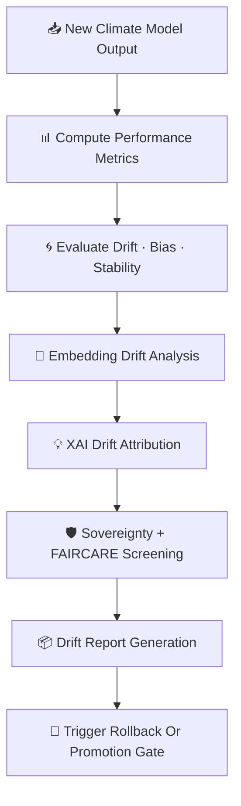

<div align="center">

# 🌀📉🌡️ **Climate AI Drift & Bias Detection — KFM v11.2.2 (MAX MODE)**  
`docs/pipelines/ai/models/climate/mlops/drift-detection.md`

**Purpose**  
Define the deterministic, sovereignty-safe, FAIR+CARE-aligned subsystem for **detecting drift, bias,  
instability, or degrading behavior** in Climate AI models.  
Covers:

🌀 **Model drift**  
📉 **Bias drift**  
🔡 **Embedding drift**  
🌪️ **Hazard-impact drift**  
💧 **Hydrology-impact drift**  
🌡️ **Climate-regime drift**  
💡 **XAI drift explainability**  
📜 **FAIR+CARE + sovereignty compliance**  
📦 **Telemetry integration**  

Used for MLOps promotion gates, rollback triggers, and long-term stability.

</div>

---

## 🧬📉🌀 **Overview — Why Drift Detection?**

Climate AI drift can silently corrupt every dependent subsystem:

- 🌪️ Hazard scoring (CAPE/CIN/shear drift)  
- 💧 Hydrology forecasts (soil moisture / runoff drift)  
- 🌊 Flood risk (ΔQ/Δt drift)  
- 🌡️ Climate analog searches (embedding drift)  
- 📖 Story Node v3 context generation  
- 🎯 Focus Mode reliability  

Therefore the drift engine MUST be:

- Deterministic  
- Continuous  
- Sovereignty-safe  
- FAIR+CARE-reviewed  
- Telemetry-backed  
- Explainable  

---

## 🧬📈🌀 **Drift Detection Architecture (Mermaid-Safe)**



---

## 📊🧪📉 **1. Performance Drift**

Compare new inference results with:

- Baselines from previous versions  
- Reanalysis truth sets  
- Historical validation libraries  

Metrics:

- RMSE / MAE drift  
- Bias drift (systematic offset)  
- Correlation decline  
- Spatial texture drift  

Example:

```json
{
  "drift": {
    "rmse_diff": +0.14,
    "bias_diff": -0.03,
    "correlation_diff": -0.07
  }
}
```

---

## ⚖️📉🌡️ **2. Climate Bias Drift**

Detect shifts in:

- Mean temperature patterns  
- Humidity gradients  
- Pressure structures  
- Wind component distributions  
- Vertical thermal gradients  

Bias drift can drastically misalign hazards + hydrology outputs.

---

## 🔡🌀📈 **3. Embedding Drift (Climate Embeddings)**

Climate embeddings provide a compact fingerprint of climate state.

Drift is detected by:

- Vector centroid shift  
- Cosine distance drift  
- Regime clustering change  
- Distribution divergence  

Embedding drift indicates deeper model instability.

---

## 🌪️💧🌊 **4. Impact Drift (Hazard + Hydrology)**

Climate drift can propagate into:

### 🌪️ Hazard Drift  
- CAPE/CIN drift → storm classification errors  
- Shear drift → tornado/hail misalignment  
- LLJ drift → convective hazard timing drift  

### 💧 Hydrology Drift  
- Soil moisture drift  
- Runoff/hydrograph distortion  
- Streamflow rise-rate drift  
- Drought-cycle distortion  

---

## 💡🧠📉 **5. XAI Drift Attribution**

XAI drift reveals *why* drift is happening:

- Feature importance shift  
- CAM distribution change  
- Attribution entropy drift  
- Layer activation drift (transformer)  

Example:

```json
{
  "xai_drift": {
    "importance_shift": {
      "temperature": +0.06,
      "humidity": -0.03,
      "wind": +0.02,
      "pressure": -0.01
    },
    "cam_shift_score": 0.22
  }
}
```

---

## 🛡️⚖️🧭 **6. Sovereignty + FAIR+CARE Screening**

Drift detection MUST also check:

- ❌ Sensitive-region drift amplification  
- ❌ New harmful climate/hazard patterns  
- ❌ Biased predictions in tribal territories  
- ❌ Hyperlocal extreme-value artifacts  

CARE block:

```json
{
  "care": {
    "masking": "h3-climate-generalized",
    "scope": "public-generalized",
    "notes": ["Climate drift monitoring detected sovereignty-relevant anomalies"]
  }
}
```

---

## 📦📝🧠 **7. Drift Report Generation**

All drift outputs logged to:

- `drift_report.json`  
- `bias_audit.json`  
- `embedding_drift.json`  
- `impact_drift.json`  
- `xai_drift_report.json`  

Each report MUST include STAC-XAI & PROV links.

---

## 🛑🚨⚙️ **8. Rollback / Promotion Logic**

Rollback triggers:

- Drift above threshold  
- Bias violation  
- Hazard-impact drift > threshold  
- Hydrology-impact drift > threshold  
- XAI drift red flags  
- Sovereignty conflict  

Promotion allowed ONLY if:

- Drift within bounds  
- Full governance approval  
- Telemetry validated  
- FAIR+CARE constraints satisfied  

---

## 🔒⚙️🧪 **Determinism Requirements**

Drift detection MUST be:

- Seed-locked  
- Stable across hardware  
- Deterministic computations  
- CI reproducible  
- Ordered evaluation  

---

## 🧪📏🔬 **CI Validation Requirements**

CI MUST validate:

- Drift schema correctness  
- Deterministic evaluation  
- No sovereignty leakage  
- XAI drift correctness  
- Telemetry completeness  
- STAC + PROV lineage  
- Threshold logic  
- Reproducible drift scores  

Failure → ❌ CI BLOCK.

---

## 🕰️📜 **Version History**

| Version  | Date       | Notes                                                  |
|----------|------------|--------------------------------------------------------|
| v11.2.2  | 2025-11-28 | Initial Drift Detection Documentation (MAX MODE)       |

---

<div align="center">

### 🔗 Footer  
[🌡️ Back to Climate AI MLOps](../README.md) ·  
[📊 Validation](./validation.md) ·  
[🏛 Governance](../../../../../standards/governance/ROOT-GOVERNANCE.md)

</div>

