<div align="center">

# 🧠🌡️📚 **Climate AI Model Training — KFM v11.2.2 (MAX MODE)**  
`docs/pipelines/ai/models/climate/mlops/model-training.md`

**Purpose**  
Define the **deterministic, seed-locked, FAIR+CARE-governed Climate AI training pipeline** used to build  
all **downscaling**, **bias-correction**, **anomaly**, and **driver models** in KFM v11.2.2.  
Training must be **reproducible**, **transparent**, **sovereignty-safe**, and **fully lineage-tracked**.

</div>

---

## 🌡️📘🧠 **Overview — Climate Model Training in KFM**

Climate model training in KFM integrates:

- 📥 Reanalysis inputs (ERA5, NARR, HRRR, NLDAS)  
- 🧠 Downscaling architectures (U-Net, Transformer, hybrid)  
- ⚡ Driver targets (CAPE, CIN, shear, LLJ, lapse rates)  
- ♻️ Sustainability telemetry (energy, carbon)  
- 🛡️ FAIR+CARE governance  
- 🌐 STAC lineage + PROV-O  
- 🔒 Hard deterministic seeding  

Training produces **version-pinned**, **immutably registered** climate models.

---

## 🧬🧠⚙️ **Training Architecture (Mermaid-Safe)**

```mermaid
flowchart TD
    A[📥 Prepare Training Dataset · STAC Input Items] --> B[🧽 Preprocessing · Normalization]
    B --> C[🧠 Train Climate Model · Seed Locked]
    C --> D[📊 Compute Metrics · RMSE MAE Bias]
    D --> E[💡 Generate XAI Model-Card Artifacts]
    E --> F[📜 Build PROV + STAC Model Metadata]
    F --> G[🔋 Record Energy + 🌍 Carbon Telemetry]
    G --> H[🛡️ FAIR + CARE + Sovereignty Screening]
    H --> I[📦 Emit Training Artifacts]
```



---

## 📥📦🌡️ **1. Training Dataset Requirements**

All training datasets MUST provide:

- STAC metadata (collection + item level)  
- CRS + units  
- Temporal extents  
- Variable definitions  
- PROV lineage  
- FAIR+CARE-safety classification  

Training data sources include:

- ERA5 / NARR / HRRR / NLDAS  
- DASC gridded climate assets  
- KFM intermediate downscaled climate fields  

Training MUST NOT include:

- Sensitive tribal-region environmental signals without generalization  
- Non-governed third-party datasets  

---

## 🧽🧮📊 **2. Preprocessing & Normalization**

Preprocessing MUST:

- Normalize variables (z-score or min-max)  
- Respect vertical axes (pressure / height)  
- Preserve physical consistency  
- Apply deterministic transformations  
- Mask sovereignty-protected regions per CARE rules  

Outputs:

- `preprocessing_summary.json`  
- `normalization_params.json`

---

## 🧠🔒⚙️ **3. Deterministic Model Training**

Training MUST be:

- **Seed-locked** (`seed: 42` or model-specific constant)  
- **Hardware-invariant**  
- **Floating-point stable**  
- **Deterministic batch ordering**  

Training metadata MUST include:

```
{
  "training": {
    "seed": 42,
    "model_version": "v11.2.2",
    "optimizer": "adamw",
    "lr": 0.0003,
    "epochs": 40,
    "batch_size": 32
  }
}
```

Artifacts:

- `<model>.pt`  
- `<model>_metadata.json`  
- `<model>_summary.json`  

---

## 📊📏🧪 **4. Metrics & Validation Preparedness**

Training MUST compute:

- RMSE, MAE  
- Bias, correlation  
- Spatial structure (SSIM)  
- Vertical profile errors  
- Hazard-linked metrics (CAPE/CIN/shear performance)  
- Hydrology-linked metrics when relevant  

Metrics written to:

- `training_metrics.json`

---

## 💡🧠🗺️ **5. XAI Model-Card Generation**

XAI artifacts MUST include:

- Feature importance  
- CAM overlays  
- Gradient attribution  
- Model-card JSON  
- STAC-XAI asset definitions  

Example snippet:

```json
{
  "xai": {
    "importance": {
      "temperature": 0.31,
      "humidity": 0.22,
      "wind": 0.18,
      "pressure": 0.13,
      "cape": 0.16
    }
  }
}
```

---

## 📜🌐🔍 **6. STAC + PROV Lineage Assembly**

Training MUST assemble a complete lineage chain:

```json
{
  "prov": {
    "wasGeneratedBy": "urn:kfm:activity:training:climate_downscaler_v11_2",
    "used": [
      "urn:kfm:data:stac:era5_item",
      "urn:kfm:data:stac:terrain_grid"
    ],
    "agent": "urn:kfm:service:climate-training-engine"
  }
}
```

STAC Model Items MUST contain:

- Hyperparameters  
- Training metadata  
- Metrics  
- XAI results  
- CARE rules  
- Sovereignty masking notes  

---

## 🔋🌍📡 **7. Sustainability Telemetry (Energy + Carbon)**

Training MUST log:

- FLOPs  
- CPU/GPU usage  
- Wh energy  
- gCO₂e carbon footprint  
- Sustainability checkpoints  

Example:

```json
{
  "energy": {
    "wh": 4.12,
    "carbon_gco2e": 0.41
  }
}
```

---

## 🛡️⚖️🧭 **8. FAIR+CARE & Sovereignty Governance**

Training MUST:

- Respect tribal sovereignty  
- Mask cultural-environmental signals  
- Avoid amplifying harmful climate narratives  
- Include CARE metadata:

```json
{
  "care": {
    "masking": "h3-climate-generalized",
    "scope": "public-generalized",
    "notes": ["Training generalized sensitive regions under sovereignty rules"]
  }
}
```

---

## 📦🚀🔐 **9. Training Artifact Emission**

Artifacts include:

```
model.pt
model_metadata.json
model_summary.json
training_metrics.json
xai/
provenance/
telemetry/
stac/model-item.json
```

ALL artifacts MUST be:

- Immutable  
- Version-pinned  
- Reproducible  
- Registry-ready  

---

## 🧪📏🔬 **CI Validation Requirements**

CI MUST validate:

- Deterministic training reproducibility  
- Correct preprocessing normalization  
- Metric thresholds  
- STAC metadata  
- PROV completeness  
- XAI integrity  
- CARE compliance  
- No sovereignty-region leakage  
- Telemetry correctness  

Failure → ❌ CI BLOCK.

---

## 🕰️📜 **Version History**

| Version  | Date       | Notes                                              |
|----------|------------|----------------------------------------------------|
| v11.2.2  | 2025-11-28 | Initial Climate Model Training Document (MAX MODE) |

---

<div align="center">

### 🔗 Footer  
[🌡️ Back to Climate AI MLOps](../README.md) ·  
[📊 Validation](./validation.md) ·  
[🏛 Governance](../../../../../standards/governance/ROOT-GOVERNANCE.md)

</div>

