<div align="center">

# 📡🌡️🧠 **Climate AI Model Monitoring — KFM v11.2.2 (MAX MODE)**  
`docs/pipelines/ai/models/climate/mlops/monitoring.md`

**Purpose**  
Define the **continuous monitoring subsystem** for deployed climate models, tracking:

📊 **Realtime model performance**  
🌀 **Drift + stability signals**  
⚖️ **Bias monitoring**  
💡 **Runtime XAI attribution**  
📜 **PROV lineage consistency**  
🔋 **Energy usage**  
🌍 **Carbon emissions**  
🛡️ **FAIR+CARE + sovereignty impacts**  

Monitoring ensures all climate models remain safe, stable, fair, and accountable post-deployment.

</div>

---

## 📘📡🌡️ **Overview — Why Climate Monitoring Matters**

Climate model outputs drive:

🌪️ hazard models,  
💧 hydrology drivers,  
📚 narrative embeddings,  
🎯 Focus Mode reasoning,  
🗺️ Story Node generation.

If climate models drift, degrade, or bias, EVERYTHING downstream degrades.

Thus monitoring must be:

- Deterministic  
- Exhaustive  
- Telemetry-backed  
- FAIR+CARE enforced  
- Sovereignty-protected  
- CI reproducible  
- Governance audited

---

## 🧬📡🌀 **Monitoring Architecture (Mermaid-Safe)**

```mermaid
flowchart TD
    A[📥 Climate Model Inference Event] --> B[📊 Capture Performance Metrics]
    B --> C[🌀 Drift Indicators]
    C --> D[⚖️ Bias Checks]
    D --> E[💡 Runtime XAI Attribution]
    E --> F[📜 PROV Lineage Verification]
    F --> G[🔋 Energy + 🌍 Carbon Accounting]
    G --> H[🛡️ FAIR + CARE + Sovereignty Screening]
    H --> I[📦 Monitoring Bundle Assembly]
    I --> J[🚨 Alerts + Governance Decisions]
```



---

## 📊🌡️🧮 **1. Model Performance Metrics**

Every inference must log:

- RMSE, MAE (when truth data is available)  
- Pattern correlation  
- Spatial error statistics  
- Vertical profile error checks  
- Extreme-value checks  
- Hazard-relevant metrics (CAPE/CIN/etc.)  
- Hydrology-relevant metrics  

Example:

```json
{
  "metrics": {
    "rmse": 1.18,
    "mae": 0.72,
    "bias": -0.03
  }
}
```

---

## 🌀📉🌡️ **2. Drift Indicators**

Monitoring MUST compute drift using:

- Rolling window analysis  
- Embedding drift (climate embeddings)  
- Cluster/regime shifts  
- Spatial texture stability  
- Hazard-impact drift  
- Hydrology-impact drift  

Outputs:

- `drift_signal.json`  
- `embedding_drift.json`  

---

## ⚖️🌫️📉 **3. Bias Monitoring**

Monitor:

- Temperature bias drift  
- Humidity bias drift  
- Pressure deviation  
- Wind vector distortion  
- Vertical gradient distortion  

Bias drift → immediate governance review.

---

## 💡🧠🌡️ **4. Runtime XAI Monitoring**

Runtime XAI MUST track:

- Feature importance drift  
- CAM hotspot changes  
- Attention entropy  
- Attribution stability  

Example:

```json
{
  "xai_runtime": {
    "importance_shift": {
      "temperature": +0.04,
      "humidity": -0.02
    },
    "cam_stability": 0.91
  }
}
```

---

## 📜🔍🧾 **5. PROV Lineage Monitoring**

Checks:

- STAC items still valid  
- Inputs used match expectations  
- Model provenance intact  
- No missing lineage links  
- Deterministic chain  

---

## 🔋🌍📊 **6. Sustainability Monitoring (Energy + Carbon)**

Every inference logs:

- FLOPs  
- GPU/CPU time  
- Wh energy  
- Carbon emissions (gCO₂e)  
- Cumulative environmental cost  

Telemetry snippet:

```json
{
  "energy": {
    "wh": 0.28,
    "carbon_gco2e": 0.03
  }
}
```

---

## 🛡️⚖️🧭 **7. FAIR+CARE + Sovereignty Screening**

Monitoring MUST detect:

- Hazards amplified in sovereignty regions  
- Sensitive-region climate drift  
- Culturally unsafe anomalies  
- Geospatial pattern leakage  

Example:

```json
{
  "care": {
    "masking": "h3-climate-generalized",
    "scope": "public-generalized",
    "notes": ["Sovereignty-protected region triggered monitoring redaction"]
  }
}
```

---

## 🚨🔔📢 **8. Alerting & Governance Decisions**

Triggered when:

- Drift threshold exceeded  
- Bias drift unacceptable  
- XAI drift red flags  
- Sustainability regression  
- FAIR+CARE violations  
- Sovereignty conflict  
- Performance degradation  

Alerts escalate to:

- Climate Working Group  
- FAIR+CARE Council  
- Sovereignty Review Board  

---

## 🧪📏🔬 **CI Validation Requirements**

CI MUST ensure:

- Deterministic metrics computation  
- Drift/bias results stable  
- FAIR+CARE enforcement  
- STAC + PROV verification  
- Energy/carbon telemetry correctness  
- No sensitive-region leakage  
- Monitoring bundle schema valid  

Failure → ❌ CI BLOCK.

---

## 🕰️📜 **Version History**

| Version  | Date       | Notes                                                  |
|----------|------------|--------------------------------------------------------|
| v11.2.2  | 2025-11-28 | Initial Climate AI Monitoring Documentation (MAX MODE) |

---

<div align="center">

### 🔗 Footer  
[🌡️ Back to Climate AI MLOps](../README.md) ·  
[🌀 Drift Detection](./drift-detection.md) ·  
[🏛 Governance](../../../../../standards/governance/ROOT-GOVERNANCE.md)

</div>

