<div align="center">

# ⏪🌡️🤖 **Climate AI Model Rollbacks — KFM v11.2.2 (MAX MODE)**  
`docs/pipelines/ai/models/climate/mlops/rollbacks.md`

**Purpose**  
Define the **safe rollback system** for Climate AI models when drift, bias, sovereignty violations,  
XAI inconsistencies, or validation failures are detected.  
Rollbacks protect downstream systems:

🌪️ Hazard inference  
💧 Hydrology drivers  
🌡️ Climate embeddings  
🗺️ Focus Mode  
📖 Story Node v3  

by restoring a **known-good**, deterministic, sovereign-safe model version.

</div>

---

## 📘⏪🌡️ **Overview — When Do Rollbacks Trigger?**

Rollbacks occur when:

- 🌀 **Drift exceeds thresholds**  
- ⚖️ **Bias grows beyond governance limits**  
- 🌡️ **Extreme-value instability appears**  
- 💧 **Hydrology-impact drift is detected**  
- 🌪️ **Hazard-impact drift appears**  
- 💡 **XAI explanations become inconsistent**  
- 🛡️ **Sovereignty protections are violated**  
- 🧪 **Validation regressions occur**  
- ⚠️ **Telemetry anomalies appear**  
- 🏛️ **Governance veto triggers**  

Rollbacks MUST be:

- Deterministic  
- Version-pinned  
- Completely reversible  
- Fully lineage-tracked  
- Bound to FAIR+CARE + sovereignty rules

---

## 🧬⏪🤖 **Rollback Architecture (Mermaid-Safe)**

```mermaid
flowchart TD
    A[🚨 Drift/Bias/Sovereignty Alert] --> B[📊 Evaluate Governance Criteria]
    B --> C[🔐 Verify Previous Stable Model Integrity]
    C --> D[📦 Activate Rollback In Registry]
    D --> E[📜 Regenerate STAC + PROV Lineage · Mark Reversion]
    E --> F[📡 Activate Monitoring And Stability Tests]
    F --> G[🛡️ FAIR + CARE Compliance Verification]
    G --> H[🎯 Release Stable Model For Inference]
```



---

## 🌀📉🔍 **1. Drift/Bias/Sovereignty Alert Intake**

Triggered by:

- Drift monitor  
- Bias monitor  
- Telemetry  
- XAI drift  
- Sovereignty filter events  
- Governance manual overrides  

Initial artifacts collected:

- `drift_report.json`  
- `bias_audit.json`  
- `sovereignty_conflict.json`  
- `xai_drift_report.json`  
- `telemetry_snapshot.json`

---

## 📊🏛️📏 **2. Governance Criteria Evaluation**

Rollback requires:

- Climate Working Group approval  
- FAIR+CARE Council signoff  
- Sovereignty Board review  
- Model-card consistency validation  
- Drift/bias evidence verification  

Outputs:

- `rollback_decision.json`

---

## 🔐📦🧠 **3. Restore Last Known-Good Model**

Registry operation MUST:

- Locate last stable version  
- Verify SHA-256 integrity  
- Confirm deterministic STAC item match  
- Revalidate model-card integrity  
- Restore:

```
model.pt
model.stac.json
provenance/
xai/
telemetry/
```

No partial rollbacks allowed — **full restore only**.

---

## 📜🌐🧬 **4. Regenerate STAC + PROV Lineage (Rollback Edition)**

Rollback MUST create a **Rollback STAC Item** marking:

- Reversion source  
- Reason for rollback  
- Drift/bias context  
- Sovereignty enforcement  
- CARE metadata  
- Hash of restored model  
- Rollback governance decision  

Example:

```json
{
  "rollback": {
    "reason": "drift_threshold_exceeded",
    "restored_version": "v11.2.1",
    "trigger": "soil_moisture_bias_drift",
    "seed": 42
  }
}
```

---

## 📡🧪🧠 **5. Post-Rollback Monitoring**

Immediate re-monitoring MUST validate:

- Performance restored  
- Drift signals reset  
- Bias signals normalized  
- XAI consistent with expected patterns  
- Sovereignty rules fully enforced  
- Telemetry signals stable  

---

## 🛡️⚖️🧭 **6. FAIR+CARE + Sovereignty Verification**

Rollback outputs MUST include CARE block:

```json
{
  "care": {
    "masking": "h3-climate-generalized",
    "scope": "public-generalized",
    "notes": ["Rollback applied due to sovereignty-related model anomaly"]
  }
}
```

Rules:

- Sensitive-region patterns MUST NOT regress  
- Cultural or environmental harm prevented  
- No geospatial leakage  
- No hazard amplification in tribal areas  

---

## 🎯🔁🌡️ **7. Release Stable Model For Inference**

Once validated:

- Stable model becomes the active deployment  
- Inference uses restored version  
- Registry flags:

```
active = v11.2.1
rollback_of = v11.2.2
```

- Monitoring enters heightened mode for 48h  

---

## 🔒⚙️🧪 **Determinism Requirements**

Rollback MUST:

- Restore deterministic artifacts  
- Use stable, reproducible STAC metadata  
- Validate SHA-256 integrity  
- Prevent partial drift restoration  
- Be fully reproducible under CI  

---

## 🧪📏🔬 **CI Validation Requirements**

CI MUST check:

- Rollback STAC item correctness  
- Care block validity  
- No sovereignty-region leakage  
- Drift/bias evidence integrity  
- Telemetry correctness  
- Deterministic reproduction of restored model  
- Full PROV lineage links valid  

Failure → ❌ CI BLOCK.

---

## 🕰️📜 **Version History**

| Version  | Date       | Notes                                                |
|----------|------------|------------------------------------------------------|
| v11.2.2  | 2025-11-28 | Initial Rollback System Documentation (MAX MODE)     |

---

<div align="center">

### 🔗 Footer  
[🌡️ Back to Climate AI MLOps](../README.md) ·  
[📡 Monitoring](./monitoring.md) ·  
[🏛 Governance](../../../../../standards/governance/ROOT-GOVERNANCE.md)

</div>

