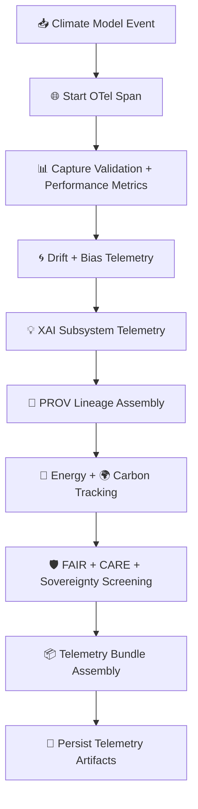

<div align="center">

# 📡🌡️🤖 **Climate AI MLOps Telemetry — KFM v11.2.2 (MAX MODE)**  
`docs/pipelines/ai/models/climate/mlops/telemetry/README.md`

**Purpose**  
Define the **telemetry + observability subsystem** for Climate AI MLOps pipelines, including:

🌐 **OpenTelemetry spans**  
📊 **model performance metrics**  
🌀 **drift + bias detection telemetry**  
📜 **model lineage (PROV)**  
💡 **XAI explainability telemetry**  
🔋 **energy consumption tracking**  
🌍 **carbon emissions auditing**  
🛡️ **FAIR+CARE + sovereignty compliance logs**  

Climate models are high-impact: inference errors or drift can influence hazards, drought analysis,  
agriculture, and Story Node v3 generation — so telemetry must be exhaustive, deterministic, and auditable.

</div>

---

## 🗂️📁📡 **Directory Layout**

```
docs/pipelines/ai/models/climate/mlops/telemetry/
    📄 README.md                 # ← This file
    📄 example-span.json         # OTel span
    📄 example-provenance.json   # PROV-O chain
    📄 example-performance.json  # RMSE/MAE/etc.
    📄 example-energy.json       # Wh telemetry
    📄 example-carbon.json       # Carbon footprint
    📄 example-drift.json        # Drift detection telemetry
    📄 example-xai.json          # XAI attribution telemetry
```

---

## 🧬📡🌡️ **Telemetry Architecture (Mermaid-Safe)**



---

## 🌡️📊🧮 **Telemetry Components**

### 1️⃣ 🌐 OpenTelemetry Spans  
Record:

- Model name & version  
- Seed  
- Training vs inference vs validation context  
- Stage timings  
- Compute backend info  

---

### 2️⃣ 📊 Model Performance Metrics  
Includes:

- RMSE, MAE  
- Bias drift  
- Correlation  
- Spatial structure loss  
- Climate-driver metrics (e.g., CAPE/CIN/cross-correlations)  

Example:

```json
{
  "performance": {
    "rmse": 1.21,
    "mae": 0.78,
    "bias": -0.06
  }
}
```

---

### 3️⃣ 🌀 Drift + Bias Telemetry  
Tracks:

- Embedding drift  
- Baseline deviation  
- Stability of climate features  
- Anomaly statistics  

Outputs:

- `drift_report.json`  
- `bias_audit.json`

---

### 4️⃣ 💡 XAI Telemetry  
XAI telemetry includes:

- Feature importance vectors  
- CAM statistics  
- Attribution summaries  
- Attention entropy  

Example:

```json
{
  "xai": {
    "importance": {
      "temperature": 0.32,
      "humidity": 0.21,
      "wind": 0.16,
      "pressure": 0.15,
      "cape": 0.16
    }
  }
}
```

---

### 5️⃣ 📜 PROV-O Lineage  
Fully traceable lineage:

- `prov:wasGeneratedBy`  
- `prov:used`  
- `prov:wasAssociatedWith`  

---

### 6️⃣ 🔋 Energy Telemetry  
Reports:

- Wh consumed  
- FLOPs  
- GPU time  
- CI energy cost  

---

### 7️⃣ 🌍 Carbon Telemetry  
Reports:

- gCO₂e per model run  
- Carbon-per-FLOP ratio  

---

### 8️⃣ 🛡️ FAIR + CARE + Sovereignty Screening  
Telemetry MUST record:

```json
{
  "care": {
    "masking": "h3-climate-generalized",
    "scope": "public-generalized",
    "notes": ["Sensitive climate regions generalized in MLOps stage"]
  }
}
```

Protects:

- Tribal data sovereignty  
- Ecological-sensitive climate signals  
- High-risk hazard zones  

---

## 🔒⚙️🧪 **Determinism Requirements**

Telemetry MUST be:

- Seed-locked  
- Repeatable on CI  
- Ordered deterministically  
- Free of stochastic randomness  
- Stable when run multiple times on identical inputs  

---

## 🧪📏🔬 **CI Validation Requirements**

CI MUST validate:

- Schema correctness  
- PROV lineage completeness  
- FAIR+CARE enforcement  
- Drift + bias tests  
- Telemetry bundle contents  
- Deterministic reproduction  
- Model-card alignment  
- All example telemetry files compile  

Failure → ❌ BLOCK.

---

## 🕰️📜 **Version History**

| Version  | Date       | Notes                                             |
|----------|------------|---------------------------------------------------|
| v11.2.2  | 2025-11-28 | Initial Climate MLOps Telemetry (MAX MODE)        |

---

<div align="center">

### 🔗 Footer  
[🌡️ Back to Climate AI MLOps](../README.md) ·  
[💡 XAI Subsystem](../xai/README.md) ·  
[🏛 Governance](../../../../../standards/governance/ROOT-GOVERNANCE.md)

</div>

