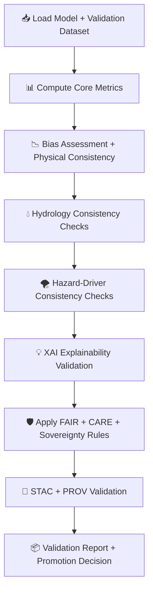

<div align="center">

# 📊🌡️🧠 **Climate AI Model Validation — KFM v11.2.2 (MAX MODE)**  
`docs/pipelines/ai/models/climate/mlops/validation.md`

**Purpose**  
Define the **validation subsystem** for Climate AI models, ensuring deterministic, governance-approved  
outputs that are stable, hazard-aware, hydrology-aware, and sovereignty-safe.  
Validation must confirm:

📈 **Metrics performance**  
📉 **Bias limits not exceeded**  
🌀 **Stability + drift resistance**  
💧 **Hydrology consistency**  
🌪️ **Hazard driver consistency**  
🧠 **XAI quality**  
🛡️ **FAIR+CARE compliance**  
📜 **STAC + PROV lineage correctness**

</div>

---

## 📘📊🌡️ **Overview — Why Validation Matters**

Climate models influence:

🌧️ Downscaling  
⚡ Hazard drivers  
💧 Hydrology models  
🌪️ Tornado/hail environments  
🧠 Focus Mode / Story Node contextual reasoning  

Validation ensures **real-world readiness** and **community safety**.

Validation MUST be:

- Reproducible  
- Deterministic  
- Comprehensive  
- FAIR+CARE aligned  
- Sovereignty-aware  
- Governed by explicit thresholds  

---

## 🧬📈🔍 **Validation Architecture (Mermaid-Safe)**



---

## 📊📏🧮 **1. Core Metrics**

Models MUST achieve thresholds:

- RMSE  
- MAE  
- SSIM  
- Correlation  
- Bias  
- Variance consistency  
- Spatial distribution structure  

Example:

```json
{
  "metrics": {
    "rmse": 1.09,
    "mae": 0.71,
    "bias": -0.02,
    "correlation": 0.92
  }
}
```

---

## 📉⚖️🌡️ **2. Bias + Physical Consistency**

Check:

- Lat/lon gradient consistency  
- Vertical thermal/wind profiles  
- Pressure consistency  
- Moisture continuity  
- Extreme-value stability  

Bias that distorts storm or hydrology interpretation → ❌ BLOCK.

---

## 💧🌊📈 **3. Hydrology Consistency Validation**

Climate downscalers MUST produce:

- Soil moisture-driven precipitation consistency  
- Runoff/evap balance alignment  
- Drought signal coherence  
- Streamflow-relevant rainfall accuracy  

Outputs:

- `hydrology_validation.json`

---

## 🌪️⚡📈 **4. Hazard-Driver Consistency Validation**

Climate models feed hazard drivers such as:

- CAPE  
- CIN  
- Shear  
- LLJ  
- Storm-relative helicity  

Validation MUST:

- Check sign/direction correctness  
- Check magnitude stability  
- Prevent hazard over-amplification  
- Detect hazard-impact drift  

Outputs:

- `hazard_driver_validation.json`

---

## 💡🧠📊 **5. XAI Explainability Validation**

Validate that:

- CAM overlays match physics  
- Attribution maps stable over seeds  
- Importance weights physically plausible  
- No sovereignty-sensitive attribution  

Outputs:

- `xai_validation.json`

---

## 🛡️⚖️🧭 **6. FAIR+CARE + Sovereignty Screening**

Validation MUST reject models that:

- Leak culturally sensitive climate patterns  
- Produce harmful or stigmatizing environmental outputs  
- Amplify hazard signals in tribal areas  
- Fail sovereignty masking or reduction rules  

CARE block:

```json
{
  "care": {
    "masking": "h3-climate-generalized",
    "scope": "public-generalized",
    "notes": ["Model rejected due to sovereignty-protection violation"]
  }
}
```

---

## 📜🌐🧬 **7. STAC + PROV Validation**

Validation ensures:

- STAC fields complete  
- Model-card correctness  
- Full PROV-O chain intact  
- Input STAC links valid  
- Care metadata included  

Outputs:

- `stac_validation.json`  
- `prov_validation.json`

---

## 📦📝🎯 **8. Validation Report + Promotion Decision**

Final decision outputs:

```
validation_report.json
promotion_decision.json
```

Promotion allowed only if:

- All thresholds met  
- CARE + sovereignty pass  
- XAI validated  
- No drift/bias red flags  
- Telemetry correct  
- PROV chain intact  

---

## 🔒⚙️🧪 **Determinism Requirements**

Validation MUST be:

- Seed-locked  
- Fully reproducible  
- Stable under CI  
- Hardware-invariant to tolerance  

---

## 🧪📏🔬 **CI Validation Requirements**

CI MUST confirm:

- Metric determinism  
- FAIR+CARE enforcement  
- STAC model-card compliance  
- Sovereignty masking  
- Correct hydrology + hazard checks  
- XAI consistency  
- No sensitive-region leakage  

Failure → ❌ CI BLOCK.

---

## 🕰️📜 **Version History**

| Version  | Date       | Notes                                               |
|----------|------------|-----------------------------------------------------|
| v11.2.2  | 2025-11-28 | Initial Climate Model Validation (MAX MODE)         |

---

<div align="center">

### 🔗 Footer  
[🌡️ Back to Climate AI MLOps](../README.md) ·  
[🧠 Model Training](./model-training.md) ·  
[🏛 Governance](../../../../../standards/governance/ROOT-GOVERNANCE.md)

</div>

