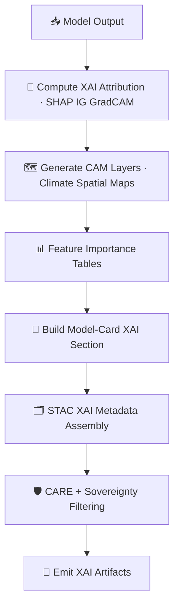

<div align="center">

# 💡🌡️🤖 **Climate AI MLOps — XAI Subsystem (MAX MODE)**  
`docs/pipelines/ai/models/climate/mlops/xai/README.md`

**Purpose**  
Define the **Explainability (XAI) subsystem** for the Climate AI MLOps pipeline, providing:  
- 🌡️ **Downscaling model explainability**  
- ⚡ **Driver model attribution (CAPE, CIN, shear, LLJ, etc.)**  
- 📉 **Bias-correction & anomaly-model XAI**  
- 🗺️ **CAM overlays** for climate surfaces  
- 📊 **Feature-importance vectors**  
- 🧠 **Transformer attention maps**  
- 🛡️ **FAIR+CARE sovereign-safe explainability**  
- 📜 **PROV-O + STAC-XAI metadata assembly**  

</div>

---

## 🗂️📁💡 **Directory Layout**

```
docs/pipelines/ai/models/climate/mlops/xai/
    📄 README.md                        # ← This file
    📄 example-model-card.json          # Full XAI-enabled model card
    📄 example-attribution.json         # Feature-importance vectors
    📄 example-cam.json                 # CAM metadata for geospatial explainability
    📄 example-provenance.json          # PROV-O lineage example
```

---

## 🧬💡🌡️ **XAI Architecture (Mermaid-Safe)**



---

## 🌡️⚡💡 **Supported Climate XAI Modalities**

### 1️⃣ **Gradient-Based Methods**
- Integrated Gradients  
- Gradient×Input  
- Saliency Maps  

### 2️⃣ **CAM / GradCAM**
- For CNN/U-Net downscaling models  
- Spatial attribution over climate grids  
- Deterministic seed-locked CAM masks  

### 3️⃣ **Feature Importance**
- SHAP-style aggregated (deterministic variant)  
- Climate-driver attribution (temp, RH, wind, pressure)  
- Bias-correction drivers  
- Anomaly-model variables  

### 4️⃣ **Attention Maps**
- Transformer-based climate models  
- Cross-layer importance  
- Spatial–temporal reasoning visibility  

---

## 🧠📊🌡️ **XAI Output Schema**

All climate models MUST generate a consistent XAI block:

```json
{
  "xai": {
    "importance": {
      "temperature": 0.31,
      "humidity": 0.22,
      "wind": 0.19,
      "pressure": 0.15,
      "cape": 0.13
    },
    "cam_assets": ["cam_temp_2025-06-03.tif"],
    "seed": 42
  }
}
```

---

## 🗺️🌀🌡️ **CAM Layer Requirements**

CAM overlays MUST:

- Use deterministic resolution  
- Be geospatially correct (CRS must be present)  
- Use **H3-masked spatial tiles** in sovereignty-covered regions  
- Embed STAC-XAI metadata  

Example STAC-XAI asset:

```json
{
  "assets": {
    "cam_temp": {
      "href": "s3://kfm/climate/xai/cam_temp_2025-06-03.tif",
      "roles": ["xai", "explanation"],
      "type": "image/tiff"
    }
  }
}
```

---

## 🛡️⚖️🧭 **FAIR+CARE + Sovereignty Rules**

Climate XAI MUST be sovereignty-safe:

- Remove hyperlocal anomaly explanation in tribal regions  
- Generalize vertical climate driver attribution  
- Mask CAM hotspots in protected ecological zones  
- Include a CARE block:

```json
{
  "care": {
    "masking": "h3-climate-generalized",
    "scope": "public-generalized",
    "notes": ["CAM and attribution generalized to respect sovereignty protections"]
  }
}
```

---

## 📜🧾🧠 **PROV-O Integration**

XAI MUST include:

```json
{
  "prov": {
    "wasGeneratedBy": "urn:kfm:activity:xai:climate:abcd123",
    "used": [
      "urn:kfm:data:stac:climate_item",
      "urn:kfm:model:climate_downscaler_v11_2"
    ],
    "agent": "urn:kfm:service:climate-xai-engine"
  }
}
```

This ensures model outputs remain lineage-safe, auditable, and reversible.

---

## 🔒⚙️🧪 **Determinism Requirements**

Climate XAI MUST be:

- Seed-locked  
- Free of random perturbations  
- Hardware-invariant (to tolerance)  
- Stable under CI replays  
- Identical outputs for identical inputs  

---

## 🧪📏🔬 **CI Validation Requirements**

CI MUST verify:

- XAI schema validity  
- Model-card correctness  
- STAC-XAI Item integrity  
- CARE + sovereignty compliance  
- Deterministic XAI output  
- PROV lineage completeness  
- Telemetry presence  
- No leakage of sensitive geographies  

Failure → ❌ CI BLOCK.

---

## 🕰️📜 **Version History**

| Version  | Date       | Notes                                             |
|----------|------------|---------------------------------------------------|
| v11.2.2  | 2025-11-28 | Initial Climate MLOps XAI Subsystem (MAX MODE)    |

---

<div align="center">

### 🔗 Footer  
[🌡️ Back to Climate AI MLOps](../README.md) ·  
[🧠 Model Training](../model-training.md) ·  
[🏛 Governance](../../../../../standards/governance/ROOT-GOVERNANCE.md)

</div>

