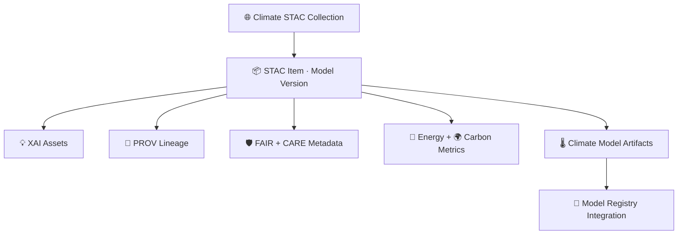

<div align="center">

# 🌐🌡️📦 **Climate AI STAC Catalog — KFM v11.2.2 (MAX MODE)**  
`docs/pipelines/ai/models/climate/stac/README.md`

**Purpose**  
Define the **STAC Catalog system** for all Climate AI model outputs:  
downscaling, driver models (CAPE, CIN, shear, LLJ), anomaly models, bias-correction models,  
XAI artifacts, provenance, energy/carbon telemetry, and sovereign-safe climate metadata.  

This catalog ensures **discoverability**, **traceability**, **FAIR+CARE compliance**,  
**deterministic lineage**, and **full compatibility with KFM Focus Mode, Story Nodes, and Hazard/Hydro pipelines**.

</div>

---

## 📘🌐🌡️ **Overview — Why a Climate STAC Catalog?**

KFM integrates **thousands of model artifacts** across:

- 🌡️ Downscaling  
- ⚡ Climate driver modeling  
- 🌧️ Bias correction  
- 📉 Anomaly modeling  
- 💧 Hydrology + climate coupling  
- 🌪️ Hazard-linked climate fields  
- 🧠 XAI model cards  
- 📜 PROV lineage  
- 🔋 Energy + 🌍 Carbon sustainability metrics  

A **governed STAC catalog** ensures:

- Deterministic metadata  
- Model reproducibility  
- FAIR+CARE ethics  
- Sovereignty protection  
- Stable API access for UI pipelines  
- STAC → Focus Mode compatibility  
- Model registry linking  
- CI validation  

---

## 🗂️📁🌡️ **Directory Layout (MAX MODE)**

```
docs/pipelines/ai/models/climate/stac/
    📄 README.md                    # ← This file
    📁 collections/                 # STAC Collections for climate model groups
        📄 downscaling.json
        📄 drivers.json
        📄 bias-correction.json
        📄 anomalies.json
        📄 mlops.json
    📁 items/                       # STAC Items for each model version
        📄 model_v11.2.2.json
        📄 model_v11.2.1.json
        📄 model_v11.1.0.json
    📁 model-cards/                 # XAI-enabled model-card JSONs
        📄 model-card_v11.2.2.json
        📄 model-card_v11.2.1.json
    📁 provenance/                  # PROV-O metadata chains
        📄 prov-model_v11.2.2.json
    📁 telemetry/                   # Energy/Carbon + OTel bundles
        📄 telemetry_v11.2.2.json
```

---

## 🧬🌐📦 **STAC Metadata Architecture (Mermaid-Safe)**



---

## 🌡️📦📜 **STAC Collection Requirements**

Each Collection MUST define:

- `id`, `title`, `description`  
- Spatial + temporal extent  
- STAC + KFM-STAC profiles  
- License  
- Keywords  
- Governance links  
- Sovereignty handling notes  
- CARE category  
- Links to child Items  

Example:

```json
{
  "type": "Collection",
  "id": "climate-drivers",
  "stac_version": "1.0.0",
  "title": "KFM Climate Driver Models (CAPE, CIN, Shear, LLJ)",
  "extent": {...},
  "license": "MIT"
}
```

---

## 📦🌡️🧠 **STAC Item Requirements (Per-Model Version)**

Each model version MUST produce:

```json
{
  "type": "Feature",
  "id": "climate_downscaler_v11_2_2",
  "stac_version": "1.0.0",
  "assets": {
    "weights": {"href": "model.pt"},
    "xai": {"href": "xai/"},
    "telemetry": {"href": "telemetry/"},
    "provenance": {"href": "prov.json"}
  },
  "properties": {
    "model:version": "v11.2.2",
    "model:seed": 42,
    "model:architecture": "unet",
    "care:scope": "public-generalized"
  }
}
```

MUST include:

- XAI assets  
- PROV-O lineage  
- CARE metadata  
- Sovereignty notes  
- Energy/Carbon metrics  
- Model-card linkage  

---

## 📄🧠💡 **Model Cards**

Model card MUST include:

- Training metadata  
- Hyperparameters  
- Metrics  
- Drift/bias risk notes  
- XAI results  
- Sovereignty-safe narrative  
- CARE metadata  
- Governance approvals  

These are stored under:

```
model-cards/model-card_v11.2.2.json
```

---

## 🧠📊🌀 **Drift/Bias & Stability Metadata**

Every STAC Item MUST include stability fields:

```json
{
  "drift": {
    "rmse_diff": 0.01,
    "embedding_shift": 0.002,
    "hazard_impact_drift": 0.003
  }
}
```

These feed MLOps gates.

---

## 🛡️⚖️🧭 **FAIR+CARE + Sovereignty Enforcement**

Climate STAC Items MUST include CARE metadata:

```json
{
  "care": {
    "masking": "h3-climate-generalized",
    "scope": "public-generalized",
    "notes": ["STAC representation generalized in sovereignty-protected regions"]
  }
}
```

STAC Items MUST NOT:

- Expose hyperlocal sensitive climate signatures  
- Amplify hazard-relevant climate patterns in tribal regions  
- Reveal culturally protected landforms  

---

## 📡🔋🌍 **Telemetry Integration**

STAC Entries MUST include pointers to:

```
telemetry_v11.2.2.json
energy_v2.json
carbon_v2.json
otel_spans.json
```

Each telemetry bundle MUST be sovereignty-screened.

---

## 🧪📏🔬 **CI Validation Requirements**

CI MUST confirm:

- STAC schema compliance  
- Deterministic STAC item creation  
- FAIR+CARE enforcement  
- Sovereignty protection  
- XAI metadata completeness  
- PROV lineage integrity  
- Telemetry schema validity  
- Model-card → STAC linkage  
- No sensitive-region leakage  

Failure → ❌ CI BLOCK.

---

## 🕰️📜 **Version History**

| Version | Date       | Notes                                       |
|---------|------------|---------------------------------------------|
| v11.2.2 | 2025-11-28 | Initial Climate STAC Catalog (MAX MODE)     |

---

<div align="center">

### 🔗 Footer  
[🌡️ Back to Climate AI Models](../README.md) ·  
[🧠 Climate MLOps](../mlops/README.md) ·  
[🏛 Governance](../../../../../standards/governance/ROOT-GOVERNANCE.md)

</div>

