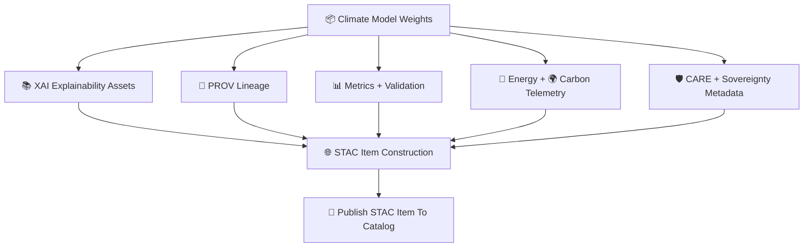

<div align="center">

# 📦🌡️🌐 **Climate STAC Items — KFM v11.2.2 (MAX MODE)**  
`docs/pipelines/ai/models/climate/stac/items/README.md`

**Purpose**  
Define the **STAC Items** representing *each version* of every Climate AI model in KFM:  
downscalers, anomaly models, bias correction, driver models (CAPE, CIN, shear, LLJ),  
XAI artifacts, provenance metadata, energy/carbon telemetry, and governance tags.  

STAC Items ensure **deterministic discoverability**, **full transparency**,  
**sovereignty-safe metadata**, and **FAIR+CARE compliance** across model families.

</div>

---

## 📘📦🌡️ **Overview — What Is A Climate STAC Item?**

A STAC Item represents:

- A specific **model version**  
- Its **assets** (weights, XAI, telemetry, PROV, metadata)  
- Its **governance metadata** (CARE, sovereignty, lineage)  
- Its **energy + carbon footprint**  
- Its **validation + drift status**  
- Its **model-card linkage**  
- Its **role** in downstream pipelines (hazard, hydro, focus, embeddings)

This allows the KFM to maintain an *immutable, governance-audited* archive  
of all Climate AI artifacts.

---

## 🗂️📁📦 **Directory Layout (MAX MODE)**

```
docs/pipelines/ai/models/climate/stac/items/
    📄 README.md                       # ← This file
    📄 model_v11.2.2.json              # Latest Climate Downscaler + Drivers
    📄 model_v11.2.1.json
    📄 model_v11.1.0.json
    📄 item-template.json              # Template for new STAC Items
```

---

## 🧬🌐📦 **STAC Item Architecture (Mermaid-Safe)**



---

## 📄🌡️🧠 **Required STAC Item Fields**

Each Climate STAC Item MUST include:

### 1️⃣ **STAC Core Fields**

```json
{
  "type": "Feature",
  "stac_version": "1.0.0",
  "id": "climate_downscaler_v11_2_2",
  "collection": "climate-models"
}
```

### 2️⃣ **Model Properties**

- `model:version`  
- `model:seed`  
- `model:architecture`  
- `model:domain`  
- `model:family` (downscaling, driver, anomaly, bias correction)

### 3️⃣ **Assets Block**

Every Item MUST include assets for:

- `"weights"`  
- `"xai"`  
- `"telemetry"`  
- `"provenance"`  
- `"model-card"`  
- `"metrics"`  

Example:

```json
{
  "assets": {
    "weights": {"href": "model.pt"},
    "xai": {"href": "xai/"},
    "telemetry": {"href": "telemetry/"},
    "provenance": {"href": "prov-model_v11.2.2.json"},
    "model-card": {"href": "model-card_v11.2.2.json"}
  }
}
```

### 4️⃣ **CARE + Sovereignty Metadata**

```json
{
  "care": {
    "masking": "h3-climate-generalized",
    "scope": "public-generalized",
    "notes": ["Model generalized in sovereignty-protected regions"]
  }
}
```

### 5️⃣ **Drift + Bias + Stability Fields**

```json
{
  "stability": {
    "drift_rmse": 0.01,
    "embedding_shift": 0.002,
    "hazard_impact_drift": 0.001
  }
}
```

### 6️⃣ **Energy + Carbon Telemetry**

```json
{
  "energy": {"wh": 3.98},
  "carbon": {"gco2e": 0.39}
}
```

### 7️⃣ **STAC Relations**

```
"links": [
  {"rel": "collection", "href": "../collections/downscaling.json"},
  {"rel": "model-card", "href": "../model-cards/model-card_v11.2.2.json"}
]
```

---

## 🧪📏🔬 **CI Validation Requirements**

CI MUST validate:

- STAC schema compliance  
- CARE + sovereignty fields  
- Metric metadata completeness  
- PROV lineage correctness  
- XAI asset presence  
- Telemetry JSON correctness  
- Deterministic STAC item generation  
- No sensitive-region leakage  

Failure → ❌ CI BLOCK.

---

## 🕰️📜 **Version History**

| Version | Date       | Notes                                      |
|---------|------------|--------------------------------------------|
| v11.2.2 | 2025-11-28 | Initial Climate STAC Items Documentation    |

---

<div align="center">

### 🔗 Footer  
[🌡️ Back to Climate STAC Catalog](../README.md) ·  
[📄 Model Cards](../model-cards/README.md) ·  
[🏛 Governance](../../../../../../../standards/governance/ROOT-GOVERNANCE.md)

</div>

