<div align="center">

# 📄🌡️🤖 **Climate Model Cards Catalog — KFM v11.2.2 (MAX MODE)**  
`docs/pipelines/ai/models/climate/stac/model-cards/README.md`

**Purpose**  
Define the **Model Card Catalog** for all Climate AI models in KFM.  
Climate model cards provide **transparent, sovereign-safe, FAIR+CARE-aligned documentation** for:

- 🌡️ Downscaling models  
- ⚡ Climate drivers (CAPE, CIN, shear, LLJ, lapse rates)  
- ☁️ Anomaly models  
- 🧪 Bias-correction models  
- 🔥 Hazard-linked climate preprocessors  
- 💡 XAI explainability attached to each model  
- 📜 PROV lineage  
- 📈 Metrics + stability + drift metadata  
- 🌍 Energy + carbon usage  
- 🛡️ Sovereignty + CARE metadata  

These cards are required for **deployment**, **validation**, **audit**, **Focus Mode integration**, and **STAC catalog publishing**.

</div>

---

## 🗂️📁📄 **Directory Layout (MAX MODE)**

```
docs/pipelines/ai/models/climate/stac/model-cards/
    📄 README.md                                 # ← This file
    📄 model-card_v11.2.2.json                    # XAI-enabled climate model card
    📄 model-card_v11.2.1.json
    📄 model-card_template.json                   # Template for new climate model cards
```

---

## 🧬📦🌡️ **Model Card Architecture (Mermaid-Safe)**

```mermaid
flowchart TD
    A[🧠 Climate Model Outputs] --> B[📊 Metrics · RMSE MAE Bias SSIM]
    B --> C[💡 XAI Explainability · CAM Importance Attribution]
    C --> D[📜 PROV Lineage · Training + Data Sources]
    D --> E[🛡️ CARE + Sovereignty Metadata]
    E --> F[🌐 Build STAC-Linked Model Card JSON]
    F --> G[📦 Publish To Model Cards Catalog]
```



---

## 📄🌡️🧠 **Required Model Card Sections**

Each Climate Model Card MUST contain the following blocks:

---

### 1️⃣ **Model Overview**

```json
{
  "model:version": "v11.2.2",
  "model:architecture": "unet",
  "model:seed": 42,
  "model:domain": "downscaling"
}
```

Includes:

- Architecture  
- Purpose  
- Model family  
- Seed lock enforcement  

---

### 2️⃣ **Training Metadata**

Training summary MUST include:

- Hyperparameters  
- Dataset STAC links  
- Training epochs  
- Normalization metadata  
- Sovereignty-safe preprocessing rules  

Example:

```json
{
  "training": {
    "epochs": 40,
    "lr": 0.0003,
    "batch_size": 32,
    "dataset_stac_refs": ["era5_item", "terrain_item"]
  }
}
```

---

### 3️⃣ **Metrics & Validation**

Must include:

- RMSE / MAE  
- Bias / correlation  
- Spatial structure metrics  
- Hazard-linked metrics (CAPE/CIN/shear)  
- Hydrology-linked metrics  

```json
{
  "metrics": {
    "rmse": 1.07,
    "bias": -0.02,
    "correlation": 0.93
  }
}
```

---

### 4️⃣ **XAI Explainability**

Each model card MUST include:

- Feature importance  
- CAM overlays  
- Attribution maps  
- XAI provenance  

Example:

```json
{
  "xai": {
    "importance": {
      "temperature": 0.32,
      "humidity": 0.21,
      "wind": 0.18,
      "pressure": 0.16,
      "cape": 0.13
    },
    "cam_assets": ["cam_temp_2025-06-03.tif"]
  }
}
```

---

### 5️⃣ **Stability, Drift & Bias Fields**

Every card MUST track:

```json
{
  "stability": {
    "drift_rmse": 0.01,
    "embedding_shift": 0.002,
    "hazard_impact_drift": 0.001
  }
}
```

---

### 6️⃣ **PROV-O Lineage Fields**

Required:

```json
{
  "prov": {
    "wasGeneratedBy": "urn:kfm:activity:training:climate_downscaler_v11_2_2",
    "used": [
      "urn:kfm:data:stac:era5_item",
      "urn:kfm:data:stac:terrain"
    ],
    "agent": "urn:kfm:service:climate-training-engine"
  }
}
```

---

### 7️⃣ **FAIR+CARE & Sovereignty Metadata**

Model cards MUST embed sovereign-safety notes:

```json
{
  "care": {
    "masking": "h3-climate-generalized",
    "scope": "public-generalized",
    "notes": ["Model outputs generalized in sovereignty-protected climate zones"]
  }
}
```

---

### 8️⃣ **Energy + Carbon Sustainability**

Required fields:

```json
{
  "energy": {"wh": 4.12},
  "carbon": {"gco2e": 0.41}
}
```

---

### 9️⃣ **Model Artifacts + STAC Links**

All cards MUST reference:

- Model weights  
- XAI artifacts  
- Telemetry bundles  
- Provenance bundles  
- STAC Item  

Example:

```json
{
  "assets": {
    "weights": {"href": "model.pt"},
    "xai": {"href": "xai/"},
    "telemetry": {"href": "telemetry/"}
  }
}
```

---

## 🛡️⚖️🧭 **FAIR+CARE & Sovereignty Enforcement in Model Cards**

All Climate AI cards MUST:

- Avoid exposing sensitive climate patterns  
- Mask hazard amplification over tribal regions  
- Generalize anomaly signals  
- Respect sovereignty metadata inheritance  
- Pass governance gates  

---

## 🧪📏🔬 **CI Validation Requirements**

CI MUST verify:

- JSON schema correctness  
- XAI completeness  
- PROV integrity  
- STAC linkage  
- CARE + sovereignty metadata  
- Drift metrics present  
- Deterministic reproduction  
- No sensitive-region leakage  

Failure → ❌ CI BLOCK.

---

## 🕰️📜 **Version History**

| Version | Date       | Notes                                        |
|---------|------------|----------------------------------------------|
| v11.2.2 | 2025-11-28 | Initial Climate Model Card Catalog (MAX MODE) |

---

<div align="center">

### 🔗 Footer  
[🌡️ Back to Climate STAC Catalog](../README.md) ·  
[📜 Provenance](../provenance/README.md) ·  
[🏛 Governance](../../../../../../../standards/governance/ROOT-GOVERNANCE.md)

</div>

