<div align="center">

# 📜🌐🌡️ **Climate STAC Provenance Catalog — KFM v11.2.2 (MAX MODE)**  
`docs/pipelines/ai/models/climate/stac/provenance/README.md`

**Purpose**  
Define the **PROV-O lineage system** for Climate STAC Collections and Items.  
This governs **traceability**, **model accountability**, **training-data lineage**,  
**XAI provenance**, **MLOps audit chains**, and **sovereignty-aware metadata paths**,  
ensuring *every climate model artifact* is reconstructible, reversible, and governance-safe.

</div>

---

## 📘📜🌡️ **Overview — Why Provenance?**

Every climate model version depends on:

- Training datasets (ERA5, NARR, HRRR, NLDAS)  
- Preprocessing pipelines  
- Downscaling architectures  
- Driver models (CAPE, CIN, shear, LLJ)  
- Bias-correction workflows  
- Anomaly pipelines  
- XAI explainability artifacts  
- Sustainability telemetry  
- Sovereignty screening logic  

PROV-O lineage guarantees:

- Deterministic reconstruction of any model version  
- Governance oversight & safety reviews  
- FAIR+CARE compliance  
- Ancestry tracking for model families  
- Transparent cross-pipeline dependency modeling  
- Inputs → transformations → outputs → metadata  

---

## 🗂️📁📜 **Directory Layout (MAX MODE)**

```
docs/pipelines/ai/models/climate/stac/provenance/
    📄 README.md                       # ← This file
    📄 prov-model_v11.2.2.json         # PROV-O lineage example for a model
    📄 prov-model_v11.2.1.json
    📄 prov-downscaling-template.json  # Template PROV structure for new models
    📄 prov-driver-template.json       # Template for CAPE/CIN/shear/LLJ models
    📄 prov-biascorr-template.json     # Template for bias-correction models
    📄 prov-anomaly-template.json      # Template for anomaly models
```

---

## 🧬📜🔐 **Provenance Architecture (Mermaid-Safe)**

```mermaid
flowchart TD
    A[📥 STAC Item] --> B[📜 PROV-O Activity Block]
    B --> C[🧬 Inputs: Training Data + Drivers + Pipelines]
    C --> D[⚙️ Transformations: Training Downscaling BiasCorr Anomaly]
    D --> E[📦 Outputs: Model Weights XAI Telemetry]
    E --> F[🛡️ CARE + Sovereignty Metadata]
    F --> G[🌐 Write STAC Item With Provenance]
```



---

## 📜🧬🌡️ **Required PROV-O Fields**

Each STAC Item MUST include:

```json
{
  "prov": {
    "wasGeneratedBy": "urn:kfm:activity:training:climate_downscaler_v11_2_2",
    "used": [
      "urn:kfm:data:stac:era5_item",
      "urn:kfm:data:stac:terrain",
      "urn:kfm:model:climate_drivers_v11_2_1"
    ],
    "agent": "urn:kfm:service:climate-training-engine"
  }
}
```

Additional mandatory blocks:

### ✔ `prov:used`  
Includes all upstream sources:

- Climate drivers  
- Terrain  
- Preprocessing pipelines  
- Hydrology coupling layers  
- Bias-correction assets  
- XAI templates  

### ✔ `prov:wasGeneratedBy`  
Describes training or model-building activity.

### ✔ `prov:wasAssociatedWith`  
Climate MLOps service agent.

### ✔ Deterministic seeds  
Always included in `properties.model:seed`.

---

## 🧠💡📊 **XAI Provenance Requirements**

Every XAI output MUST have:

```json
{
  "xai:prov": {
    "wasGeneratedBy": "urn:kfm:activity:xai:climate_v11_2_2",
    "used": [
      "weights.pt",
      "normalization.json",
      "driver_inputs.json"
    ],
    "agent": "urn:kfm:service:climate-xai-engine"
  }
}
```

XAI provenance links **attribution maps → model parameters → training inputs**.

---

## 🔋🌍📡 **Telemetry Provenance Integration**

Telemetry artifacts MUST include PROV links:

```json
{
  "prov": {
    "wasGeneratedBy": "urn:kfm:activity:telemetry:run",
    "used": ["model.pt", "stac_item.json"],
    "agent": "urn:kfm:service:climate-telemetry-engine"
  }
}
```

Energy & carbon metrics MUST be tied to activity IDs.

---

## 🛡️⚖️🧭 **FAIR+CARE & Sovereignty Provenance**

Provenance MUST track:

- Sovereignty-driven masking  
- CARE transformation stages  
- H3 downsampling in sensitive areas  
- Hazard suppression logic  
- Cultural-site redaction  

Example:

```json
{
  "care": {
    "masking": "h3-climate-generalized",
    "scope": "public-generalized",
    "notes": ["Sovereignty protections applied during training and STAC assembly"]
  }
}
```

---

## 📦📜🧾 **Provenance Templates Provided**

Templates MUST exist for:

- Downscaling models  
- Driver models  
- Bias correction  
- Anomaly detection  
- Climate embeddings coupling  

These templates ensure deterministic, CI-safe PROV creation.

---

## 🧪📏🔬 **CI Validation Requirements**

CI MUST verify:

- PROV-O schema validity  
- All upstream dependencies included  
- Deterministic ordering of `prov:used`  
- Sovereignty metadata present  
- CARE metadata valid  
- STAC–PROV cross-links intact  
- Activity → agent → entity chains complete  
- No sensitive-site leakage  

Failure → ❌ CI BLOCK.

---

## 🕰️📜 **Version History**

| Version | Date       | Notes                                             |
|---------|------------|---------------------------------------------------|
| v11.2.2 | 2025-11-28 | Initial Climate STAC Provenance Catalog (MAX MODE) |

---

<div align="center">

### 🔗 Footer  
[🌡️ Back to Climate STAC Catalog](../README.md) ·  
[📜 STAC Items](../items/) ·  
[🏛 Governance](../../../../../../../standards/governance/ROOT-GOVERNANCE.md)

</div>

