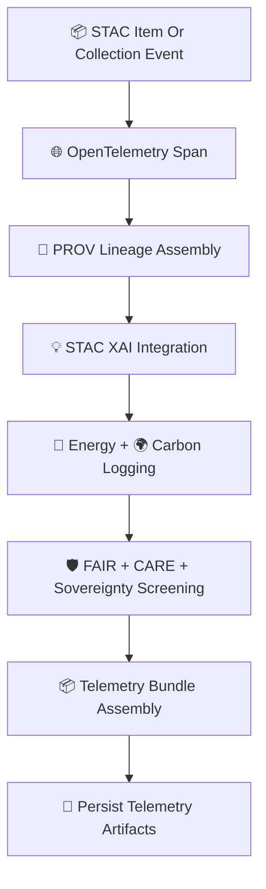

<div align="center">

# 📡🌐🌡️ **Climate STAC Telemetry — KFM v11.2.2 (MAX MODE)**  
`docs/pipelines/ai/models/climate/stac/telemetry/README.md`

**Purpose**  
Define the **telemetry subsystem** used for KFM Climate STAC Items & Collections.  
Telemetry ensures **traceability**, **observability**, **sustainability tracking**, and **FAIR+CARE compliance**  
for climate model metadata and STAC lineage.

Covers:

🌐 **OpenTelemetry (OTel) spans**  
📜 **PROV-O lineage blocks**  
💡 **STAC-XAI metadata**  
🔋 **Energy usage**  
🌍 **Carbon emissions**  
🛡️ **FAIR+CARE + sovereignty screening**  
📦 **CI validation for STAC packages**

</div>

---

## 🗂️📁📡 **Directory Layout**

```
docs/pipelines/ai/models/climate/stac/telemetry/
    📄 README.md                # ← This file
    📄 example-span.json        # OTel span telemetry
    📄 example-provenance.json  # PROV-O metadata
    📄 example-energy.json      # Energy usage
    📄 example-carbon.json      # Carbon metrics
    📄 example-stac.json        # STAC telemetry wrapper
```

---

## 🧬📡🌐 **STAC Telemetry Architecture (Mermaid-Safe)**



---

## 🌐📡📊 **1. OpenTelemetry For STAC**

STAC telemetry MUST include:

- Event type (Item, Collection)  
- Operation metadata (create/update/validate)  
- Latency  
- Seed for deterministic STAC-building routines  
- STAC version  
- Schema profile (KFM-STAC v11)  

Example:

```json
{
  "otel": {
    "operation": "stac_item_create",
    "latency_ms": 16,
    "seed": 42
  }
}
```

---

## 📜🧾🌡️ **2. PROV-O Lineage**

Each STAC event MUST generate:

```json
{
  "prov": {
    "wasGeneratedBy": "urn:kfm:activity:stac:build",
    "used": [
      "urn:kfm:model:climate_downscaler_v11_2_2",
      "urn:kfm:data:stac:era5_item"
    ],
    "agent": "urn:kfm:service:climate-stac-engine"
  }
}
```

Ensures:

- Full traceability  
- Easy rollback/revalidation  
- Governance auditability  

---

## 💡🌐🧠 **3. STAC-XAI Integration**

Telemetry MUST capture:

- Presence of XAI assets  
- CAM/mask coverage  
- Importance-vector metadata  
- XAI provenance  
- XAI–STAC link correctness  

Example:

```json
{
  "xai": {
    "assets": ["cam_temp_2025-06-03.tif"],
    "importance_present": true
  }
}
```

---

## 🔋🌍📊 **4. Sustainability Telemetry**

Track:

- Energy (Wh)  
- FLOPs  
- GPU/CPU usage  
- Carbon emissions (gCO₂e)  
- Accumulated climate-model meta-cost  

Example:

```json
{
  "energy": {
    "wh": 0.12,
    "carbon_gco2e": 0.01
  }
}
```

---

## 🛡️⚖️🌎 **5. FAIR+CARE + Sovereignty Screening**

STAC telemetry MUST include:

```json
{
  "care": {
    "masking": "h3-climate-generalized",
    "scope": "public-generalized",
    "notes": ["STAC telemetry inspected for sensitive-region leakage"]
  }
}
```

Protects:

- Tribal sovereignty  
- Culturally sensitive metadata  
- Non-public environmental signatures  

---

## 📦📜🔒 **6. Telemetry Bundle Assembly**

Bundles MUST include:

```
otel/
prov/
xai/
energy/
carbon/
stac/
```

Packaged into:

- `.json`  
- `.zip` bundles for CI  

---

## 🧪📏🔬 **CI Validation Requirements**

CI MUST ensure:

- STAC telemetry schema validity  
- PROV-O completeness  
- XAI presence  
- CARE metadata correctness  
- No sovereignty-leaking metadata  
- Deterministic telemetry under repeated builds  
- Telemetry bundle completeness  

Failure → ❌ CI BLOCK.

---

## 🕰️📜 **Version History**

| Version | Date       | Notes                                          |
|---------|------------|------------------------------------------------|
| v11.2.2 | 2025-11-28 | Initial Climate STAC Telemetry (MAX MODE)      |

---

<div align="center">

### 🔗 Footer  
[🌡️ Back to Climate STAC Catalog](../README.md) ·  
[🧠 Climate MLOps](../../mlops/README.md) ·  
[🏛 Governance](../../../../../../../standards/governance/ROOT-GOVERNANCE.md)

</div>

