<div align="center">

# 📑🔡🧠 **Embeddings Evaluation Report — KFM v11.2.2 (MAX MODE)**  
`docs/pipelines/ai/models/embeddings/evaluation-report.md`

**Purpose**  
Provide a **full governance-grade evaluation report** for all embedding models used in KFM,  
including spatial 🗺️, climate 🌡️, hydrology 💧, hazard 🌪️, narrative 📚, and fusion embeddings 🎯.  
This report consolidates:

📊 Cross-domain quality metrics  
📈 Stability + drift analysis  
🌀 Regime/clustering diagnostics  
💡 XAI attribution verification  
🔡 Domain relevance distributions  
🛡️ FAIR+CARE + sovereignty compliance  
📜 STAC/PROV traceability  
🔋 Energy + 🌍 carbon sustainability impacts  

This file is typically **generated automatically** during quarterly governance cycles.

</div>

---

## 🧬📑🔡 **Evaluation Architecture (Mermaid-Safe)**

```mermaid
flowchart TD
    A[📥 Load Embedding Models All Domains] --> B[📊 Compute Quality Metrics]
    B --> C[📈 Stability And Drift Analysis]
    C --> D[🧩 Regime Cluster Evaluation]
    D --> E[💡 XAI Attribution Consistency]
    E --> F[🛡️ FAIRCARE And Sovereignty Screening]
    F --> G[📜 STAC And PROV Consistency Checks]
    G --> H[🔋 Sustainability Energy Carbon Assessment]
    H --> I[📦 Final Evaluation Report Assembly]
```



---

## 📊🔡💠 **1. Cross-Domain Quality Metrics**

Evaluate for each domain:

- **Vector norm statistics**  
- **Cosine similarity distributions**  
- **Dimension integrity**  
- **Embedding variance**  
- **Cluster coherence (k-means or HDBSCAN)**  
- **Latent manifold structure (PCA/UMAP)**  
- **Outlier analysis**  

Example metrics block:

```json
{
  "quality": {
    "norm_mean": 1.01,
    "norm_std": 0.07,
    "cosine_mean": 0.42,
    "cluster_coherence": 0.87
  }
}
```

---

## 📈🌀🔍 **2. Stability & Drift Evaluation**

Check:

- Centroid drift  
- Cosine-distance drift  
- Cross-domain drift (spatial ↔ climate ↔ hydrology ↔ hazard ↔ narrative)  
- Sensitive-region drift (sovereignty zones)  
- Similarity-distribution shifts  
- Embedding “shape” evolution over versions  

Outputs:

- `drift_summary.json`  
- `centroid_drift.json`  
- `cosine_drift.json`  

---

## 🧩📊🧠 **3. Regime & Cluster Evaluation**

Embedding regime detection includes:

- Cluster center movement  
- Regime reassignment rate  
- Hazard/hydro/climate domain misalignment  
- Fusion instability  
- Narrative cluster drift  

Outputs:

- `cluster_report.json`  
- `regime_shift.json`  

---

## 💡🧠📈 **4. XAI Attribution Evaluation**

Verify:

- Cross-domain importance vector correctness  
- CAM stability (spatial embeddings)  
- Narrative attention weights integrity  
- Transformer-attention entropy changes  
- XAI drift thresholds  

Example:

```json
{
  "xai_evaluation": {
    "importance_stability": 0.91,
    "cam_shift_score": 0.17,
    "attention_entropy": 0.82
  }
}
```

---

## 🛡️⚖️🧭 **5. FAIR+CARE + Sovereignty Compliance Evaluation**

Evaluate:

- Culturally sensitive narrative embeddings  
- Hazard signal leakage in tribal lands  
- Climate anomaly misrepresentation  
- Sensitive geography encoded in spatial embeddings  
- Proper H3 masking in sovereignty zones  

Example:

```json
{
  "care": {
    "masking": "h3-embedding-generalized",
    "scope": "public-generalized",
    "safe": true
  }
}
```

---

## 📜🌐🔍 **6. STAC + PROV Consistency**

Cross-reference:

- STAC Items ↔ model-card metadata  
- PROV lineage completeness  
- Asset references (weights, XAI, telemetry)  
- Drift/stability fields present  
- Version-pinning integrity  

Example:

```json
{
  "stac_consistency": {
    "valid": true,
    "missing_links": []
  }
}
```

---

## 🔋🌍📊 **7. Sustainability Evaluation**

Record and evaluate:

- Energy use (Wh)  
- Carbon emissions (gCO₂e)  
- FLOP estimates  
- Hardware utilization  
- Training → inference sustainability ratio  

Example:

```json
{
  "sustainability": {
    "energy_wh": 3.11,
    "carbon_gco2e": 0.28
  }
}
```

---

## 📦🧾🎯 **8. Final Evaluation Verdict**

A governance-complete evaluation MUST produce:

```
evaluation_report.json
evaluation_verdict.json
evaluation_artifacts/
    quality/
    drift/
    xai/
    stac/
    sustainability/
    sovereignty/
```

Verdicts:

- **approval**  
- **approval-with-conditions**  
- **reject-and-retrain**  
- **trigger-rollback**  

Example verdict:

```json
{
  "verdict": "approval-with-conditions",
  "notes": ["Minor drift near sensitive hydrology clusters; monitor for 30 days"]
}
```

---

## 🕰️📜 **Version History**

| Version | Date       | Notes                                                  |
|---------|------------|--------------------------------------------------------|
| v11.2.2 | 2025-11-28 | Initial Embeddings Evaluation Report (MAX MODE)        |

---

<div align="center">

### 🔗 Footer  
[🔡 Back to Embeddings Models](./README.md) ·  
[🚀 MLOps Pipeline](mlops/README.md) ·  
[🏛 Governance](../../../standards/governance/ROOT-GOVERNANCE.md)

</div>

