<div align="center">

# 📚🔡🧠 **Embeddings Model Examples — KFM v11.2.2 (MAX MODE)**  
`docs/pipelines/ai/models/embeddings/examples/README.md`

**Purpose**  
Provide a library of **clean, deterministic, FAIR+CARE-safe examples** for all embedding model types:

🗺️ **Spatial embeddings**  
🌡️ **Climate embeddings**  
💧 **Hydrology embeddings**  
🌪️🔥🌊❄️ **Hazard embeddings**  
📚 **Narrative embeddings (Story Node v3)**  
🎯 **Cross-domain fusion vectors (Focus Mode)**  

These examples assist developers, governance reviewers, and CI tools in validating  
**correct embedding structure, metadata, XAI, and sovereignty compliance**.

</div>

---

## 🗂️📁🔡 **Directory Layout (MAX MODE)**

```
docs/pipelines/ai/models/embeddings/examples/
    📄 README.md                           # ← This file
    📄 example_spatial_embedding.json       # DEM/H3/landcover example embedding
    📄 example_climate_embedding.json       # climate latent vector with metadata
    📄 example_hydrology_embedding.json     # soil moisture/runoff/streamflow embedding
    📄 example_hazard_embedding.json        # tornado/hail/fire/heat/winter embedding
    📄 example_narrative_embedding.json     # Story Node semantic vector example
    📄 example_fusion_embedding.json        # Focus Mode cross-domain fusion vector
    📄 example_xai_block.json               # XAI attribution for embedding
    📄 example_stac_embedding_item.json     # STAC embedding item example
    📄 example_provenance.json              # PROV lineage example
```

---

## 🧬🔡📦 **Embedding Example Architecture (Mermaid-Safe)**

```mermaid
flowchart TD
    A[🔡 Example Embedding Vector] --> B[📊 Metadata · Dimension · Domain · Seed]
    B --> C[💡 XAI Block · Importance · CAM · Attention]
    C --> D[📜 PROV Lineage]
    D --> E[🌐 STAC Embedding Item]
    E --> F[🛡️ CARE + Sovereignty Metadata]
```



---

## 🗺️🏔️🌾 **Example — Spatial Embedding**

```json
{
  "domain": "spatial",
  "dimension": 512,
  "vector": [0.12, 0.09, 0.03, "..."],
  "h3": "892830828cbffff",
  "metadata": {
    "terrain_relief": 0.41,
    "landcover_class": "grassland",
    "watershed_id": "HUC10-1026000805"
  },
  "seed": 42
}
```

---

## 🌡️🌬️💧 **Example — Climate Embedding**

```json
{
  "domain": "climate",
  "dimension": 768,
  "vector": [0.22, 0.14, 0.07, "..."],
  "metadata": {
    "temp_2m": 300.4,
    "dewpoint_2m": 294.9,
    "wind_10m_u": -4.1,
    "wind_10m_v": 1.8,
    "pressure_msl": 100880
  },
  "seed": 42
}
```

---

## 💧🌊🪴 **Example — Hydrology Embedding**

```json
{
  "domain": "hydrology",
  "dimension": 640,
  "vector": [0.04, 0.02, 0.33, "..."],
  "metadata": {
    "soil_moisture": 0.41,
    "runoff_mm": 3.1,
    "streamflow_cms": 12.4
  },
  "seed": 42
}
```

---

## 🌪️🔥🌨️ **Example — Hazard Embedding**

```json
{
  "domain": "hazard",
  "dimension": 768,
  "vector": [0.18, 0.26, 0.31, "..."],
  "metadata": {
    "srh_0_1km": 134,
    "cape": 2820,
    "shear_0_6km": 22,
    "hail_proxy": 0.64
  },
  "seed": 42
}
```

---

## 📚🧠📖 **Example — Narrative Embedding**

```json
{
  "domain": "narrative",
  "dimension": 1024,
  "vector": [0.05, 0.11, 0.02, "..."],
  "metadata": {
    "text_excerpt": "The valley floor narrowed between steep bluffs...",
    "geospatial_context": "H3-892830828cbffff",
    "temporal_context": "1873-06-14"
  },
  "seed": 42
}
```

---

## 🎯🔡🧠 **Example — Fusion Embedding (Focus Mode)**

```json
{
  "domain": "fusion",
  "dimension": 2048,
  "vector": [0.44, 0.21, 0.17, "..."],
  "metadata": {
    "spatial_weight": 0.28,
    "climate_weight": 0.21,
    "hydrology_weight": 0.19,
    "hazard_weight": 0.17,
    "narrative_weight": 0.15
  },
  "seed": 42
}
```

---

## 💡🧠📊 **Example — XAI Block (Cross-Domain Attribution)**

```json
{
  "xai": {
    "importance": {
      "spatial": 0.28,
      "climate": 0.22,
      "hydrology": 0.18,
      "hazard": 0.17,
      "narrative": 0.15
    },
    "seed": 42
  }
}
```

---

## 🌐📦📜 **Example — STAC Embedding Item**

```json
{
  "type": "Feature",
  "stac_version": "1.0.0",
  "id": "embedding_climate_v11_2_2",
  "properties": {
    "model:domain": "climate",
    "model:dimension": 768,
    "model:seed": 42
  },
  "assets": {
    "weights": {"href": "embedding_model.pt"},
    "xai": {"href": "xai/"},
    "telemetry": {"href": "telemetry/"},
    "provenance": {"href": "provenance.json"}
  },
  "care": {
    "masking": "h3-embedding-generalized",
    "scope": "public-generalized"
  }
}
```

---

## 📜🧬🌐 **Example — PROV Lineage**

```json
{
  "prov": {
    "wasGeneratedBy": "urn:kfm:activity:training:embedding_v11_2_2",
    "used": [
      "urn:kfm:data:stac:terrain_item",
      "urn:kfm:data:stac:climate_item"
    ],
    "agent": "urn:kfm:service:embeddings-training-engine"
  }
}
```

---

## 🧪📏🔬 **CI Validation Notes for Examples**

All example files MUST:

- Use deterministic seeds  
- Match KFM-STAC + KFM-OP v11.2.2 schemas  
- Include CARE metadata  
- Include PROV lineage  
- Avoid sensitive-region leakage  
- Use realistic but non-identifying values  
- Validate under CI example-schema  

---

## 🕰️📜 **Version History**

| Version | Date       | Notes                                                |
|---------|------------|------------------------------------------------------|
| v11.2.2 | 2025-11-28 | Initial Embeddings Examples Catalog (MAX MODE)       |

---

<div align="center">

### 🔗 Footer  
[🔡 Back to Embeddings Models](../README.md) ·  
[🚀 MLOps Pipeline](../mlops/README.md) ·  
[🏛 Governance](../../../../../standards/governance/ROOT-GOVERNANCE.md)

</div>

