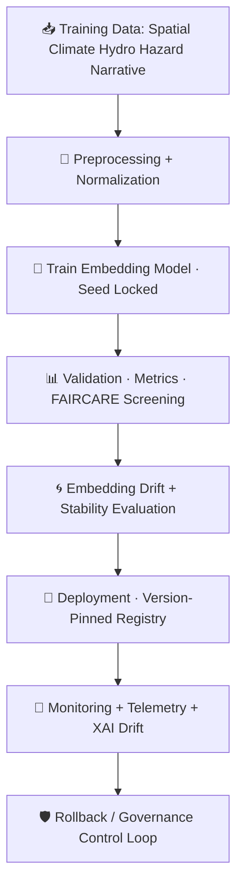

<div align="center">

# 🔡🧠🚀 **Embeddings MLOps Pipeline — KFM v11.2.2 (MAX MODE)**  
`docs/pipelines/ai/models/embeddings/mlops/README.md`

**Purpose**  
Define the **end-to-end MLOps system** for training, validating, deploying, monitoring, governing,  
and rolling back **Embeddings Models** across domains:

🗺️ *Spatial Embeddings*  
🌡️ *Climate Embeddings*  
💧 *Hydrology Embeddings*  
🌪️🔥🌊❄️ *Hazard Embeddings*  
📚 *Narrative/StoryNode Embeddings*  
🤝 *Focus Mode + Multi-Embedding Fusion Ecosystem*

All embedding models MUST be **seed-locked**, **sovereignty-protected**, **FAIR+CARE-compliant**,  
**XAI-enabled**, and **fully STAC/PROV traceable**.

</div>

---

## 📘🔡🧠 **Overview — What Are Embeddings MLOps Pipelines?**

KFM embedding models compress high-dimensional environmental + geospatial + narrative signals into  
**fused latent vectors** enabling:

- Vector search  
- Climate analog detection  
- Hazard/hydro/climate pattern retrieval  
- Focus Mode contextual reasoning  
- Story Node v3 semantic grounding  
- Embedding-driven routing and similarity inference

MLOps ensures these embeddings remain:

- Deterministic  
- Stable  
- Sovereignty-safe  
- Governed  
- Drift-resistant  
- XAI-interpretable  
- STAC-cataloged and version-pinned

---

## 🗂️📁🔡 **Directory Layout (MAX MODE)**

```
docs/pipelines/ai/models/embeddings/mlops/
    📄 README.md                  # ← This file
    📄 training.md                # Embedding model training procedures
    📄 validation.md              # Validation gates for embeddings
    📄 deployment.md              # Registry + promotion rules
    📄 monitoring.md              # Continuous monitoring + drift checks
    📄 drift-detection.md         # Embedding drift algorithms
    📄 rollbacks.md               # Safe rollback procedures
    📁 telemetry/                 # Energy/Carbon/OTel/PROV
        📄 README.md
    📁 xai/                       # Embedding Explainability Subsystem
        📄 README.md
```

---

## 🧬🔡⚙️ **Embeddings MLOps Architecture (Mermaid-Safe)**



---

## 🧠📚🔡 **Embedding Model Types Supported**

- 🗺️ **Spatial Embeddings** → terrain, H3, landcover, watershed  
- 🌡️ **Climate Embeddings** → temp, dewpoint, wind, pressure, stability  
- 💧 **Hydrology Embeddings** → runoff, soil moisture, streamflow, drought  
- 🌪️🔥🌊❄️ **Hazard Embeddings** → tornado, hail, flood, fire-weather, heat, winter  
- 📚 **Narrative Embeddings** → Story Node v3, contextual semantics  
- 🎯 **Focus Fusion Embeddings** → cross-domain fusion vectors  

All embedding types MUST follow identical MLOps governance and validation rules.

---

## 📘📦🧠 **Model Training Requirements (Summary)**

Training MUST be:

- Deterministic  
- Seed-locked  
- FAIR+CARE-reviewed  
- Sovereignty-filtered  
- PROV-tracked  
- STAC-linked  
- Sustainability-measured  

Outputs MUST include:

- Model weights (`.pt` or `.onnx`)  
- Embedding dimension summary  
- Training metrics  
- XAI artifacts  
- PROV lineage  
- Telemetry (energy, carbon)  
- CARE metadata  

---

## 📊🧪📈 **Validation Gates**

Validation MUST check:

- Mean vector stability  
- Embedding drift tolerance  
- Similarity-distance consistency  
- Sovereignty leakage tests  
- Climate/hazard/hydro/narrative alignment  
- XAI importance-dimension coherence  
- FAIR+CARE compliance  
- Telemetry correctness  

Outputs:

- `validation_report.json`  
- `promotion_decision.json`

---

## 🚀📦🔐 **Deployment Rules**

Deployment requires:

- Deterministic model weights  
- Model-card JSON  
- STAC Item  
- PROV lineage  
- CARE block  
- XAI importance + CAM (if spatial)  
- Energy/carbon metrics  
- Registry immutability  

Example registry path:

```
embeddings/models/<domain>/v11.2.2/
```

---

## 📡🧠📈 **Monitoring + Telemetry**

Monitors:

- Embedding drift  
- Similarity regression  
- Distance-distribution changes  
- FAIR+CARE violations  
- Sovereignty masking success  
- XAI drift  
- Energy/carbon cost trends  
- PROV lineage continuity  

Example telemetry snippet:

```json
{
  "drift": {
    "centroid_shift": 0.002,
    "cosine_shift": 0.004
  }
}
```

---

## 🌀📉🔡 **Embedding Drift Detection**

Embedding drift checks:

- Centroid drift  
- Local neighborhood distortion  
- Regime clustering changes  
- Hazard-impact drift  
- Hydrology-impact drift  
- Narrative-context drift  
- XAI-relative drift  
- Sovereignty-region anomaly drift  

Rollback triggers defined in `rollbacks.md`.

---

## ⏪🛡️⚙️ **Rollbacks & Recovery**

Rollback when:

- Drift threshold exceeded  
- Sovereignty violation  
- CARE block failure  
- XAI inconsistency  
- Telemetry regression  
- Governance veto  

Rollback MUST:

- Restore last known-good embedding model  
- Reset STAC Item + PROV lineage  
- Regenerate CARE metadata  
- Enforce deterministic reproduction  

---

## 🧪📏🔬 **CI Validation Requirements**

CI MUST verify:

- Deterministic embeddings  
- No sovereignty leakage  
- FAIR+CARE compliance  
- XAI completeness  
- STAC + PROV correctness  
- Drift detection reproducibility  
- Telemetry validity  
- Energy/carbon metadata  

CI failure → ❌ BLOCK.

---

## 🕰️📜 **Version History**

| Version | Date       | Notes                                       |
|---------|------------|---------------------------------------------|
| v11.2.2 | 2025-11-28 | Initial Embeddings MLOps Pipeline (MAX MODE) |

---

<div align="center">

### 🔗 Footer  
[🔡 Back to Embeddings Models](../README.md) ·  
[💡 XAI Subsystem](./xai/README.md) ·  
[🏛 Governance](../../../../../standards/governance/ROOT-GOVERNANCE.md)

</div>

