<div align="center">

# 🚀🔡🧠 **Embeddings Model Deployment — KFM v11.2.2 (MAX MODE)**  
`docs/pipelines/ai/models/embeddings/mlops/deployment.md`

**Purpose**  
Define the **deployment, promotion, and integrity-governance system** for all embedding models:  
🗺️ Spatial, 🌡️ Climate, 💧 Hydrology, 🌪️ Hazard, 📚 Narrative, and 🎯 Focus Fusion embeddings.  
Deployment ensures embedding vectors remain **deterministic, sovereignty-safe, FAIR+CARE compliant,  
STAC-linked, XAI-enabled, traceable, and registry-immutable**.

</div>

---

## 📘🚀🔡 **Overview — Why Embedding Deployment Governance?**

Embedding models influence:

- 🔍 Similarity search  
- 🌡️ Climate analog detection  
- 💧 Hydrology regime clustering  
- 🌪️ Hazard pattern recognition  
- 📚 Story Node v3 narrative alignment  
- 🎯 Focus Mode fusion vectors  

Incorrect, drifting, or biased embeddings can propagate **system-wide errors**.

Deployment governance enforces:

- Deterministic weights  
- Metadata completeness  
- FAIR+CARE ethics  
- Sovereignty safety  
- Registry integrity  
- Version-pinned semantics  
- CI guardrails  

---

## 🧬🚀📦 **Deployment Architecture (Mermaid-Safe)**

```mermaid
flowchart TD
    A[📦 Candidate Embedding Model Artifacts] --> B[📊 Validation + Drift/Bias Screening]
    B --> C[🔐 Integrity Signing + Hashing]
    C --> D[🌐 Build STAC Embedding Item + PROV Chain]
    D --> E[🛡️ FAIRCARE + Sovereignty Enforcement]
    E --> F[🚀 Push To Embedding Model Registry]
    F --> G[📡 Activate Monitoring + Telemetry]
    G --> H[🌀 Promotion / Rollback Governance]
```



---

## 📦🔡🧠 **1. Embedding Artifact Preparation**

Required artifacts:

```
embedding_model.pt
embedding_metadata.json
embedding_summary.json
xai/
provenance/
telemetry/
stac/item.json
```

Artifacts MUST be:

- Reproducible  
- Seed-locked  
- Deterministic  
- CARE-compliant  
- STAC/PROV-integrated  

---

## 📊📈🔍 **2. Validation + Drift/Bias Screening**

Deployment blocked unless:

- Centroid drift < threshold  
- Cosine distribution stable  
- No sensitive-region leakage  
- No hazard/hydro/climate embedding anomalies  
- Narrative/sociocultural embedding safety passes  
- Telemetry + XAI present  
- FAIR+CARE gates pass  

Outputs:

- `deployment_validation.json`  
- `promotion_decision.json`

---

## 🔐📝🧾 **3. Integrity Signing + Hashing**

All embedding models MUST be:

- SHA-256 hashed  
- Optionally Sigstore-signed  
- Locked immutable in registry  

Example:

```json
{
  "integrity": {
    "hash": "<sha256>",
    "signature": "<sigstore-block>",
    "immutable": true
  }
}
```

---

## 🌐📜📦 **4. STAC Embedding Item Assembly**

STAC Item MUST include:

- Embedding domain  
- Seed  
- Dimensionality  
- Training metadata  
- Metrics  
- Drift indicators  
- XAI vectors  
- CARE + sovereignty metadata  
- Energy/carbon telemetry  
- Model-card references  

Example STAC snippet:

```json
{
  "model:domain": "climate",
  "model:dimension": 1024,
  "model:seed": 42,
  "assets": {
    "weights": {"href": "embedding_model.pt"},
    "xai": {"href": "xai/"},
    "telemetry": {"href": "telemetry/"}
  }
}
```

---

## 🛡️⚖️🧭 **5. FAIR+CARE + Sovereignty Enforcement**

Embedding deployment MUST ensure:

- No cultural site embedding patterns  
- No geospatial leakage in sensitive areas  
- H3-based downsampling for sovereignty regions  
- Hazard-driven embedding suppression when needed  

CARE block required:

```json
{
  "care": {
    "masking": "h3-embedding-generalized",
    "scope": "public-generalized",
    "notes": ["Embedding model generalized in sovereignty-protected embeddings domain"]
  }
}
```

---

## 🚀📦🔐 **6. Deployment To Embedding Model Registry**

Registry entries MUST be immutable:

```
embeddings/models/<domain>/v11.2.2/
    embedding_model.pt
    embedding.stac.json
    provenance/
    xai/
    telemetry/
```

Deployment MUST update:

- Registry manifest  
- STAC index catalog  
- CI validation tables  

---

## 📡🧠📈 **7. Monitoring Activation**

Post-deployment monitoring includes:

- Embedding drift  
- XAI change detection  
- Similarity-distribution shifts  
- Sovereignty-safety checks  
- Telemetry (energy, carbon, OTel spans)  

---

## 🌀⏪⚙️ **8. Promotion / Rollback Controls**

Promotion allowed only when:

- Drift thresholds stable  
- Sovereignty tests pass  
- FAIR+CARE validated  
- PROV and STAC complete  

Rollback triggers:

- Drift anomaly  
- CARE violation  
- Narrative or hazard misalignment  
- Telemetry outliers  
- Governance veto  

Rollback MUST restore:

```
last_known_good/
stac/
provenance/
telemetry/
xai/
```

---

## 🔒⚙️🧪 **Determinism Requirements**

Deployment MUST verify:

- Reproducible embedding vectors  
- Stable hash across runs  
- Deterministic STAC and PROV outputs  
- Ordered metadata serialization  
- Fixed seed presence  

---

## 🧪📏🔬 **CI Validation Requirements**

CI MUST confirm:

- Embedding determinism  
- No sensitive-region leakage  
- FAIR+CARE enforcement  
- STAC/PROV completeness  
- XAI correctness  
- Energy/carbon telemetry validity  
- Drift/bias validation  
- Schema correctness  

Failure → ❌ CI BLOCK.

---

## 🕰️📜 **Version History**

| Version | Date       | Notes                                                   |
|---------|------------|---------------------------------------------------------|
| v11.2.2 | 2025-11-28 | Initial Embeddings MLOps Deployment Documentation        |

---

<div align="center">

### 🔗 Footer  
[🔡 Back to Embeddings MLOps](../README.md) ·  
[📊 Validation](./validation.md) ·  
[🏛 Governance](../../../../../standards/governance/ROOT-GOVERNANCE.md)

</div>

