<div align="center">

# 🌀🔡🧠 **Embeddings Drift & Bias Detection — KFM v11.2.2 (MAX MODE)**  
`docs/pipelines/ai/models/embeddings/mlops/drift-detection.md`

**Purpose**  
Define the **drift detection and bias auditing system** for all KFM embedding models.  
This subsystem tracks **vector-space stability**, **cross-domain influence drift**,  
**sovereignty-relevant anomalies**, and **FAIR+CARE integrity** across:

🗺️ Spatial Embeddings  
🌡️ Climate Embeddings  
💧 Hydrology Embeddings  
🌪️ Hazard Embeddings  
📚 Narrative Embeddings  
🎯 Focus Fusion Embeddings  

Embedding drift has *massive downstream impacts* on hazard, hydrology, climate analogs, and  
Story Node/Focus Mode reasoning.

</div>

---

## 📘🌀🔡 **Overview — Why Embedding Drift Matters**

Drift in embedding models can:

- Degrade similarity search  
- Distort climate analog detection  
- Misalign hazard/hydro/climate embeddings  
- Produce culturally unsafe narratives  
- Break Focus Mode contextual reasoning  
- Misbehavior in risk-scoring or watershed identification  
- Compromise sovereignty protections  

Thus drift detection MUST be exhaustive, deterministic, and governance-audited.

---

## 🧬🌀📡 **Drift Detection Architecture (Mermaid-Safe)**

```mermaid
flowchart TD
    A[📥 New Embedding Vector Output] --> B[📊 Compute Core Metrics]
    B --> C[📉 Centroid Shift Analysis]
    C --> D[🔡 Cosine-Distance Drift]
    D --> E[🧩 Regime Cluster Drift]
    E --> F[💡 XAI Drift Attribution]
    F --> G[🛡️ CARE + Sovereignty Screening]
    G --> H[📦 Drift Report Assembly]
    H --> I[🛑 Trigger Rollback Or Promotion Gate]
```



---

## 📊🔡📈 **1. Core Metrics**

Core drift metrics MUST include:

- Norm stability  
- Cosine similarity distribution  
- PCA/UMAP latent consistency  
- Distance variance  
- Cross-domain relevance scores  

Example:

```json
{
  "metrics": {
    "norm_mean": 1.02,
    "norm_std": 0.07
  }
}
```

---

## 📉📍🌀 **2. Centroid Shift**

Track centroid Δ of vector clouds:

```
centroid_drift = || centroid_new - centroid_baseline ||
```

Thresholds MUST be governance-approved.

---

## 📉🔡🧠 **3. Cosine-Distance Drift**

Track distribution divergence:

- Cosine shift mean  
- Cosine shift variance  
- Long-tail anomalies  
- Sensitive-region distortions  

Example:

```json
{
  "cosine_drift": 0.0042
}
```

---

## 🧩📈🔍 **4. Regime Cluster Drift**

Track:

- Cluster center displacement  
- Regime assignment changes  
- Hazard/hydro/climate domain misalignment  
- Sovereignty-area cluster split/merge anomalies  

Outputs:

- `cluster_drift.json`

---

## 💡🧠📊 **5. XAI Drift Attribution**

Track cross-domain XAI drift:

```json
{
  "xai_drift": {
    "importance_shift": {
      "spatial": +0.03,
      "climate": -0.01,
      "hydrology": +0.02,
      "hazard": -0.02,
      "narrative": -0.02
    },
    "cam_shift_score": 0.17
  }
}
```

---

## 🛡️⚖️🧭 **6. CARE + Sovereignty Drift Screening**

All drift detection MUST include:

```json
{
  "care": {
    "masking": "h3-embedding-generalized",
    "scope": "public-generalized",
    "notes": ["Drift detection flagged sovereignty-relevant embedding change"]
  }
}
```

Screen for:

- Cultural-site embedding anomalies  
- Hazard or climate misalignment in tribal regions  
- Sensitive-region vector amplification  

---

## 📦📝🧾 **7. Drift Report Assembly**

Assemble report artifacts:

- `drift_report.json`  
- `centroid_drift.json`  
- `cosine_drift.json`  
- `cluster_drift.json`  
- `xai_drift.json`  
- `sovereignty_drift.json`  
- STAC-XAI + PROV lineage references  

All MUST be CI-auditable.

---

## 🛑⚙️🎯 **8. Rollback / Promotion Gate**

Rollback triggers:

- Drift above threshold  
- Sovereignty anomaly  
- XAI drift instability  
- Hazard/hydro/climate domain misalignment  
- FairCARE governance veto  

Promotion allowed ONLY if:

- Drift scores stable  
- CARE + sovereignty safe  
- XAI consistent  
- Telemetry validated  
- STAC/PROV complete  

---

## 🔒⚙️🧪 **Determinism Requirements**

All drift detection MUST be:

- Seed-locked  
- Deterministic across hardware  
- Stable under CI  
- Free of randomness  
- Ordered evaluation  

---

## 🧪📏🔬 **CI Validation Requirements**

CI MUST validate:

- Drift metric determinism  
- Correct CARE metadata  
- Sovereignty protection integrity  
- PROV lineage links  
- STAC-XAI compliance  
- Metric threshold correctness  
- No sensitive-region leakage  
- Reproducibility across runs  

Failure → ❌ CI BLOCK.

---

## 🕰️📜 **Version History**

| Version | Date       | Notes                                                     |
|---------|------------|-----------------------------------------------------------|
| v11.2.2 | 2025-11-28 | Initial Embeddings Drift Detection Documentation (MAX MODE) |

---

<div align="center">

### 🔗 Footer  
[🔡 Back to Embeddings MLOps](../README.md) ·  
[📡 Telemetry](../telemetry/README.md) ·  
[🏛 Governance](../../../../../standards/governance/ROOT-GOVERNANCE.md)

</div>

