<div align="center">

# 📡🔡🧠 **Embeddings Model Monitoring — KFM v11.2.2 (MAX MODE)**  
`docs/pipelines/ai/models/embeddings/mlops/monitoring.md`

**Purpose**  
Define the **continuous monitoring subsystem** for embedding models driving KFM’s cross-domain intelligence.  
Monitoring ensures **embedding stability**, **drift detection**, **sovereignty protection**,  
**FAIR+CARE compliance**, and **telemetry-backed governance** across:

🗺️ Spatial Embeddings  
🌡️ Climate Embeddings  
💧 Hydrology Embeddings  
🌪️ Hazard Embeddings  
📚 Narrative Embeddings  
🎯 Focus Fusion Embeddings

Embedding health affects **hazards**, **hydrology models**, **climate inference**, **vector search**,  
**Story Node v3 narratives**, and **Focus Mode context reasoning**.

</div>

---

## 📘📡🔡 **Overview — Why Monitoring Embeddings Matters**

If embedding models drift:

- Hazard prediction becomes unstable  
- Hydrology similarity mappings break  
- Climate analog search becomes invalid  
- Narrative embeddings can become culturally unsafe  
- Focus Mode loses contextual accuracy  
- Sovereignty masking may degrade  

Therefore monitoring must be:

- Deterministic  
- Seed-locked  
- FAIR+CARE-governed  
- Sovereignty-aware  
- Fully telemetry backed  
- CI reproducible  
- PROV-linked  

---

## 🧬📡🌀 **Monitoring Architecture (Mermaid-Safe)**

```mermaid
flowchart TD
    A[📥 Embedding Model Inference Event] --> B[📊 Compute Runtime Embedding Metrics]
    B --> C[🌀 Drift Indicators]
    C --> D[🔡 Similarity Distribution Monitoring]
    D --> E[💡 Runtime XAI Attribution Checks]
    E --> F[📜 PROV Lineage Verification]
    F --> G[🔋 Energy + 🌍 Carbon Accounting]
    G --> H[🛡️ FAIRCARE + Sovereignty Screening]
    H --> I[📦 Monitoring Bundle Assembly]
    I --> J[🚨 Alerts + Governance Review]
```



---

## 📊🔡📈 **1. Embedding Performance Metrics**

Each embedding inference MUST compute:

- Vector norm  
- Variance  
- Cosine similarity to baseline clusters  
- Embedding dimension integrity  
- PCA/UMAP stability  
- H3 region consistency (if spatial)  
- Environmental alignment  

Example:

```json
{
  "metrics": {
    "norm_mean": 1.03,
    "norm_std": 0.05,
    "cosine_mean": 0.42
  }
}
```

---

## 🌀📉🔡 **2. Drift Indicators**

Monitor:

- Centroid drift  
- Cosine distribution drift  
- Cross-domain drift (spatial↔climate↔hydro↔hazard↔narrative)  
- Cluster (regime) drift  
- H3-sensitive drift  
- Sovereignty-region anomalies  

Outputs:

- `drift_signal.json`  
- `embedding_drift.json`

---

## 📈📊🧩 **3. Similarity-Distribution Monitoring**

Embedding similarity powers:

- Hazard/environment analog search  
- Hydrology regime classification  
- Climate cluster matching  
- Narrative linkage  
- Focus Mode retrieval

Monitoring MUST track:

- Similarity histograms  
- Distribution skew  
- Tail-outlier signals  
- Neighborhood consistency  

Example:

```json
{
  "similarity_distribution": {
    "mean": 0.41,
    "std": 0.09,
    "tail_anomalies": 3
  }
}
```

---

## 💡🧠🔍 **4. Runtime XAI Attribution Monitoring**

Track:

- Cross-domain importance shifts  
- CAM map changes (spatial embeddings)  
- Attention entropy (Transformer embeddings)  
- Narrative-attention stability  
- Sovereignty-sensitive attribution changes  

Example:

```json
{
  "xai_runtime": {
    "importance_shift": {
      "spatial": +0.02,
      "hazard": -0.01,
      "climate": +0.01
    }
  }
}
```

---

## 📜🧾🧬 **5. PROV Lineage Verification**

Ensure:

- The correct model weights were used  
- STAC Item references match deployment  
- Provenance chain unbroken  
- Deterministic metadata trails preserved  

---

## 🔋🌍📡 **6. Energy + Carbon Accounting**

Each embedding inference logs:

- FLOPs  
- Wh energy used  
- Carbon emitted (gCO₂e)  
- GPU/CPU utilization  
- Cumulative usage over time  

Example:

```json
{
  "energy": {
    "wh": 0.09,
    "carbon_gco2e": 0.01
  }
}
```

---

## 🛡️⚖️🧭 **7. FAIR+CARE + Sovereignty Screening**

Embedding monitoring MUST include CARE block:

```json
{
  "care": {
    "masking": "h3-embedding-generalized",
    "scope": "public-generalized",
    "notes": ["Monitoring generalized over sovereignty-sensitive regions"]
  }
}
```

Screen for:

- Sovereignty-region drift  
- Culturally unsafe narrative embeddings  
- Hazard anomaly leakage into sensitive domains  
- Spatial over-localization  

---

## 🚨🛑🏛️ **8. Alerts + Governance Review**

Alerts triggered when:

- Drift threshold exceeded  
- XAI drift unstable  
- Sovereignty red flags detected  
- CARE violation  
- Similarity distribution anomaly  
- Telemetry outliers  
- PROV inconsistency
- Embedding domain misalignment  

Alerts escalate to:

- Embeddings Working Group  
- FAIR+CARE Council  
- Sovereignty Review Board  

---

## 🧪📏🔬 **CI Validation Requirements**

CI MUST confirm:

- Deterministic monitoring outputs  
- No sensitive-region leakage  
- CARE + sovereignty compliance  
- XAI metadata correctness  
- Drift metric reproducibility  
- Telemetry schema integrity  
- PROV lineage validity  
- Similarity distribution stability  

Failure → ❌ CI BLOCK.

---

## 🕰️📜 **Version History**

| Version | Date       | Notes                                                  |
|---------|------------|--------------------------------------------------------|
| v11.2.2 | 2025-11-28 | Initial Embeddings Monitoring Documentation (MAX MODE) |

---

<div align="center">

### 🔗 Footer  
[🔡 Back to Embeddings MLOps](../README.md) ·  
[🌀 Drift Detection](./drift-detection.md) ·  
[🏛 Governance](../../../../../standards/governance/ROOT-GOVERNANCE.md)

</div>

