<div align="center">

# ⏪🔡🧠 **Embeddings Rollback System — KFM v11.2.2 (MAX MODE)**  
`docs/pipelines/ai/models/embeddings/mlops/rollbacks.md`

**Purpose**  
Define the **rollback + safe reversion system** for embedding models across spatial, climate, hydrology,  
hazard, narrative, and Focus Mode fusion vectors.  
Rollbacks protect **contextual intelligence**, **hazard/hydro models**, **climate analogs**,  
**Story Node reasoning**, and **vector search correctness** when drift, bias, or sovereignty violations occur.

</div>

---

## 📘⏪🔡 **Overview — When Do Embedding Rollbacks Trigger?**

Rollbacks are triggered by:

- 🌀 Embedding drift > threshold  
- 📉 Bias or domain misalignment  
- 🎯 Similarity-distribution anomalies  
- 🛡️ Sovereignty or CARE violations  
- 💡 XAI drift or unsafe attribution  
- ⚠️ Telemetry inconsistencies  
- 🧩 Cluster/regime instability  
- 🏛️ Governance veto  

Recovery MUST be:

- Deterministic  
- Seed-locked  
- REPRODUCIBLE  
- Sovereignty-safe  
- FAIR+CARE validated  
- STAC + PROV updated  

---

## 🧬⏪⚙️ **Rollback Architecture (Mermaid-Safe)**

```mermaid
flowchart TD
    A[🚨 Drift/Bias/Sovereignty Alert] --> B[📊 Governance Review + Evidence Eval]
    B --> C[🔐 Verify Prior Stable Embedding Model Integrity]
    C --> D[📦 Restore From Registry · Rehydrate STAC Item]
    D --> E[📜 Build Rollback PROV + STAC Metadata]
    E --> F[📡 Post-Rollback Monitoring + XAI Stability]
    F --> G[🛡️ Confirm FAIRCARE + Sovereignty Compliance]
    G --> H[🎯 Re-Activate Stable Embedding Model]
```



---

## 🌀📉📑 **1. Alert Intake & Evidence Capture**

Rollback begins when:

- Drift detection fails thresholds  
- Similarity signature anomalies flagged  
- Sovereignty protection triggered  
- XAI drift red-flag  
- Telemetry anomaly  

Capture:

- `drift_report.json`  
- `similarity_drift.json`  
- `sovereignty_alert.json`  
- `xai_drift.json`  
- `telemetry_snapshot.json`  

---

## 🏛️📊⚖️ **2. Governance Review**

Rollback MUST be reviewed by:

- Embeddings Working Group  
- FAIR+CARE Council  
- Sovereignty Board  
- (Optional) Hazard/Hydro/Climate model leads  

Decision recorded in:

- `rollback_decision.json`

---

## 🔐📦🧠 **3. Restore Prior Stable Embedding Model**

Registry restore MUST:

- Verify SHA-256 integrity  
- Validate deterministic reproduction  
- Confirm STAC Item integrity  
- Restore full artifact set:

```
embedding_model.pt
embedding.stac.json
provenance/
xai/
telemetry/
```

No partial restores.

---

## 📜🌐🧬 **4. Rollback STAC + PROV Regeneration**

Rollback MUST generate a new STAC Item documenting:

- Rollback reason  
- Restored version  
- Seed  
- CARE context  
- Drift/bias metrics leading to rollback  
- Sovereignty trigger  

Example:

```json
{
  "rollback": {
    "reason": "embedding_drift_exceeded",
    "restored_version": "v11.2.1",
    "seed": 42
  }
}
```

---

## 📡🔍🧠 **5. Post-Rollback Monitoring**

Immediate monitoring MUST confirm:

- Embedding drift stabilized  
- Similarity distribution normalized  
- XAI attribution restored  
- Sovereignty masks applied  
- CARE metadata correct  
- Telemetry consistent  

---

## 🛡️⚖️🧭 **6. FAIR+CARE + Sovereignty Verification**

Rollback MUST enforce:

```json
{
  "care": {
    "masking": "h3-embedding-generalized",
    "scope": "public-generalized",
    "notes": ["Rollback applied after sovereignty-protection violation"]
  }
}
```

All embedding outputs verified for:

- Cultural safety  
- Spatial safety  
- Hazard/environ anomaly masking  
- Narrative-neutrality  

---

## 🎯🚀🔁 **7. Re-Activate Stable Embedding Model**

Stable model becomes active deployment:

```
active = v11.2.1
rollback_of = v11.2.2
```

Re-activation triggers enhanced drift monitoring for 48h.

---

## 🔒⚙️🧪 **Determinism Requirements**

Rollback MUST:

- Be fully deterministic  
- Reproduce identical embedding vectors  
- Match prior STAC metadata  
- Validate lineage + provenance  
- Enforce stable sorting/serialization  

---

## 🧪📏🔬 **CI Validation Requirements**

CI MUST validate:

- Rollback correctness  
- Deterministic reproduction  
- FAIR+CARE + sovereignty correctness  
- Drift/bias evidence  
- PROV + STAC linkage  
- Telemetry bundle consistency  
- No sensitive-region leakage  

Failure → ❌ CI BLOCK.

---

## 🕰️📜 **Version History**

| Version | Date       | Notes                                               |
|---------|------------|-----------------------------------------------------|
| v11.2.2 | 2025-11-28 | Initial Embeddings Rollback Documentation (MAX MODE) |

---

<div align="center">

### 🔗 Footer  
[🔡 Back to Embeddings MLOps](../README.md) ·  
[📡 Monitoring](./monitoring.md) ·  
[🏛 Governance](../../../../../standards/governance/ROOT-GOVERNANCE.md)

</div>

