<div align="center">

# 📡🔡🧠 **Embeddings MLOps Telemetry — KFM v11.2.2 (MAX MODE)**  
`docs/pipelines/ai/models/embeddings/mlops/telemetry/README.md`

**Purpose**  
Define the **telemetry subsystem** for Embedding Models used across spatial, climate, hydrology,  
hazard, narrative, and Focus Mode fusion pipelines.  
Telemetry ensures **observability**, **drift detection**, **FAIR+CARE governance**,  
**sovereignty safety**, and complete **PROV lineage** for embedding-related activity.

</div>

---

## 🗂️📁📡 **Directory Layout**

```
docs/pipelines/ai/models/embeddings/mlops/telemetry/
    📄 README.md                     # ← This file
    📄 example-span.json             # OTel span telemetry
    📄 example-drift.json            # Drift signals
    📄 example-performance.json      # Embedding metrics
    📄 example-energy.json           # Energy usage
    📄 example-carbon.json           # Carbon emissions
    📄 example-provenance.json       # PROV lineage metadata
    📄 example-xai.json              # XAI telemetry block
```

---

## 🧬📡🔡 **Telemetry Architecture (Mermaid-Safe)**

```mermaid
flowchart TD
    A[📥 Embedding Model Event] --> B[🌐 OpenTelemetry Span]
    B --> C[📊 Embedding Performance Metrics]
    C --> D[🌀 Embedding Drift Monitoring]
    D --> E[💡 XAI Telemetry · Attribution Shifts]
    E --> F[📜 PROV Lineage]
    F --> G[🔋 Energy And 🌍 Carbon Logging]
    G --> H[🛡️ FAIRCARE + Sovereignty Screening]
    H --> I[📦 Telemetry Bundle Assembly]
    I --> J[💾 Persist Telemetry Artifacts]
```



---

## 🔡📊🧠 **1. Embedding Performance Metrics**

Metrics MUST include:

- Vector norm consistency  
- PCA/UMAP reconstruction stability  
- Similarity-distance distribution  
- Cluster cohesion  
- Domain alignment (spatial/climate/hydro/hazard/narrative)  
- Drift-resilience metrics  

Example:

```json
{
  "metrics": {
    "norm_mean": 1.02,
    "norm_std": 0.08,
    "cosine_mean": 0.41
  }
}
```

---

## 🌀📉🔡 **2. Embedding Drift Monitoring**

Telemetry MUST track:

- Centroid drift  
- Cosine distribution shifts  
- Neighborhood distortion  
- Regime clustering drift  
- Cross-domain alignment drift  
- Sovereignty region drift red flags  

Example:

```json
{
  "drift": {
    "centroid_shift": 0.003,
    "cosine_shift": 0.004,
    "h3_sensitive_change": true
  }
}
```

---

## 💡🧠🔍 **3. XAI Telemetry**

Record:

- Feature importance drift  
- CAM changes (spatial embeddings)  
- Attention entropy (Transformer embeddings)  
- Attribution maps  
- Sovereignty-governed generalization  

Example:

```json
{
  "xai": {
    "importance_shift": {
      "spatial": +0.03,
      "climate": -0.02,
      "hazard": +0.01
    }
  }
}
```

---

## 📜🌐📦 **4. PROV Lineage For Telemetry**

Every telemetry file MUST include PROV:

```json
{
  "prov": {
    "wasGeneratedBy": "urn:kfm:activity:telemetry:embedding_run",
    "used": ["embedding_model.pt", "embedding_dataset"],
    "agent": "urn:kfm:service:embedding-telemetry-engine"
  }
}
```

---

## 🔋🌍📊 **5. Sustainability Telemetry (Energy + Carbon)**

Telemetry MUST include:

- Wh  
- gCO₂e  
- CPU/GPU utilization  
- FLOPs  
- Cumulative carbon cost  

Example:

```json
{
  "energy": {
    "wh": 0.14,
    "carbon_gco2e": 0.02
  }
}
```

---

## 🛡️⚖️🧭 **6. FAIR+CARE + Sovereignty Screening**

Embedding telemetry MUST apply:

```json
{
  "care": {
    "masking": "h3-embedding-generalized",
    "scope": "public-generalized",
    "notes": ["Telemetry redacted/generalized due to sovereignty impacts"]
  }
}
```

Screen for:

- Hazard-signature leakage  
- Climate anomaly exposure  
- Cultural site proximity patterns  
- Sovereignty boundary violations  

---

## 📦📜🔐 **7. Telemetry Bundle Assembly**

Bundles MUST include:

- `otel/`  
- `drift/`  
- `metrics/`  
- `xai/`  
- `prov/`  
- `energy/`  
- `carbon/`  

and be CI-auditable.

---

## 🧪📏🔬 **CI Validation Requirements**

CI MUST ensure:

- JSON schema validity  
- Deterministic formation of telemetry files  
- FAIR+CARE compliance  
- Sovereignty safety  
- XAI drift constraints  
- PROV chain completeness  
- No sensitive-region leakage  
- Telemetry consistency across runs  

Failure → ❌ CI BLOCK.

---

## 🕰️📜 **Version History**

| Version | Date       | Notes                                              |
|---------|------------|----------------------------------------------------|
| v11.2.2 | 2025-11-28 | Initial Embeddings MLOps Telemetry (MAX MODE)      |

---

<div align="center">

### 🔗 Footer  
[🔡 Back to Embeddings MLOps](../README.md) ·  
[💡 XAI](../xai/README.md) ·  
[🏛 Governance](../../../../../standards/governance/ROOT-GOVERNANCE.md)

</div>

