<div align="center">

# 🧠🔡🚀 **Embeddings Model Training — KFM v11.2.2 (MAX MODE)**  
`docs/pipelines/ai/models/embeddings/mlops/training.md`

**Purpose**  
Define the **deterministic, FAIR+CARE–governed, sovereignty-safe training pipeline** used to create  
all embedding models in KFM:

🗺️ Spatial Embeddings  
🌡️ Climate Embeddings  
💧 Hydrology Embeddings  
🌪️ Hazard Embeddings  
📚 Narrative Embeddings  
🎯 Focus Fusion Embeddings  

Training MUST be **seed-locked**, **physically consistent**, **sensitivity-aware**,  
and **entirely reconstructible** via STAC + PROV lineage.

</div>

---

## 📘🧠🔡 **Overview — What Embeddings Training Produces**

Embedding training converts diverse domain inputs into **latent vectors** representing:

- Spatial structure (terrain, landcover, H3, watersheds)  
- Climate states (temp, dewpoint, wind, stability)  
- Hydrology regimes (soil moisture, runoff, streamflow, drought)  
- Hazard fingerprints (tornado/hail/flood/fire/heat/winter)  
- Narrative sem

atics (Story Node v3 contextual vocab)  
- Multi-domain fusion (Focus Mode)  

These vectors power similarity search, hazard/hydro/climate analog detection, Focus Mode context,  
and narrative reasoning.

---

## 🧬🧠⚙️ **Training Architecture (Mermaid-Safe)**

```mermaid
flowchart TD
    A[📥 Load Training Dataset · STAC + PROV Driven] --> B[🧽 Preprocess · Normalize · Sovereignty Mask]
    B --> C[🧠 Train Embedding Model · Seed Locked]
    C --> D[📊 Compute Metrics · Drift Sensitivity · Similarity Stability]
    D --> E[💡 Generate XAI Attribution · CAM/Attention]
    E --> F[📜 Build STAC + PROV Training Metadata]
    F --> G[🔋 Record Energy + 🌍 Carbon Usage]
    G --> H[🛡️ FAIR + CARE + Sovereignty Screening]
    H --> I[📦 Emit Training Artifacts]
```



---

## 📥🔡📚 **1. Training Dataset Requirements**

All embedding training datasets MUST include:

- STAC Items (spatial/climate/hydro/hazard/narrative sources)  
- CRS + units + temporal metadata  
- PROV lineage  
- FAIR+CARE classification  
- Sovereignty screening rules  

Forbidden inputs:

- Raw sensitive-region environmental fields without H3 generalization  
- Non-governed third-party corpora  

---

## 🧽🧮🌍 **2. Preprocessing + Sovereignty Masking**

Preprocessing MUST:

- Normalize domain variables deterministically  
- Convert geospatial layers into tensor-aligned embeddings  
- H3-index all spatial references  
- Apply sovereignty masking  
- Balanced sampling across domains  

Outputs:

- `preprocessing_summary.json`  
- `normalization_params.json`  

---

## 🧠🔒🚀 **3. Deterministic Embedding Model Training**

Training MUST be:

- Seed-locked  
- Deterministic across hardware  
- Stable in floating-point operations  
- Ordered in batch sampling  

Minimum training metadata:

```json
{
  "training": {
    "seed": 42,
    "architecture": "transformer",
    "dimension": 1024,
    "epochs": 50,
    "batch_size": 64,
    "lr": 0.0002
  }
}
```

Outputs:

```
embedding_model.pt
embedding_metadata.json
embedding_summary.json
```

---

## 📊🔡📈 **4. Metrics & Stability Evaluation**

Training MUST compute:

- Embedding norm distribution  
- Similarity histogram stability  
- PCA/UMAP structure  
- Cluster (regime) coherence  
- Embedding drift sensitivity  
- Domain alignment consistency  

Metrics stored in:

- `embedding_training_metrics.json`

---

## 💡🧠📊 **5. XAI Attribution Outputs**

Each embedding model MUST emit XAI results:

- Feature importance vectors  
- Spatial CAM (for spatial embeddings)  
- Attention maps (for transformer encoders)  
- Cross-domain attribution summaries  

Example:

```json
{
  "xai": {
    "importance": {
      "spatial": 0.26,
      "climate": 0.21,
      "hydrology": 0.19,
      "hazard": 0.17,
      "narrative": 0.17
    },
    "seed": 42
  }
}
```

---

## 📜🌐🧬 **6. STAC + PROV Lineage Assembly**

Training MUST yield a complete lineage chain:

```json
{
  "prov": {
    "wasGeneratedBy": "urn:kfm:activity:training:embedding_v11_2_2",
    "used": [
      "urn:kfm:data:stac:terrain",
      "urn:kfm:data:stac:climate_item",
      "urn:kfm:data:stac:hazard_item"
    ],
    "agent": "urn:kfm:service:embeddings-training-engine"
  }
}
```

STAC Embedding Items MUST include:

- Dimension  
- Metrics  
- XAI results  
- CARE metadata  
- Telemetry  
- Stability metrics  

---

## 🔋🌍📡 **7. Sustainability Telemetry Logging**

Training MUST track:

- FLOPs  
- CPU/GPU utilization  
- Energy used (Wh)  
- Carbon emitted (gCO₂e)  
- Training time  

Example:

```json
{
  "energy": {
    "wh": 3.17,
    "carbon_gco2e": 0.28
  }
}
```

---

## 🛡️⚖️🧭 **8. FAIR+CARE + Sovereignty Enforcement**

Training MUST enforce:

```json
{
  "care": {
    "masking": "h3-embedding-generalized",
    "scope": "public-generalized",
    "notes": ["Sensitive training regions generalized under sovereignty rules"]
  }
}
```

Embedding training MUST NOT:

- Leak sensitive locations  
- Encode cultural signals improperly  
- Amplify hazard patterns in tribal regions  
- Produce narrative-unsafe embeddings  

---

## 📦🚀🔐 **9. Training Artifacts (Final Emission)**

All artifacts MUST be deterministic and registry-ready:

```
embedding_model.pt
embedding_training_metrics.json
embedding_metadata.json
embedding_summary.json
xai/
provenance/
telemetry/
stac/embedding-item.json
```

---

## 🧪📏🔬 **CI Validation Requirements**

CI MUST validate:

- Deterministic embeddings  
- Sovereignty-safe preprocessing  
- FAIR+CARE enforcement  
- Training metrics correctness  
- XAI outputs present  
- STAC + PROV integrity  
- No sensitive-region leakage  
- Sustainability telemetry integrity  

Failure → ❌ CI BLOCK.

---

## 🕰️📜 **Version History**

| Version | Date       | Notes                                           |
|---------|------------|-------------------------------------------------|
| v11.2.2 | 2025-11-28 | Initial Embeddings Training Document (MAX MODE) |

---

<div align="center">

### 🔗 Footer  
[🔡 Back to Embeddings MLOps](../README.md) ·  
[📊 Validation](./validation.md) ·  
[🏛 Governance](../../../../../standards/governance/ROOT-GOVERNANCE.md)

</div>

