<div align="center">

# 📊🔡🧠 **Embeddings Model Validation — KFM v11.2.2 (MAX MODE)**  
`docs/pipelines/ai/models/embeddings/mlops/validation.md`

**Purpose**  
Define the **validation subsystem** for training and evaluating embedding models.  
Validation ensures each embedding type (spatial, climate, hydrology, hazard, narrative, fusion) is:

- Stable  
- Drift-resistant  
- FAIR+CARE compliant  
- Sovereignty-safe  
- XAI-correct  
- Downstream-compatible (hazards, hydro, climate inference, StoryNode, Focus Mode)

</div>

---

## 📘📊🔡 **Overview — Why Embedding Validation Matters**

Embedding vectors feed:

- Hazard and hydrology models  
- Climate analog systems  
- Spatial similarity search  
- Narrative generation  
- Focus Mode reasoning  

If embedding quality degrades, **the entire AI stack becomes unstable**.

Validation must be:

- Deterministic  
- CI reproducible  
- Physically interpretable  
- Cross-domain assessed  
- Governance approved  

---

## 🧬📈🔍 **Validation Architecture (Mermaid-Safe)**

```mermaid
flowchart TD
    A[📥 Load Embedding Model + Validation Data] --> B[📊 Compute Core Metrics]
    B --> C[📉 Distribution/Tail Behavior Analysis]
    C --> D[🌀 Drift Pre-Check]
    D --> E[💡 Cross-Domain XAI Consistency]
    E --> F[🛡️ FAIR + CARE + Sovereignty Screening]
    F --> G[📜 STAC + PROV Validation]
    G --> H[📦 Validation Report + Promotion Decision]
```



---

## 📊🔡📈 **1. Core Metrics Validation**

Metrics MUST include:

- Norm stability  
- Vector variance  
- Cosine-similarity statistics  
- Embedding dimension consistency  
- Cluster cohesion  
- PCA/UMAP baseline shape stability  

Example:

```json
{
  "metrics": {
    "norm_mean": 1.01,
    "norm_std": 0.06,
    "cosine_mean": 0.42
  }
}
```

---

## 📉📈📊 **2. Distribution + Tail Behavior Analysis**

Validation MUST detect:

- Similarity distribution shifts  
- Cluster breakages  
- Outlier vectors  
- Tail-event inflation  
- Sensitive-region vector anomalies  

Produce:

- `similarity_distribution.json`  
- `outliers.json`

---

## 🌀📉🔡 **3. Drift Pre-Check**

Detect:

- Centroid drift  
- Cosine drift  
- Regime clustering drift  
- Cross-domain drift  
- Sovereignty-region drift  
- Climate/hazard/hydro alignment shifts  

Outputs:

- `pre_drift.json`

---

## 💡🧠🔍 **4. XAI Consistency Validation**

Validate:

- Attribution weights consistent with training  
- Cross-domain XAI coherence  
- CAM stability (spatial embeddings)  
- Attention map plausibility (Transformer embeddings)  
- Sovereignty-safe XAI redactions  

Example:

```json
{
  "xai": {
    "importance": {
      "spatial": 0.27,
      "climate": 0.21,
      "hydrology": 0.19,
      "hazard": 0.17,
      "narrative": 0.16
    }
  }
}
```

---

## 🛡️⚖️🧭 **5. FAIR+CARE + Sovereignty Screening**

Embedding validation MUST detect:

- Culturally unsafe narrative embeddings  
- Sensitive geographic encodings  
- Hazard amplification near tribal regions  
- Overlocalized embeddings  
- Any violation of sovereignty protections  

Requires CARE metadata:

```json
{
  "care": {
    "masking": "h3-embedding-generalized",
    "scope": "public-generalized",
    "notes": ["Model rejected for sovereignty-sensitive domain violations"]
  }
}
```

---

## 📜🌐🧬 **6. STAC + PROV Validation**

Validate:

- STAC Item correctness  
- PROV lineage completeness  
- Training metadata references  
- XAI→STAC linkage  
- Telemetry completeness  
- CARE compliance  

Outputs:

- `stac_validation.json`  
- `prov_validation.json`

---

## 📦📝🎯 **7. Validation Report + Promotion Decision**

Produce:

```
validation_report.json
promotion_decision.json
```

Promotion allowed only if:

- Drift < thresholds  
- XAI consistent  
- No sovereignty leakage  
- FAIR+CARE compliance  
- Telemetry correct  
- STAC + PROV intact  

---

## 🔒⚙️🧪 **Determinism Requirements**

Validation MUST be:

- Seed-locked  
- Deterministic  
- Hardware-invariant  
- CI reproducible  
- Order-stable  

---

## 🧪📏🔬 **CI Validation Requirements**

CI MUST confirm:

- Deterministic metrics  
- CARE + sovereignty enforcement  
- STAC integrity  
- PROV lineage  
- XAI consistency  
- Drift thresholds  
- No sensitive-region leakage  

Failure → ❌ CI BLOCK.

---

## 🕰️📜 **Version History**

| Version | Date       | Notes                                                   |
|---------|------------|---------------------------------------------------------|
| v11.2.2 | 2025-11-28 | Initial Embeddings Validation Documentation (MAX MODE)  |

---

<div align="center">

### 🔗 Footer  
[🔡 Back to Embeddings MLOps](../README.md) ·  
[🚀 Deployment](./deployment.md) ·  
[🏛 Governance](../../../../../standards/governance/ROOT-GOVERNANCE.md)

</div>

