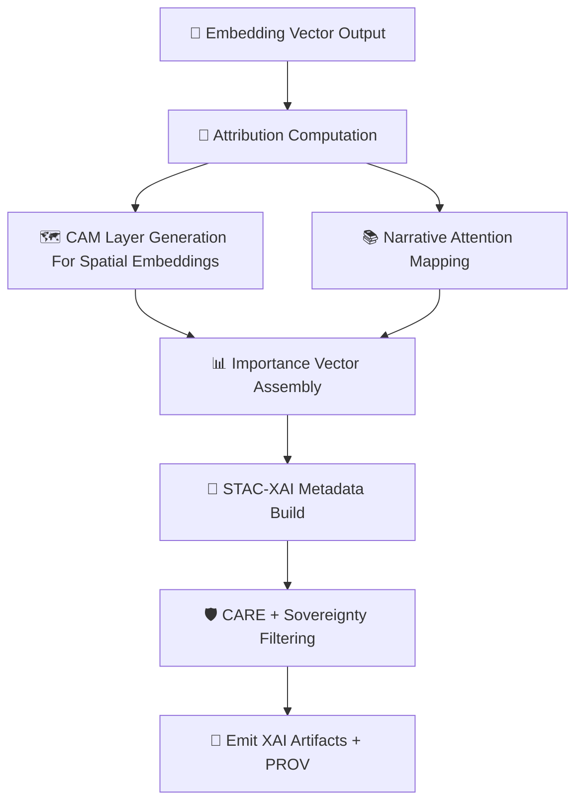

<div align="center">

# 💡🔡🧠 **Embeddings MLOps XAI Subsystem — KFM v11.2.2 (MAX MODE)**  
`docs/pipelines/ai/models/embeddings/mlops/xai/README.md`

**Purpose**  
Define the **Explainability subsystem** for *all embedding models* in the KFM, including:

🗺️ **Spatial embeddings**  
🌡️ **Climate embeddings**  
💧 **Hydrology embeddings**  
🌪️🔥🌊❄️ **Hazard embeddings**  
📚 **Narrative embeddings (Story Node v3)**  
🎯 **Focus Mode cross-domain fusion embeddings**

Provides:

- Cross-embedding attribution vectors  
- Domain importance weights  
- CAM overlays (spatial)  
- Attention maps (Transformer-based embeddings)  
- Sovereignty-safe explainability  
- Deterministic seed-locked XAI  
- STAC-XAI metadata & PROV lineage  

</div>

---

## 🗂️📁💡 **Directory Layout**

```
docs/pipelines/ai/models/embeddings/mlops/xai/
    📄 README.md                      # ← This file
    📄 example-importance.json        # Cross-domain importance vector
    📄 example-cam.json               # Spatial CAM output
    📄 example-attention.json         # Embedding transformer attention
    📄 example-xai-provenance.json    # PROV-O lineage for XAI generation
```

---

## 🧬💡🔡 **Embeddings XAI Architecture (Mermaid-Safe)**



---

## 🔡🧠📈 **1. Cross-Embedding Attribution**

Every embedding model MUST output a deterministic importance vector:

```json
{
  "xai": {
    "importance": {
      "spatial": 0.27,
      "climate": 0.22,
      "hydrology": 0.18,
      "hazard": 0.17,
      "narrative": 0.16
    },
    "seed": 42
  }
}
```

This vector:

- Guides Focus Mode  
- Controls narrative blending  
- Helps detect drift  
- Ensures transparent cross-domain influence  

---

## 🗺️🟦💡 **2. CAM Overlays (Spatial Embeddings Only)**

Spatial embeddings may produce deterministic CAMs over:

- DEM / terrain layers  
- Landcover  
- Watersheds  
- H3 hex rings  
- Geomorphic structures  

CAM-generation MUST be:

- Deterministic  
- CARE-filtered  
- H3-generalized in sovereignty zones  

Example STAC-XAI asset:

```json
{
  "assets": {
    "cam_spatial": {
      "href": "s3://kfm/embeddings/xai/cam_spatial_2025-06-03.tif",
      "roles": ["xai", "explanation"],
      "type": "image/tiff"
    }
  }
}
```

---

## 📚🧠🔡 **3. Narrative Embedding Explainability**

Narrative embeddings MUST provide:

- Text-level attention maps  
- Geospatial token contributions  
- Environmental cue weighting  
- Sensitivity to climate/hydro/hazard embeddings  

This prevents culturally unsafe or sovereignty-violating associations.

---

## 🌡️💧🌪️🔥 **4. Environmental Domain Attribution**

Embedding XAI MUST show how domains influence each other:

- Climate → Hazard (CAPE/CIN/shear/LLJ latent flow)  
- Hydrology → Flood/Hazard vectors  
- Spatial → Narrative context  
- Hazard → Focus Mode context  
- Climate → Drought/soil moisture latent shifts  

These cross-domain influences MUST be surfaced and logged.

---

## 🧠👁️📊 **5. Transformer Attention Maps**

If embeddings use Transformers:

- Self-attention & cross-attention MUST be logged  
- Attention matrices MUST be seed-locked  
- Tokens MUST include spatial/temporal/environmental meaning  
- Narrative-attention MUST be sovereignty-filtered  

Example:

```json
{
  "attention": {
    "entropy": 0.83,
    "dominant_tokens": ["terrain", "temp", "soil_moisture"]
  }
}
```

---

## 🛡️⚖️🧭 **6. FAIR+CARE + Sovereignty Enforcement**

XAI MUST enforce:

- No culturally sensitive token exposure  
- No hyperlocal attribution in tribal regions  
- No hazard amplification visibility  
- H3 downsampling around protected areas  

CARE block example:

```json
{
  "care": {
    "masking": "h3-embedding-generalized",
    "scope": "public-generalized",
    "notes": ["Embedding XAI generalized in sovereignty-sensitive region"]
  }
}
```

---

## 📜🌐🧬 **7. PROV-O Lineage Requirements**

Every XAI output MUST include PROV:

```json
{
  "prov": {
    "wasGeneratedBy": "urn:kfm:activity:xai:embedding_v11_2_2",
    "used": [
      "embedding_model.pt",
      "embedding_normalization.json"
    ],
    "agent": "urn:kfm:service:embeddings-xai-engine"
  }
}
```

---

## 🧪📏🔬 **8. CI Validation Requirements**

CI MUST verify:

- Deterministic XAI outputs  
- Feature-importance schema correctness  
- CAM coverage valid + safe  
- No sovereignty leakage  
- PROV completeness  
- XAI–STAC linkage  
- Drift thresholds respected  
- Telemetry correctness  

Failure → ❌ CI BLOCK.

---

## 🕰️📜 **Version History**

| Version | Date       | Notes                                             |
|---------|------------|---------------------------------------------------|
| v11.2.2 | 2025-11-28 | Initial Embeddings MLOps XAI Subsystem (MAX MODE) |

---

<div align="center">

### 🔗 Footer  
[🔡 Back to Embeddings MLOps](../README.md) ·  
[📡 Telemetry](../telemetry/README.md) ·  
[🏛 Governance](../../../../../standards/governance/ROOT-GOVERNANCE.md)

</div>

