<div align="center">

# 🗂️🔡🌐 **Embeddings STAC Collections — KFM v11.2.2 (MAX MODE)**  
`docs/pipelines/ai/models/embeddings/stac/collections/README.md`

**Purpose**  
Define the **STAC Collections** governing all embedding model families:

🗺️ Spatial  
🌡️ Climate  
💧 Hydrology  
🌪️ Hazard  
📚 Narrative  
🎯 Fusion (Focus Mode cross-domain embeddings)

Collections ensure deterministic grouping, metadata inheritance, sovereignty protection,  
and FAIR+CARE alignment across embedding domains.

</div>

---

## 📘🗂️🔡 **Overview — Why Embedding STAC Collections Exist**

Embedding STAC Collections define:

- Domain grouping  
- Dimensionality invariants  
- Model families  
- Spatial/temporal extents  
- Governance metadata  
- CARE + sovereignty rules  
- XAI inheritance  
- STAC→Item linking  
- Downstream compatibility (hydrology, hazard, climate inference, Focus Mode)

This ensures cross-domain embeddings remain **governed**, **safe**, and **discoverable**.

---

## 🗂️📁🌐 **Directory Layout (MAX MODE)**

```
docs/pipelines/ai/models/embeddings/stac/collections/
    📄 README.md
    📄 spatial.json
    📄 climate.json
    📄 hydrology.json
    📄 hazard.json
    📄 narrative.json
    📄 fusion.json
```

---

## 🧬📦🌐 **STAC Collections Architecture (Mermaid-Safe)**

```mermaid
flowchart TD
    A[🗂️ Embedding STAC Collection] --> B[📄 Domain Definition Spatial Climate Hydro Hazard Narrative Fusion]
    A --> C[🛡️ CARE And Sovereignty Metadata]
    A --> D[💡 XAI Metadata Inheritance Rules]
    A --> E[📜 PROV O Structure Rules]
    A --> F[🔋 Energy And 🌍 Carbon Requirements]
    B --> G[📦 STAC Items For Each Version]
    G --> H[🎯 Downstream Pipelines Focus Mode StoryNodes Hazard Hydro AI]
```



---

## 🗂️🔡📦 **Collection Definition Requirements**

Each embedding domain Collection MUST include:

- **Core STAC fields**  
- **Domain definition** (spatial/climate/hydro/hazard/narrative/fusion)  
- **Spatial + temporal extents**  
- **Embedding dimension invariants**  
- **Model family metadata**  
- **FAIR+CARE compliance block**  
- **Sovereignty-protection rules**  
- **Energy/Carbon expectations**  
- **XAI inheritance rules**  
- **Links to Items**  

Example core block:

```json
{
  "type": "Collection",
  "stac_version": "1.0.0",
  "id": "embeddings-spatial",
  "description": "KFM Spatial Embeddings for terrain landcover watershed and H3 context"
}
```

---

## 🧭🗺️📐 **Special Requirements Per Domain**

### 🗺️ Spatial Collection  

Must specify:

- Terrain grids  
- H3 resolutions  
- Landcover domain metadata  
- Watershed schemas  

---

### 🌡️ Climate Collection  

Must specify:

- Climate variable domains  
- Training/climate-source relationships  
- Hazard/hydro coupling (CAPE CIN shear moisture transport)  

---

### 💧 Hydrology Collection  

Must specify:

- Watershed definitions  
- Flow accumulation  
- Drought-cycle metadata  
- RRHI / streamflow contextual signals  

---

### 🌪️ Hazard Collection  

Must specify:

- Tornado/hail/fire/heat/winter hazard domains  
- Hazard-driver linkages  
- Climate coupling  

---

### 📚 Narrative Collection  

Must specify:

- Story Node v3 semantic embeddings  
- Cultural-safety metadata  
- Sovereignty-safe narrative constraints  

---

### 🎯 Fusion Collection  

Must specify:

- Cross-domain fusion rules  
- Context-routing definitions  
- Focus Mode compliance  
- Embedding-weight inheritance  

---

## 🛡️⚖️🧭 **FAIR+CARE + Sovereignty Requirements**

All Collections MUST include:

```json
{
  "care": {
    "masking": "h3-embedding-generalized",
    "scope": "public-generalized",
    "notes": ["Collection metadata generalized to protect sovereignty-sensitive embedding domains"]
  }
}
```

Care rules MUST govern:

- Sensitive-region vector suppression  
- Narrative content constraints  
- Hazard/climate signature generalization  
- Tribal boundary mask inheritance  

---

## 🔋🌍📊 **Energy + Carbon Requirements**

Collections MUST document:

- Expected energy usage categories  
- Carbon accounting metadata  
- Governance targets for model training sustainability  

---

## 🧪📏🔬 **CI Validation Requirements**

CI MUST validate:

- STAC schema compliance  
- CARE and sovereignty metadata  
- Deterministic serialization  
- XAI inheritance rules  
- PROV integrity  
- Item-linking correctness  
- No sensitive-region metadata leakage  
- Sustainability metadata presence  

Failure → ❌ CI BLOCK.

---

## 🕰️📜 **Version History**

| Version | Date       | Notes                                                |
|---------|------------|------------------------------------------------------|
| v11.2.2 | 2025-11-28 | Initial Embeddings STAC Collections Catalog (MAX MODE) |

---

<div align="center">

### 🔗 Footer  
[🔡 Back to Embeddings STAC Catalog](../README.md) ·  
[📦 STAC Items](../items/README.md) ·  
[🏛 Governance](../../../../../../standards/governance/ROOT-GOVERNANCE.md)

</div>

