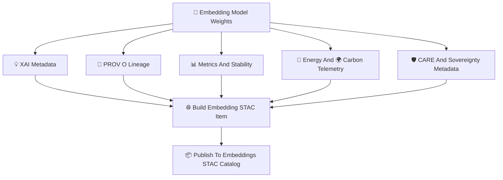

<div align="center">

# 📦🔡🌐 **Embeddings STAC Items — KFM v11.2.2 (MAX MODE)**  
`docs/pipelines/ai/models/embeddings/stac/items/README.md`

**Purpose**  
Define the **STAC Items** representing every version of every embedding model  
(spatial, climate, hydrology, hazard, narrative, fusion) in the Kansas Frontier Matrix.  
Each STAC Item captures:

🔡 **Embedding vectors**  
💡 **XAI explainability metadata**  
📜 **PROV lineage**  
🔋 **Energy/Carbon telemetry**  
🛡️ **FAIR+CARE + sovereignty protections**  
📄 **Model-card linkage**  
📦 **Immutable model registry assets**

</div>

---

## 📘📦🔡 **Overview — What Is An Embedding STAC Item?**

A STAC Item describes one embedding model version, including:

- Model domain (spatial/climate/hydro/hazard/narrative/fusion)  
- Dimensionality  
- Seed (deterministic)  
- XAI artifacts  
- Telemetry  
- PROV  
- CARE + sovereignty metadata  
- STAC asset listings  
- Model-card linkage  
- Drift/stability indicators  

These Items ensure deterministic, governed, sovereignty-safe embedding releases.

---

## 🗂️📁📦 **Directory Layout (MAX MODE)**

```
docs/pipelines/ai/models/embeddings/stac/items/
    📄 README.md
    📄 embedding_spatial_v11.2.2.json
    📄 embedding_climate_v11.2.2.json
    📄 embedding_hydrology_v11.2.2.json
    📄 embedding_hazard_v11.2.2.json
    📄 embedding_narrative_v11.2.2.json
    📄 embedding_fusion_v11.2.2.json
    📄 item_template.json
```

---

## 🧬🌐📦 **Embedding STAC Item Architecture (Mermaid-Safe)**



---

## 📄🔡🧠 **Required STAC Item Fields**

### 1️⃣ **Core STAC Fields**

```json
{
  "type": "Feature",
  "id": "embedding_spatial_v11_2_2",
  "stac_version": "1.0.0",
  "collection": "embeddings-spatial"
}
```

### 2️⃣ **Model Properties**

- `model:domain`  
- `model:dimension`  
- `model:architecture`  
- `model:seed`  
- `model:family` (spatial/climate/hydro/hazard/narrative/fusion)

### 3️⃣ **Assets Block**

Every STAC Item MUST include:

```json
{
  "assets": {
    "weights": {"href": "embedding_model.pt"},
    "xai": {"href": "xai/"},
    "telemetry": {"href": "telemetry/"},
    "provenance": {"href": "prov_embedding.json"},
    "model-card": {"href": "../model-cards/model-card_spatial_v11.2.2.json"},
    "metrics": {"href": "embedding_metrics.json"}
  }
}
```

### 4️⃣ **CARE + Sovereignty Metadata**

```json
{
  "care": {
    "masking": "h3-embedding-generalized",
    "scope": "public-generalized",
    "notes": ["Embedding generalized in sovereignty-sensitive regions"]
  }
}
```

### 5️⃣ **Drift + Stability Fields**

```json
{
  "stability": {
    "drift_centroid": 0.002,
    "drift_cosine": 0.004,
    "cluster_shift": 0.001
  }
}
```

### 6️⃣ **Energy + Carbon Telemetry**

```json
{
  "energy": {"wh": 3.12},
  "carbon": {"gco2e": 0.29}
}
```

### 7️⃣ **STAC Relations**

```
"links": [
  {"rel": "collection", "href": "../collections/spatial.json"},
  {"rel": "model-card", "href": "../model-cards/model-card_spatial_v11.2.2.json"}
]
```

---

## 🧪📏🔬 **CI Validation Requirements**

CI MUST validate:

- Deterministic STAC item structure  
- Schema correctness  
- FAIR+CARE + sovereignty enforcement  
- Telemetry presence  
- XAI metadata correctness  
- PROV lineage integrity  
- STAC → model-card → provenance linkage  
- No leakage of sensitive-region vectors  
- Reproducibility across runs  

Failure → ❌ CI BLOCK.

---

## 🕰️📜 **Version History**

| Version | Date       | Notes                                             |
|---------|------------|---------------------------------------------------|
| v11.2.2 | 2025-11-28 | Initial Embeddings STAC Items Catalog (MAX MODE)  |

---

<div align="center">

### 🔗 Footer  
[🔡 Back to Embeddings STAC Catalog](../README.md) ·  
[📄 Model Cards](../model-cards/README.md) ·  
[🏛 Governance](../../../../../../standards/governance/ROOT-GOVERNANCE.md)

</div>

