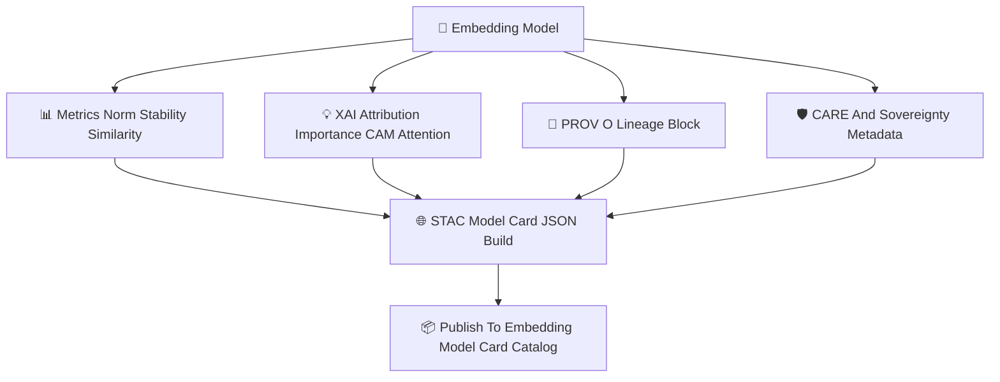

<div align="center">

# 📄🔡🧠 **Embeddings Model Cards Catalog — KFM v11.2.2 (MAX MODE)**  
`docs/pipelines/ai/models/embeddings/stac/model-cards/README.md`

**Purpose**  
Define the **Model Card Catalog** for all embedding models in KFM v11.2.2, including:

🗺️ Spatial embeddings  
🌡️ Climate embeddings  
💧 Hydrology embeddings  
🌪️ Hazard embeddings  
📚 Narrative embeddings  
🎯 Focus Mode fusion embeddings  

Model cards provide **FAIR+CARE-governed**, **sovereignty-safe**, **XAI-rich**,  
and **fully traceable (PROV + STAC)** documentation for each embedding release.

</div>

---

## 🗂️📁📄 **Directory Layout (MAX MODE)**

```
docs/pipelines/ai/models/embeddings/stac/model-cards/
    📄 README.md                                # ← This file
    📄 model-card_spatial_v11.2.2.json
    📄 model-card_climate_v11.2.2.json
    📄 model-card_hydrology_v11.2.2.json
    📄 model-card_hazard_v11.2.2.json
    📄 model-card_narrative_v11.2.2.json
    📄 model-card_fusion_v11.2.2.json
    📄 model-card_template.json                 # Template for new model cards
```

---

## 🧬📄🌐 **Model Card Architecture (Mermaid-Safe)**



---

## 📄🔡🧠 **Required Model Card Sections**

All embedding model cards MUST include:

---

### 1️⃣ **Model Overview**

```json
{
  "model:version": "v11.2.2",
  "model:domain": "spatial",
  "model:dimension": 512,
  "model:seed": 42,
  "model:architecture": "transformer"
}
```

---

### 2️⃣ **Training Metadata**

Includes:

- Epochs  
- Learning rate  
- Dataset STAC links  
- Preprocessing + sovereign masking  
- Hyperparameters  

Example:

```json
{
  "training": {
    "epochs": 48,
    "batch_size": 64,
    "lr": 0.0002,
    "dataset_stac_refs": ["terrain_item", "landcover_item"]
  }
}
```

---

### 3️⃣ **Metrics & Stability**

Metrics MUST include:

- Norm mean/std  
- Cosine similarity distribution  
- PCA/UMAP stability  
- Cluster coherence  
- Drift sensitivity values  

Example:

```json
{
  "metrics": {
    "norm_mean": 1.02,
    "norm_std": 0.08,
    "cosine_mean": 0.41
  }
}
```

---

### 4️⃣ **XAI Explainability**

MUST include:

- Cross-domain importance vectors  
- CAM (if spatial)  
- Transformer attention maps (if applicable)  
- Attribution lineage  

```json
{
  "xai": {
    "importance": {
      "spatial": 0.28,
      "climate": 0.22,
      "hydrology": 0.19,
      "hazard": 0.17,
      "narrative": 0.14
    }
  }
}
```

---

### 5️⃣ **Drift + Stability Fields**

Every card MUST include:

```json
{
  "stability": {
    "drift_centroid": 0.002,
    "drift_cosine": 0.004,
    "cluster_shift": 0.001
  }
}
```

---

### 6️⃣ **PROV-O Lineage**

Core requirement:

```json
{
  "prov": {
    "wasGeneratedBy": "urn:kfm:activity:training:embedding_spatial_v11_2_2",
    "used": [
      "urn:kfm:data:terrain_item",
      "urn:kfm:data:landcover_item"
    ],
    "agent": "urn:kfm:service:embeddings-training-engine"
  }
}
```

---

### 7️⃣ **FAIR+CARE + Sovereignty Metadata**

```json
{
  "care": {
    "masking": "h3-embedding-generalized",
    "scope": "public-generalized",
    "notes": ["Embedding vector generalized in sovereignty-protected regions"]
  }
}
```

---

### 8️⃣ **Energy + Carbon Sustainability**

Embedding models MUST track:

```json
{
  "energy": {"wh": 3.12},
  "carbon": {"gco2e": 0.29}
}
```

---

### 9️⃣ **STAC Asset Links**

Required:

```json
{
  "assets": {
    "weights": {"href": "embedding_model.pt"},
    "xai": {"href": "xai/"},
    "telemetry": {"href": "telemetry/"},
    "provenance": {"href": "prov_embedding.json"}
  }
}
```

---

## 🛡️⚖️🧭 **FAIR+CARE & Sovereignty Enforcement**

All model cards MUST:

- Mask sensitive-region signals  
- Downsample CAM maps in protected areas  
- Remove culturally unsafe narrative associations  
- Reflect sovereignty transformations in lineage  

Failure → ❌ CI BLOCK.

---

## 🧪📏🔬 **CI Validation Requirements**

CI MUST validate:

- JSON schema correctness  
- STAC + PROV lineage integrity  
- XAI completeness  
- Drift/stability fields  
- CARE + sovereignty metadata  
- Deterministic metadata ordering  
- Telemetry block correctness  
- No sensitive-region leakage  

Failure → ❌ BLOCK.

---

## 🕰️📜 **Version History**

| Version | Date       | Notes                                                |
|---------|------------|------------------------------------------------------|
| v11.2.2 | 2025-11-28 | Initial Embeddings Model Cards Catalog (MAX MODE)    |

---

<div align="center">

### 🔗 Footer  
[🔡 Back to Embeddings STAC Catalog](../README.md) ·  
[📦 STAC Items](../items/README.md) ·  
[🏛 Governance](../../../../../../standards/governance/ROOT-GOVERNANCE.md)

</div>

