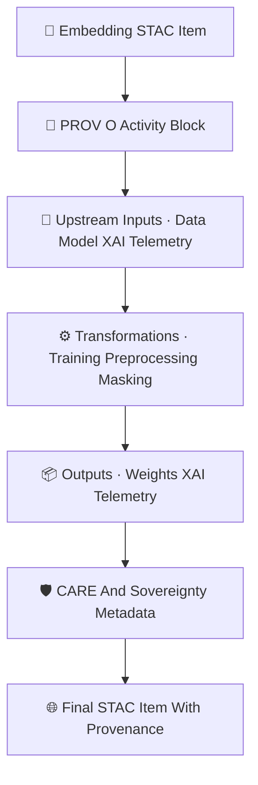

<div align="center">

# 📜🌐🔡 **Embeddings STAC Provenance Catalog — KFM v11.2.2 (MAX MODE)**  
`docs/pipelines/ai/models/embeddings/stac/provenance/README.md`

**Purpose**  
Define the **PROV-O lineage system** governing *all embedding models* and their STAC entries  
across spatial, climate, hydrology, hazard, narrative, and fusion domains.  
This subsystem preserves **traceability**, **determinism**, **governance auditability**,  
and **sovereignty-safe metadata inheritance** across the entire embedding model lifecycle.

</div>

---

## 📘📜🔡 **Overview — Why Embedding Provenance Matters**

Embeddings represent **multi-domain semantic intelligence**:

🗺️ spatial  
🌡️ climate  
💧 hydrology  
🌪️ hazard  
📚 narrative  
🎯 fusion (Focus Mode)

Their provenance must capture:

- Input datasets (STAC Items)  
- Preprocessing + masking steps  
- Training activities + hyperparameters  
- XAI generation steps  
- Telemetry production  
- Sovereignty and CARE transformations  
- Model registry lineage  
- Drift/rollback ancestry  

Without PROV, embeddings cannot be audited, reversed, or validated safely.

---

## 🗂️📁📜 **Directory Layout (MAX MODE)**

```
docs/pipelines/ai/models/embeddings/stac/provenance/
    📄 README.md                               # ← This file
    📄 prov_embedding_spatial_v11.2.2.json      # Spatial embedding lineage
    📄 prov_embedding_climate_v11.2.2.json      # Climate embedding lineage
    📄 prov_embedding_hydro_v11.2.2.json        # Hydrology embedding lineage
    📄 prov_embedding_hazard_v11.2.2.json       # Hazard embedding lineage
    📄 prov_embedding_narrative_v11.2.2.json    # Narrative embedding lineage
    📄 prov_embedding_fusion_v11.2.2.json       # Fusion embedding lineage
    📄 prov_embedding_template.json             # Template for new embedding models
```

---

## 🧬📜🌐 **Provenance Architecture (Mermaid-Safe)**



---

## 📜🔡🧬 **Required PROV-O Blocks**

### ✔ `prov:wasGeneratedBy`  
Captures training or embedding-builder activity.

```json
{
  "prov": {
    "wasGeneratedBy": "urn:kfm:activity:training:embedding_spatial_v11_2_2"
  }
}
```

### ✔ `prov:used`  
MUST list *all* upstream data, models, preprocessing configs, masking rules, and XAI templates:

```json
{
  "prov": {
    "used": [
      "urn:kfm:data:stac:terrain_item",
      "urn:kfm:data:stac:landcover_item",
      "urn:kfm:data:stac:climate_item",
      "urn:kfm:model:driver_shear_v11_2_1",
      "urn:kfm:preprocess:sovereignty_mask_v3"
    ]
  }
}
```

### ✔ `prov:wasAssociatedWith`  
MUST identify training / XAI / telemetry engines:

```json
{
  "prov": {
    "agent": "urn:kfm:service:embeddings-training-engine"
  }
}
```

### ✔ Deterministic Seed  
Included in `properties.model:seed`.

---

## 💡🔡📊 **XAI Provenance Requirements**

Every embedding STAC item MUST include an XAI provenance block:

```json
{
  "xai:prov": {
    "wasGeneratedBy": "urn:kfm:activity:xai:embedding_v11_2_2",
    "used": [
      "embedding_model.pt",
      "embedding_normalization.json"
    ],
    "agent": "urn:kfm:service:embeddings-xai-engine"
  }
}
```

This ties attribution → weights → dataset.

---

## 🔋🌍📡 **Telemetry Provenance Integration**

Telemetry MUST record PROV lineage for:

- Energy  
- Carbon  
- OTel spans  
- Drift signals  
- XAI runtime attribution  

```json
{
  "prov": {
    "wasGeneratedBy": "urn:kfm:activity:telemetry:embedding_run",
    "used": ["embedding_model.pt", "embedding_stac_item.json"],
    "agent": "urn:kfm:service:embedding-telemetry-engine"
  }
}
```

---

## 🛡️⚖️🧭 **FAIR+CARE + Sovereignty Provenance**

Embedding provenance MUST include sovereignty metadata:

```json
{
  "care": {
    "masking": "h3-embedding-generalized",
    "scope": "public-generalized",
    "notes": ["Sovereignty constraints applied during embedding training and STAC assembly"]
  }
}
```

Requirements:

- No culturally sensitive embedding vectors  
- No geography revealing sacred or restricted sites  
- No hazard/climate signature leakage over tribal regions  
- MUST document all sovereignty-driven transformations  

---

## 📦📜🧾 **Provenance Templates**

Templates MUST exist for:

- Spatial embeddings  
- Climate embeddings  
- Hydrology embeddings  
- Hazard embeddings  
- Narrative embeddings  
- Fusion embeddings  
- Vector index provenance  

Ensures consistency and CI-safe metadata generation.

---

## 🧪📏🔬 **CI Validation Requirements**

CI MUST validate:

- PROV schema correctness  
- Deterministic ordering of `prov:used`  
- No missing upstream references  
- Sovereignty metadata present  
- CARE metadata correct  
- XAI → STAC → PROV link integrity  
- No sensitive-region leakage  
- Telemetry lineage valid  
- Reproducible across runs  

Failure → ❌ CI BLOCK.

---

## 🕰️📜 **Version History**

| Version | Date       | Notes                                                   |
|---------|------------|---------------------------------------------------------|
| v11.2.2 | 2025-11-28 | Initial Embeddings STAC Provenance Catalog (MAX MODE)   |

---

<div align="center">

### 🔗 Footer  
[🔡 Back to Embeddings STAC Catalog](../README.md) ·  
[📜 Telemetry](../telemetry/README.md) ·  
[🏛 Governance](../../../../../../standards/governance/ROOT-GOVERNANCE.md)

</d

