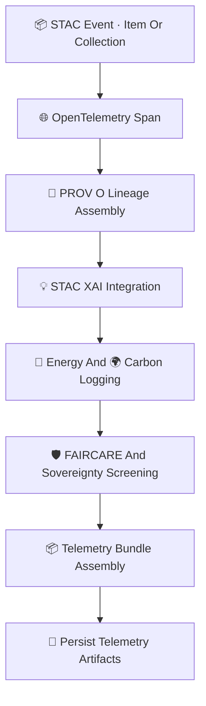

<div align="center">

# 📡🌐🔡 **Embeddings STAC Telemetry — KFM v11.2.2 (MAX MODE)**  
`docs/pipelines/ai/models/embeddings/stac/telemetry/README.md`

**Purpose**  
Define the **telemetry subsystem** for all Embeddings STAC Items & Collections.  
Telemetry ensures **observability**, **traceability**, **sovereignty-safe metadata**,  
**sustainability tracking**, and **XAI + PROV linkage** for embedding metadata.

Covers:

🌐 **OpenTelemetry spans**  
📜 **PROV-O lineage**  
💡 **STAC-XAI integration**  
🔋 **Energy metrics**  
🌍 **Carbon emissions**  
🛡️ **FAIR+CARE + sovereignty compliance**  
📦 **Telemetry bundle validation (CI)**  

</div>

---

## 🗂️📁📡 **Directory Layout (MAX MODE)**

```
docs/pipelines/ai/models/embeddings/stac/telemetry/
    📄 README.md                
    📄 example-span.json        # OTel span for STAC activity
    📄 example-provenance.json  # PROV-O metadata for STAC operations
    📄 example-energy.json      # Energy usage metadata
    📄 example-carbon.json      # Carbon footprint
    📄 example-stac.json        # Telemetry wrapper for a full STAC Item or Collection
```

---

## 🧬📡🌐 **STAC Telemetry Architecture (Mermaid-Safe)**



---

## 🌐📡📊 **1. OTel Span Requirements**

Spans MUST record:

- STAC creation/update/validation event  
- Latency  
- Model domain (spatial/climate/hydro/hazard/narrative/fusion)  
- STAC version  
- Seed for deterministic operations  
- Collection/Item identifiers  

Example:

```json
{
  "otel": {
    "operation": "stac_item_create",
    "latency_ms": 12,
    "domain": "spatial",
    "seed": 42
  }
}
```

---

## 📜🧾🔡 **2. PROV-O Lineage Requirements**

Every STAC-related telemetry event MUST generate PROV:

```json
{
  "prov": {
    "wasGeneratedBy": "urn:kfm:activity:stac:embedding_build",
    "used": [
      "urn:kfm:model:embedding_spatial_v11_2_2",
      "urn:kfm:data:stac:terrain_item"
    ],
    "agent": "urn:kfm:service:embedding-stac-engine"
  }
}
```

This ensures deterministic, auditable metadata.

---

## 💡🔡🧠 **3. STAC-XAI Integration**

Telemetry MUST verify:

- Presence of XAI assets  
- Correct linkage to STAC Items  
- CAM/attention assets exist where applicable  
- XAI provenance included  

Example:

```json
{
  "xai": {
    "assets_present": true,
    "cam_available": false,
    "attention_available": true
  }
}
```

---

## 🔋🌍📊 **4. Energy + Carbon Telemetry**

Telemetry MUST include:

- Wh  
- gCO₂e  
- FLOPs  
- CPU/GPU usage  

Example:

```json
{
  "energy": {
    "wh": 0.11,
    "carbon_gco2e": 0.02
  }
}
```

---

## 🛡️⚖️🧭 **5. FAIR+CARE + Sovereignty Screening**

Telemetry MUST enforce:

```json
{
  "care": {
    "masking": "h3-embedding-generalized",
    "scope": "public-generalized",
    "notes": ["STAC telemetry redacted for sovereignty-sensitive material"]
  }
}
```

Check for:

- Sensitive-region vector leakage  
- Narrative embedding exposure  
- Hazard/climate spatial signature spread  
- Cross-domain unsafe correlations  

---

## 📦📜🔐 **6. Telemetry Bundle Assembly**

Bundles MUST contain:

```
otel/
prov/
xai/
energy/
carbon/
stac_event.json
```

All bundles MUST be:

- Deterministic  
- CI-validated  
- Sovereignty-safe  

---

## 🧪📏🔬 **CI Validation Requirements**

CI MUST confirm:

- Telemetry schema validity  
- Deterministic STAC event logs  
- XAI asset references correct  
- PROV lineage complete  
- CARE metadata correctness  
- No sovereignty leakage  
- Telemetry bundles fully present  
- STAC version + domain fields set  

Failure → ❌ CI BLOCK.

---

## 🕰️📜 **Version History**

| Version | Date       | Notes                                           |
|---------|------------|-------------------------------------------------|
| v11.2.2 | 2025-11-28 | Initial Embeddings STAC Telemetry (MAX MODE)    |

---

<div align="center">

### 🔗 Footer  
[🔡 Back to Embeddings STAC Catalog](../README.md) ·  
[📜 Provenance](../provenance/README.md) ·  
[🏛 Governance](../../../../../../standards/governance/ROOT-GOVERNANCE.md)

</div>

