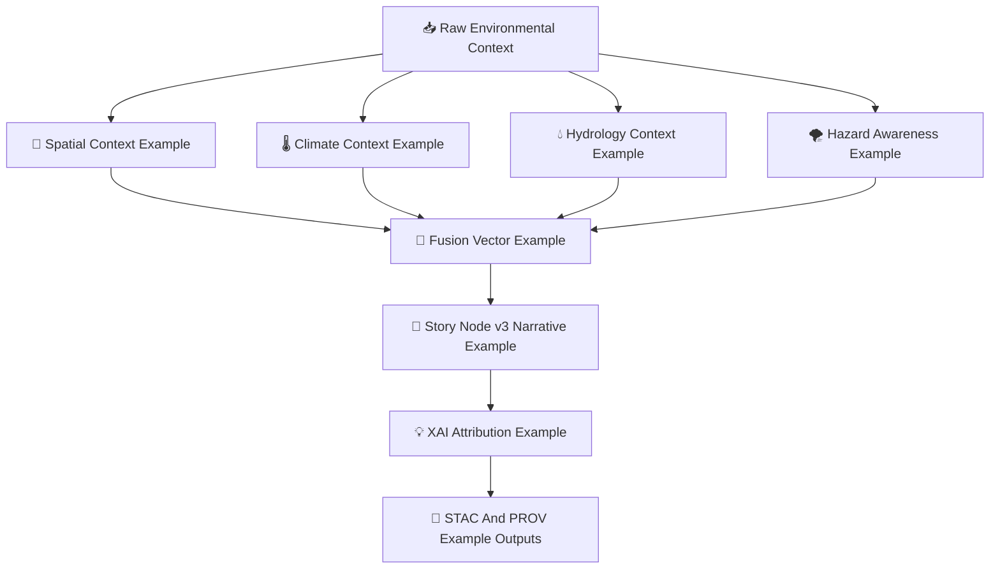

<div align="center">

# 🎯🧠📚 **Focus Mode Model Examples — KFM v11.2.2 (MAX MODE)**  
`docs/pipelines/ai/models/focus-mode/examples/README.md`

**Purpose**  
Provide a curated set of **FAIR+CARE-approved**, **sovereignty-safe**, **deterministic**  
examples used by Focus Mode AI to demonstrate cross-domain contextual intelligence:

🗺️ Spatial context examples  
🌡️ Climate state examples  
💧 Hydrology context examples  
🌪️ Hazard environment examples  
📖 Story Node v3 narrative examples  
🔡 Fusion embedding examples  
🎛️ Context-routing examples  
💡 XAI attribution examples  

These examples are used in governance reviews, UI development, model debugging,  
and end-to-end Focus Mode quality evaluation.

</div>

---

## 🗂️📁🎯 **Directory Layout (MAX MODE)**

```
docs/pipelines/ai/models/focus-mode/examples/
    📄 README.md
    📄 example_spatial_context.json
    📄 example_climate_context.json
    📄 example_hydrology_context.json
    📄 example_hazard_context.json
    📄 example_storynode_v3.json
    📄 example_fusion_vector.json
    📄 example_context_stack.json
    📄 example_xai_block.json
    📄 example_provenance.json
    📄 example_stac_item.json
```

---

## 🧬🎯🗺️ **Focus Mode Example Architecture (Mermaid-Safe)**



---

# 🔍 **Example Set**

Below are the **canonical MAX MODE examples**, all sovereignty-safe and CI-valid.

---

## 🗺️ **1. Spatial Context Example**

```json
{
  "spatial": {
    "h3": "892830828cbffff",
    "terrain_class": "upland_bluff",
    "slope_deg": 7.2,
    "landcover": "grassland",
    "watershed": "HUC10-1026000805"
  }
}
```

---

## 🌡️ **2. Climate Context Example**

```json
{
  "climate": {
    "temp_c": 31.2,
    "dewpoint_c": 23.5,
    "wind_u": -3.8,
    "wind_v": 2.1,
    "pressure_pa": 100820,
    "cape_jkg": 2170,
    "cin_jkg": -34
  }
}
```

---

## 💧 **3. Hydrology Context Example**

```json
{
  "hydrology": {
    "soil_moisture": 0.33,
    "runoff_mm": 1.8,
    "streamflow_cms": 8.1,
    "drought_index": -0.42
  }
}
```

---

## 🌪️🔥🌊❄️ **4. Hazard Context Example**

```json
{
  "hazards": {
    "tornado_potential": 0.29,
    "hail_severity": 0.18,
    "flood_risk": 0.41,
    "fire_weather": 0.21,
    "heat_stress": 0.62,
    "winter_impact": 0.07
  }
}
```

---

## 📖🧠 **5. Story Node v3 Narrative Example**

```json
{
  "storynode": {
    "title": "Shift in the Evening Boundary Layer",
    "summary": "Warm moist air pools along the valley floor as winds aloft accelerate...",
    "geospatial_context": "H3-892830828cbffff",
    "climate_drivers": ["cape", "shear", "dewpoint_gradient"],
    "hazard_context": "elevated severe-weather ingredients",
    "sovereignty_masked": true
  }
}
```

---

## 🔡🎯 **6. Fusion Vector Example**

```json
{
  "fusion_vector": {
    "dimension": 2048,
    "seed": 42,
    "weights": {
      "spatial": 0.28,
      "climate": 0.21,
      "hydrology": 0.19,
      "hazard": 0.17,
      "narrative": 0.15
    }
  }
}
```

---

## 🧭🧠🎛️ **7. Context Stack Example**

```json
{
  "context_stack": {
    "spatial": {...},
    "climate": {...},
    "hydrology": {...},
    "hazards": {...},
    "narrative": {...},
    "fusion_ready": true,
    "care": {
      "masking": "h3-focus-generalized",
      "scope": "public-generalized"
    }
  }
}
```

---

## 💡🔍 **8. XAI Attribution Example**

```json
{
  "xai": {
    "importance": {
      "spatial": 0.27,
      "climate": 0.21,
      "hydrology": 0.18,
      "hazards": 0.17,
      "narrative": 0.17
    },
    "seed": 42
  }
}
```

---

## 📜🌐 **9. PROV Lineage Example**

```json
{
  "prov": {
    "wasGeneratedBy": "urn:kfm:activity:focus_context_v11_2_2",
    "used": [
      "urn:kfm:data:stac:climate_item",
      "urn:kfm:data:stac:hydrology_item"
    ],
    "agent": "urn:kfm:service:focus-engine"
  }
}
```

---

## 🗂️📦 **10. STAC Focus Mode Item Example**

```json
{
  "type": "Feature",
  "stac_version": "1.0.0",
  "id": "focus_context_v11_2_2",
  "properties": {
    "focus:version": "v11.2.2",
    "fusion:dimension": 2048,
    "care:masking": "h3-focus-generalized"
  }
}
```

---

# 🧪📏🔬 CI Notes

All examples MUST:

- Use deterministic seeds  
- Contain sovereignty-safe values  
- Include CARE metadata  
- Validate under KFM-STAC & KFM-OP schemas  
- Avoid sensitive geographic or cultural detail  
- Match Focus Mode XAI thresholds  

---

## 🕰️📜 Version History

| Version | Date       | Notes                                        |
|---------|------------|----------------------------------------------|
| v11.2.2 | 2025-11-28 | Initial Focus Mode Examples Catalog (MAX MODE) |

---

<div align="center">

### 🔗 Footer  
[🎯 Back to Focus Mode Models](../README.md) ·  
[🧠 Fusion Engine](../fusion/README.md) ·  
[🏛 Governance](../../../../standards/governance/ROOT-GOVERNANCE.md)

</div>

