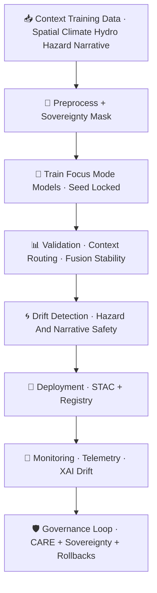

<div align="center">

# 🎯🧠🚀 **Focus Mode MLOps Pipeline — KFM v11.2.2 (MAX MODE)**  
`docs/pipelines/ai/models/focus-mode/mlops/README.md`

**Purpose**  
Define the **end-to-end MLOps system** that governs the lifecycle of **Focus Mode AI models**, including:  

🧭 **Geo-awareness engines**  
🌡️ **Climate-context interpreters**  
💧 **Hydrology-context models**  
🌪️ **Hazard-awareness layers**  
🔡 **Fusion vector generators**  
📖 **Story Node v3 narrative models**  
🧠 **Transformer context modules**  
💡 **XAI explainability layers**  

This pipeline ensures Focus Mode remains:  
**deterministic**, **sovereignty-safe**, **FAIR+CARE aligned**, **STAC-indexed**, **PROV-backed**,  
and **auditable across all environmental + narrative domains**.

</div>

---

## 🧬🧠🎯 **Focus Mode MLOps Architecture (Mermaid-Safe)**



---

## 🗂️📁🎯 **Directory Layout (MAX MODE)**

```
docs/pipelines/ai/models/focus-mode/mlops/
    📄 README.md
    📄 training.md
    📄 validation.md
    📄 deployment.md
    📄 monitoring.md
    📄 drift-detection.md
    📄 rollbacks.md
    📁 telemetry/
        📄 README.md
    📁 xai/
        📄 README.md
```

---

# 🔍 **Overview — What Does Focus Mode MLOps Govern?**

Focus Mode MLOps controls all models responsible for:

### 🧭 **Spatial Grounding**
H3, terrain, landcover, watershed, sovereignty-zone detection.

### 🌡️ **Climate Context**
Realtime climate state reasoning; anomaly behaviors; hazard precursors.

### 💧 **Hydrology Context**
Streamflow, drought, soil moisture, runoff contextual relevance.

### 🌪️🔥🌊❄️ **Hazard Awareness**
Tornado/hail/flood/fire/heat/winter hazard-environment scoring.

### 🔡 **Fusion Vector Construction**
Cross-domain embedding mixing → **2048-D fused vector** for Story Node v3.

### 📖 **Story Node v3 Narrative Logic**
Context-aware deterministic narrative generation.

### 💡 **XAI Context Attribution**
CAM, attention weights, cross-domain importance vectors.

### 🛡️ **FAIR+CARE + Sovereignty Enforcement**
No cultural leakage. No unsafe hazard over-localization.  
All outputs must be sovereignty-generalized where required.

---

# 🧠⚙️ **Training Requirements**

Focus Mode training MUST ensure:

- Deterministic seeds (no random ops)  
- CARE-governed spatial masking  
- Sovereignty-informed data curation  
- Balanced environmental sampling  
- Fusion attention stability  
- Narrative-safety constraints  
- STAC & PROV lineage for every input  

Outputs:

- `focus_model.pt`  
- `fusion_weights.json`  
- `context_router.pt`  
- `storynode_v3.pt`  
- `xai/…`  
- `provenance/…`  
- `telemetry/…`  
- `focus_model-card.json`  

---

# 📊🧪 **Validation Requirements**

Validation MUST confirm:

- Fusion vector stability  
- Consistent Story Node activation  
- Correct hazard/hydro/climate routing  
- Spatial CAM plausibility  
- Narrative cultural safety  
- Sovereignty-compliant XAI  
- No hazard over-amplification  

Outputs:

- `validation_report.json`  
- `promotion_decision.json`

---

# 🌀📉 **Drift Detection Requirements**

Drift engine MUST inspect:

- Fusion vector distribution shift  
- Climate/hydro/hazard regime misalignment  
- Spatial CAM displacement  
- Narrative-attention entropy drift  
- Sovereignty-region drift  
- Similarity mapping instability  

Triggers:

- `rollback`  
- `retrain`  
- `governance review`

---

# 🚀🔐 **Deployment Requirements**

Deployment requires:

- Model-card v11  
- STAC Item  
- PROV chain  
- CARE + sovereignty enforcement  
- Signed hash (optional Sigstore)  
- Registry immutability  

Registry path:

```
focus/models/v11.2.2/
```

---

# 📡📊 **Monitoring Requirements**

Monitoring includes:

- OTel spans  
- XAI deltas  
- Narrative safety metrics  
- Fusion stability  
- Hazard/hydro consistency  
- Sovereignty violation checks  
- Energy + carbon telemetry  

---

# ⏪🛡️ **Rollback Requirements**

Rollback triggers include:

- Drift violation  
- Sovereignty conflict  
- CARE safety failure  
- Narrative instability  
- Fusion collapse  
- Telemetry anomalies  

Rollback restores:

```
focus/models/<last_stable_version>/
```

---

# 🧪📏🔬 **CI Validation Requirements**

CI MUST validate:

- Deterministic fusion vectors  
- Story Node correctness  
- CARE + sovereignty metadata  
- XAI completeness  
- STAC + PROV chain  
- Telemetry/schema correctness  
- Drift signals stable  
- No sensitive-region leakage  

Failure → ❌ CI BLOCK.

---

# 🕰️📜 **Version History**

| Version | Date       | Notes                                          |
|---------|------------|------------------------------------------------|
| v11.2.2 | 2025-11-28 | Initial Focus Mode MLOps Pipeline (MAX MODE)   |

---

<div align="center">

### 🔗 Footer  
[🎯 Back to Focus Mode Models](../README.md) ·  
[🧠 Focus Mode Fusion](../fusion/README.md) ·  
[🏛 Governance](../../../../standards/governance/ROOT-GOVERNANCE.md)

</div>

