<div align="center">

# 🚀🎯🧠 **Focus Mode Deployment — KFM v11.2.2 (MAX MODE)**  
`docs/pipelines/ai/models/focus-mode/mlops/deployment.md`

**Purpose**  
Define the **governed deployment pipeline** for Focus Mode models, including:

🧭 **Geo-awareness engine**  
🌡️ **Climate context model**  
💧 **Hydrology context model**  
🌪️ **Hazard-awareness model**  
🔡 **Fusion vector generator (2048D)**  
📖 **Story Node v3 narrative engine**  
💡 **XAI attribution component**  

All deployments MUST be **deterministic**, **FAIR+CARE aligned**, **sovereignty-safe**,  
and **fully STAC + PROV integrated**.

</div>

---

## 🧬🚀🎯 **Focus Mode Deployment Architecture (Mermaid-Safe)**

```mermaid
flowchart TD
    A[📦 Candidate Focus Mode Artifacts] --> B[📊 Validation · Context QA]
    B --> C[🔐 Model Integrity Hash + Signing]
    C --> D[🌐 Build STAC Model Item]
    D --> E[🛡️ CARE And Sovereignty Screening]
    E --> F[🚀 Push To Focus Mode Registry]
    F --> G[📡 Activate Telemetry Monitoring]
    G --> H[🛑 Promotion Gate Or Rollback Trigger]
```



---

# 🧱 **Deployment Components**

---

## 📦 **1. Deployment Artifacts Required**

Each Focus Mode release MUST include:

```
focus_model.pt
fusion_weights.json
context_router.pt
storynode_v3.pt
xai/
provenance/
telemetry/
stac/focusmodel-item.json
model-card.json
```

Artifacts MUST be:

- Reproducible  
- Deterministic  
- CARE-compliant  
- Sovereignty-filtered  
- STAC-referenced  
- PROV-traceable  

---

## 📊 **2. Validation Before Deployment**

Validation MUST confirm:

- Fusion vector stability  
- Story Node reasoning correctness  
- Hazard/Hydro/Climate routing correctness  
- Geo-awareness fidelity  
- Sovereignty masking integrity  
- XAI correctness  
- Telemetry presence  
- Drift-baseline alignment  

Results:

- `deployment_validation.json`  
- `promotion_decision.json`

---

## 🔐 **3. Integrity Hashing + Signing**

Deployment MUST enforce:

- SHA-256 on all major model files  
- Optional Sigstore transparency log  
- Immutability flag  

Stored in:

```json
{
  "integrity": {
    "hash": "<sha256>",
    "signature": "<sigstore>",
    "immutable": true
  }
}
```

---

## 🌐 **4. STAC Model Item Assembly**

STAC Focus Mode Item MUST include:

- Model version  
- Context domains included  
- Fusion dimension  
- XAI assets  
- Telemetry references  
- PROV lineage  
- CARE metadata  
- Sovereignty notes  

Example:

```json
{
  "focus:version": "v11.2.2",
  "fusion:dimension": 2048,
  "xai:assets": ["xai/"],
  "care:masking": "h3-focus-generalized"
}
```

---

## 🛡️ **5. FAIR+CARE + Sovereignty Screening**

Deployment MUST NOT:

- Reveal culturally sensitive context  
- Produce hyperlocal hazard interpretations  
- Encode tribal-sovereignty–restricted cues  

CARE block example:

```json
{
  "care": {
    "masking": "h3-focus-generalized",
    "scope": "public-generalized",
    "notes": ["Deployment generalized for sovereignty protection"]
  }
}
```

---

## 🚀 **6. Registry Push**

Deployment is completed by pushing all artifacts to registry:

```
focus/models/v11.2.2/
    focus_model.pt
    focusmodel-item.stac.json
    provenance/
    xai/
    telemetry/
```

Registry entries MUST be immutable.

---

## 📡 **7. Monitoring Activation**

Upon deployment, Focus Mode begins emitting:

- OTel spans  
- XAI runtime metrics  
- Fusion stability deltas  
- Hazard/hydro/climate relevance  
- Narrative-safety metrics  
- Sovereignty violation checks  

---

## 🛑 **8. Promotion Gate / Rollback Logic**

Promotion allowed when:

- Validation passed  
- Drift signals stable  
- XAI consistent  
- CARE + sovereignty safe  
- Telemetry complete  
- PROV lineage intact  

Rollback triggers:

- Drift violation  
- Sovereignty violation  
- XAI instability  
- Fusion collapse  
- Narrative safety regression  
- Governance veto  

Rollback restores last stable release.

---

# 🧪📏🔬 **CI Validation Requirements**

CI MUST confirm:

- Deterministic fusion outputs  
- CARE + sovereignty correctness  
- XAI completeness  
- Telemetry validity  
- STAC + PROV chain integrity  
- DRIFT SAFE  
- Performance thresholds  
- No sensitive-region leakage  

Failure → ❌ CI BLOCK.

---

# 🕰️📜 **Version History**

| Version | Date       | Notes                                              |
|---------|------------|----------------------------------------------------|
| v11.2.2 | 2025-11-28 | Initial Focus Mode Deployment Document (MAX MODE)  |

---

<div align="center">

### 🔗 Footer  
[🎯 Back to Focus Mode MLOps](../README.md) ·  
[📊 Validation](./validation.md) ·  
[🏛 Governance](../../../../../standards/governance/ROOT-GOVERNANCE.md)

</div>

