<div align="center">

# 🌀🎯🧠 **Focus Mode Drift & Bias Detection — KFM v11.2.2 (MAX MODE)**  
`docs/pipelines/ai/models/focus-mode/mlops/drift-detection.md`

**Purpose**  
Define the **drift detection subsystem** for Focus Mode, responsible for identifying:  

🔡 **Fusion vector instability**  
📖 **Narrative drift & cultural-safety violations**  
🌡️💧🌪️ **Climate/Hydrology/Hazard context drift**  
🧭 **Geo-awareness drift**  
💡 **XAI attribution drift**  
⚖️ **Sovereignty-dependent drift**  

This system ensures Focus Mode stays **deterministic**, **FAIR+CARE aligned**, **sovereignty-safe**,  
and **environmentally + narratively coherent**.

</div>

---

## 🧬🌀🎯 **Drift Detection Architecture (Mermaid-Safe)**

```mermaid
flowchart TD
    A[📥 New Focus Mode Inference] --> B[🔡 Fusion Vector Drift Analysis]
    B --> C[📖 Narrative And StoryNode Drift]
    C --> D[🌡️ Climate Drift Signals]
    D --> E[💧 Hydrology Drift Signals]
    E --> F[🌪️ Hazard Drift Signals]
    F --> G[🧭 Geo Awareness Drift]
    G --> H[💡 XAI Attribution Drift]
    H --> I[🛡️ Sovereignty Drift Screening]
    I --> J[📦 Drift Report Assembly]
    J --> K[🛑 Rollback Recommendation Or Promotion Approval]
```



---

# 🔍 **Drift Categories & Requirements**

---

## 🔡 **1. Fusion Vector Drift**

Fusion (2048D) drift MUST examine:

- Vector centroid shift  
- Cosine-distance drift  
- Cross-domain weight instability  
- H3-sensitive domain drift  
- Fusion collapse (loss of domain separation)

Output:

```json
{
  "fusion_drift": {
    "centroid_shift": 0.003,
    "cosine_shift": 0.004,
    "domain_weight_shift": {"spatial": +0.02}
  }
}
```

---

## 📖 **2. Narrative & Story Node Drift**

StoryNode v3 drift MUST detect:

- Narrative channel misalignment  
- Cultural-safety violations  
- Attention entropy divergence  
- Topic-domain leakage (narrative ↔ hazard/climate)  
- Sovereignty-sensitive narrative drift  

Example:

```json
{
  "narrative_drift": {
    "attention_entropy_change": 0.11,
    "unsafe_topic_shift": true
  }
}
```

---

## 🌡️ **3. Climate Context Drift**

Detect drift in:

- CAPE/CIN influence  
- Shear/LLJ coupling  
- Climate anomaly sensitivity  
- Temperature/dewpoint gradients  
- Relevance-score instability  

---

## 💧 **4. Hydrology Context Drift**

Hydro drift MUST detect:

- Drought/humidity imbalance  
- Runoff/soil-moisture deviation  
- Streamflow-regime misalignment  
- RRHI instability (Runoff Hazard Index)  

---

## 🌪️🔥🌊 **5. Hazard Environment Drift**

Hazard drift MUST track:

- Tornado/hail driver misalignment  
- Flood hazard mis-weighting  
- Fire-weather drift  
- Heat/winter instability  
- Hazard Emergence Over-Specification (HEOS)  

---

## 🧭 **6. Geo-Awareness Drift**

Check:

- Spatial CAM displacement  
- H3 region mismatch  
- Sovereignty-boundary drift  
- Terrain/landcover/watershed signal drift  

---

## 💡 **7. XAI Attribution Drift**

Drift detection MUST evaluate:

- Importance vector drift  
- CAM displacement  
- Transformer attention entropy drift  
- Cross-domain attribution anomalies  

Example:

```json
{
  "xai_drift": {
    "importance_shift": {
      "spatial": +0.02,
      "climate": -0.01,
      "hazards": +0.01
    },
    "cam_shift": 0.18
  }
}
```

---

## 🛡️⚖️ **8. Sovereignty Drift Screening**

Critical for Focus Mode:

- Drift in protected H3 regions  
- Narrative unsafe drift tied to tribal lands  
- Hyperlocal hazard-signal emergence  
- Cultural context leakage  

CARE block:

```json
{
  "care": {
    "masking": "h3-focus-generalized",
    "scope": "public-generalized",
    "notes": ["Drift detected in sovereignty-sensitive domain"]
  }
}
```

---

## 📦📝 **9. Drift Report Assembly**

All drift reports MUST be emitted as:

```
drift_report.json
fusion_drift.json
narrative_drift.json
climate_drift.json
hydrology_drift.json
hazard_drift.json
geo_drift.json
xai_drift.json
sovereignty_drift.json
```

Each MUST include STAC & PROV lineage references.

---

## 🛑⚙️ **10. Rollback / Promotion Decision**

Rollback triggers:

- Narrative cultural-safety risk  
- Hazard over-localization  
- Sovereignty-region drift  
- Fusion collapse  
- XAI drift anomalies  
- Climate/hydro/hazard misalignment  
- Governance veto  

Promotion allowed ONLY IF:

- All drift < thresholds  
- Sovereignty-safe  
- XAI stable  
- Fusion stable  
- Telemetry consistent  
- PROV complete  

---

# 🔒⚙️ **Determinism Requirements**

Drift detection MUST be:

- Seed-locked  
- Hardware-invariant  
- Order-stable  
- Reproducible under CI  

---

# 🧪📏🔬 **CI Validation Requirements**

CI MUST validate:

- JSON schema correctness  
- Deterministic drift scores  
- Sovereignty masking correctness  
- CARE metadata enforcement  
- XAI drift validity  
- STAC + PROV chain  
- Script reproducibility  
- Cross-domain drift logic completeness  

Failure → ❌ CI BLOCK.

---

# 🕰️📜 Version History

| Version | Date       | Notes                                                        |
|---------|------------|--------------------------------------------------------------|
| v11.2.2 | 2025-11-28 | Initial Focus Mode Drift Detection Documentation (MAX MODE) |

---

<div align="center">

### 🔗 Footer  
[🎯 Back to Focus Mode MLOps](../README.md) ·  
[📡 Telemetry](../telemetry/README.md) ·  
[🏛 Governance](../../../../../standards/governance/ROOT-GOVERNANCE.md)

</div>

